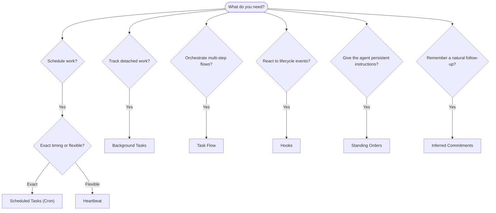
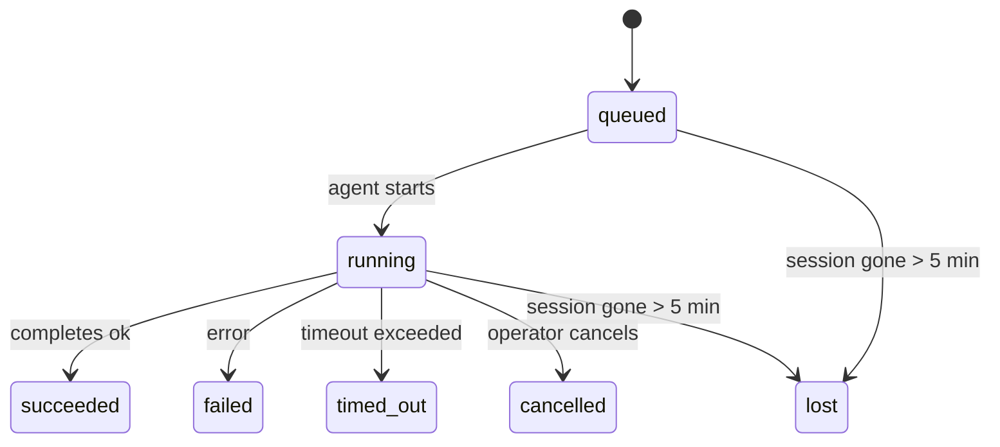

# OpenClaw Documentation Skill

This skill contains the complete documentation for OpenClaw. Use it to answer questions about configuration, setup, architecture, and channels.


## Section: Auth Credential Semantics
Source: https://docs.openclaw.ai/auth-credential-semantics.md

> ## Documentation Index
> Fetch the complete documentation index at: https://docs.openclaw.ai/llms.txt
> Use this file to discover all available pages before exploring further.

# Auth credential semantics

This document defines the canonical credential eligibility and resolution semantics used across:

* `resolveAuthProfileOrder`
* `resolveApiKeyForProfile`
* `models status --probe`
* `doctor-auth`

The goal is to keep selection-time and runtime behavior aligned.

## Stable probe reason codes

* `ok`
* `excluded_by_auth_order`
* `missing_credential`
* `invalid_expires`
* `expired`
* `unresolved_ref`
* `no_model`

## Token credentials

Token credentials (`type: "token"`) support inline `token` and/or `tokenRef`.

### Eligibility rules

1. A token profile is ineligible when both `token` and `tokenRef` are absent.
2. `expires` is optional.
3. If `expires` is present, it must be a finite number greater than `0`.
4. If `expires` is invalid (`NaN`, `0`, negative, non-finite, or wrong type), the profile is ineligible with `invalid_expires`.
5. If `expires` is in the past, the profile is ineligible with `expired`.
6. `tokenRef` does not bypass `expires` validation.

### Resolution rules

1. Resolver semantics match eligibility semantics for `expires`.
2. For eligible profiles, token material may be resolved from inline value or `tokenRef`.
3. Unresolvable refs produce `unresolved_ref` in `models status --probe` output.

## Agent copy portability

Agent auth inheritance is read-through. When an agent has no local profile, it
can resolve profiles from the default/main agent store at runtime without
copying secret material into its own `auth-profiles.json`.

Explicit copy flows, such as `openclaw agents add`, use this portability policy:

* `api_key` profiles are portable unless `copyToAgents: false`.
* `token` profiles are portable unless `copyToAgents: false`.
* `oauth` profiles are not portable by default because refresh tokens can be
  single-use or rotation-sensitive.
* Provider-owned OAuth flows may opt in with `copyToAgents: true` only when
  copying refresh material across agents is known safe.

Non-portable profiles remain available through read-through inheritance unless
the target agent signs in separately and creates its own local profile.

## Config-only auth routes

`auth.profiles` entries with `mode: "aws-sdk"` are routing metadata, not stored
credentials. They are valid when the target provider uses
`models.providers.<id>.auth: "aws-sdk"` or the built-in Amazon Bedrock default
AWS SDK route. These profile ids may appear in `auth.order` and session
overrides even when no matching entry exists in `auth-profiles.json`.

Do not write `type: "aws-sdk"` into `auth-profiles.json`. If a legacy install
has such a marker, `openclaw doctor --fix` moves it to `auth.profiles` and
removes the marker from the credential store.

## Explicit auth order filtering

* When `auth.order.<provider>` or the auth-store order override is set for a
  provider, `models status --probe` only probes profile ids that remain in the
  resolved auth order for that provider.
* A stored profile for that provider that is omitted from the explicit order is
  not silently tried later. Probe output reports it with
  `reasonCode: excluded_by_auth_order` and the detail
  `Excluded by auth.order for this provider.`

## Probe target resolution

* Probe targets can come from auth profiles, environment credentials, or
  `models.json`.
* If a provider has credentials but OpenClaw cannot resolve a probeable model
  candidate for it, `models status --probe` reports `status: no_model` with
  `reasonCode: no_model`.

## External CLI credential discovery

* Runtime-only credentials owned by external CLIs are discovered only when the
  provider, runtime, or auth profile is in scope for the current operation, or
  when a stored local profile for that external source already exists.
* Auth-store callers should choose an explicit external-CLI discovery mode:
  `none` for persisted/plugin auth only, `existing` for refreshing already
  stored external CLI profiles, or `scoped` for a concrete provider/profile set.
* Read-only/status paths pass `allowKeychainPrompt: false`; they use file-backed
  external CLI credentials only and do not read or reuse macOS Keychain results.

## OAuth SecretRef Policy Guard

* SecretRef input is for static credentials only.
* If a profile credential is `type: "oauth"`, SecretRef objects are not supported for that profile credential material.
* If `auth.profiles.<id>.mode` is `"oauth"`, SecretRef-backed `keyRef`/`tokenRef` input for that profile is rejected.
* Violations are hard failures in startup/reload auth resolution paths.

## Legacy-Compatible Messaging

For script compatibility, probe errors keep this first line unchanged:

`Auth profile credentials are missing or expired.`

Human-friendly detail and stable reason codes may be added on subsequent lines.

## Related

* [Secrets management](/gateway/secrets)
* [Auth storage](/concepts/oauth)


---


## Section: Cron Jobs
Source: https://docs.openclaw.ai/automation/cron-jobs.md

> ## Documentation Index
> Fetch the complete documentation index at: https://docs.openclaw.ai/llms.txt
> Use this file to discover all available pages before exploring further.

# Scheduled tasks

Cron is the Gateway's built-in scheduler. It persists jobs, wakes the agent at the right time, and can deliver output back to a chat channel or webhook endpoint.

## Quick start

<Steps>
  <Step title="Add a one-shot reminder">
    ```bash theme={"theme":{"light":"min-light","dark":"min-dark"}}
    openclaw cron add \
      --name "Reminder" \
      --at "2026-02-01T16:00:00Z" \
      --session main \
      --system-event "Reminder: check the cron docs draft" \
      --wake now \
      --delete-after-run
    ```
  </Step>

  <Step title="Check your jobs">
    ```bash theme={"theme":{"light":"min-light","dark":"min-dark"}}
    openclaw cron list
    openclaw cron show <job-id>
    ```
  </Step>

  <Step title="See run history">
    ```bash theme={"theme":{"light":"min-light","dark":"min-dark"}}
    openclaw cron runs --id <job-id>
    ```
  </Step>
</Steps>

## How cron works

* Cron runs **inside the Gateway** process (not inside the model).
* Job definitions persist at `~/.openclaw/cron/jobs.json` so restarts do not lose schedules.
* Runtime execution state persists next to it in `~/.openclaw/cron/jobs-state.json`. If you track cron definitions in git, track `jobs.json` and gitignore `jobs-state.json`.
* After the split, older OpenClaw versions can read `jobs.json` but may treat jobs as fresh because runtime fields now live in `jobs-state.json`.
* When `jobs.json` is edited while the Gateway is running or stopped, OpenClaw compares the changed schedule fields with pending runtime slot metadata and clears stale `nextRunAtMs` values. Pure formatting or key-order-only rewrites preserve the pending slot.
* All cron executions create [background task](/automation/tasks) records.
* On Gateway startup, overdue isolated agent-turn jobs are rescheduled out of the channel-connect window instead of replaying immediately, so Discord/Telegram startup and native-command setup stay responsive after restarts.
* One-shot jobs (`--at`) auto-delete after success by default.
* Isolated cron runs best-effort close tracked browser tabs/processes for their `cron:<jobId>` session when the run completes, so detached browser automation does not leave orphaned processes behind.
* Isolated cron runs that receive the narrow cron self-cleanup grant can still read scheduler status and a self-filtered list of their current job, so status/heartbeat checks can inspect their own schedule without gaining broader cron mutation access.
* Isolated cron runs also guard against stale acknowledgement replies. If the first result is just an interim status update (`on it`, `pulling everything together`, and similar hints) and no descendant subagent run is still responsible for the final answer, OpenClaw re-prompts once for the actual result before delivery.
* Isolated cron runs prefer structured execution-denial metadata from the embedded run, then fall back to known final summary/output markers such as `SYSTEM_RUN_DENIED` and `INVALID_REQUEST`, so a blocked command is not reported as a green run.
* Isolated cron runs also treat run-level agent failures as job errors even when no reply payload is produced, so model/provider failures increment error counters and trigger failure notifications instead of clearing the job as successful.
* When an isolated agent-turn job reaches `timeoutSeconds`, cron aborts the underlying agent run and gives it a short cleanup window. If the run does not drain, Gateway-owned cleanup force-clears that run's session ownership before cron records the timeout, so queued chat work is not left behind a stale processing session.

<a id="maintenance" />

<Note>
  Task reconciliation for cron is runtime-owned first, durable-history-backed second: an active cron task stays live while the cron runtime still tracks that job as running, even if an old child session row still exists. Once the runtime stops owning the job and the 5-minute grace window expires, maintenance checks persisted run logs and job state for the matching `cron:<jobId>:<startedAt>` run. If that durable history shows a terminal result, the task ledger is finalized from it; otherwise Gateway-owned maintenance can mark the task `lost`. Offline CLI audit can recover from durable history, but it does not treat its own empty in-process active-job set as proof that a Gateway-owned cron run is gone.
</Note>

## Schedule types

| Kind    | CLI flag  | Description                                             |
| ------- | --------- | ------------------------------------------------------- |
| `at`    | `--at`    | One-shot timestamp (ISO 8601 or relative like `20m`)    |
| `every` | `--every` | Fixed interval                                          |
| `cron`  | `--cron`  | 5-field or 6-field cron expression with optional `--tz` |

Timestamps without a timezone are treated as UTC. Add `--tz America/New_York` for local wall-clock scheduling.

Recurring top-of-hour expressions are automatically staggered by up to 5 minutes to reduce load spikes. Use `--exact` to force precise timing or `--stagger 30s` for an explicit window.

### Day-of-month and day-of-week use OR logic

Cron expressions are parsed by [croner](https://github.com/Hexagon/croner). When both the day-of-month and day-of-week fields are non-wildcard, croner matches when **either** field matches — not both. This is standard Vixie cron behavior.

```
# Intended: "9 AM on the 15th, only if it's a Monday"
# Actual:   "9 AM on every 15th, AND 9 AM on every Monday"
0 9 15 * 1
```

This fires \~5–6 times per month instead of 0–1 times per month. OpenClaw uses Croner's default OR behavior here. To require both conditions, use Croner's `+` day-of-week modifier (`0 9 15 * +1`) or schedule on one field and guard the other in your job's prompt or command.

## Execution styles

| Style           | `--session` value   | Runs in                  | Best for                        |
| --------------- | ------------------- | ------------------------ | ------------------------------- |
| Main session    | `main`              | Next heartbeat turn      | Reminders, system events        |
| Isolated        | `isolated`          | Dedicated `cron:<jobId>` | Reports, background chores      |
| Current session | `current`           | Bound at creation time   | Context-aware recurring work    |
| Custom session  | `session:custom-id` | Persistent named session | Workflows that build on history |

<AccordionGroup>
  <Accordion title="Main session vs isolated vs custom">
    **Main session** jobs enqueue a system event and optionally wake the heartbeat (`--wake now` or `--wake next-heartbeat`). Those system events do not extend daily/idle reset freshness for the target session. **Isolated** jobs run a dedicated agent turn with a fresh session. **Custom sessions** (`session:xxx`) persist context across runs, enabling workflows like daily standups that build on previous summaries.
  </Accordion>

  <Accordion title="What 'fresh session' means for isolated jobs">
    For isolated jobs, "fresh session" means a new transcript/session id for each run. OpenClaw may carry safe preferences such as thinking/fast/verbose settings, labels, and explicit user-selected model/auth overrides, but it does not inherit ambient conversation context from an older cron row: channel/group routing, send or queue policy, elevation, origin, or ACP runtime binding. Use `current` or `session:<id>` when a recurring job should deliberately build on the same conversation context.
  </Accordion>

  <Accordion title="Runtime cleanup">
    For isolated jobs, runtime teardown now includes best-effort browser cleanup for that cron session. Cleanup failures are ignored so the actual cron result still wins.

    Isolated cron runs also dispose any bundled MCP runtime instances created for the job through the shared runtime-cleanup path. This matches how main-session and custom-session MCP clients are torn down, so isolated cron jobs do not leak stdio child processes or long-lived MCP connections across runs.
  </Accordion>

  <Accordion title="Subagent and Discord delivery">
    When isolated cron runs orchestrate subagents, delivery also prefers the final descendant output over stale parent interim text. If descendants are still running, OpenClaw suppresses that partial parent update instead of announcing it.

    For text-only Discord announce targets, OpenClaw sends the canonical final assistant text once instead of replaying both streamed/intermediate text payloads and the final answer. Media and structured Discord payloads are still delivered as separate payloads so attachments and components are not dropped.
  </Accordion>
</AccordionGroup>

### Payload options for isolated jobs

<ParamField path="--message" type="string" required>
  Prompt text (required for isolated).
</ParamField>

<ParamField path="--model" type="string">
  Model override; uses the selected allowed model for the job.
</ParamField>

<ParamField path="--thinking" type="string">
  Thinking level override.
</ParamField>

<ParamField path="--light-context" type="boolean">
  Skip workspace bootstrap file injection.
</ParamField>

<ParamField path="--tools" type="string">
  Restrict which tools the job can use, for example `--tools exec,read`.
</ParamField>

`--model` uses the selected allowed model as that job's primary model. It is not the same as a chat-session `/model` override: configured fallback chains still apply when the job primary fails. If the requested model is not allowed or cannot be resolved, cron fails the run with an explicit validation error instead of silently falling back to the job's agent/default model selection.

Cron jobs can also carry payload-level `fallbacks`. When present, that list replaces the configured fallback chain for the job. Use `fallbacks: []` in the job payload/API when you want a strict cron run that tries only the selected model. If a job has `--model` but neither payload nor configured fallbacks, OpenClaw passes an explicit empty fallback override so the agent primary is not appended as a hidden extra retry target.

Model-selection precedence for isolated jobs is:

1. Gmail hook model override (when the run came from Gmail and that override is allowed)
2. Per-job payload `model`
3. User-selected stored cron session model override
4. Agent/default model selection

Fast mode follows the resolved live selection too. If the selected model config has `params.fastMode`, isolated cron uses that by default. A stored session `fastMode` override still wins over config in either direction.

If an isolated run hits a live model-switch handoff, cron retries with the switched provider/model and persists that live selection for the active run before retrying. When the switch also carries a new auth profile, cron persists that auth profile override for the active run too. Retries are bounded: after the initial attempt plus 2 switch retries, cron aborts instead of looping forever.

Before an isolated cron run enters the agent runner, OpenClaw checks reachable local provider endpoints for configured `api: "ollama"` and `api: "openai-completions"` providers whose `baseUrl` is loopback, private-network, or `.local`. If that endpoint is down, the run is recorded as `skipped` with a clear provider/model error instead of starting a model call. The endpoint result is cached for 5 minutes, so many due jobs using the same dead local Ollama, vLLM, SGLang, or LM Studio server share one small probe instead of creating a request storm. Skipped provider-preflight runs do not increment execution-error backoff; enable `failureAlert.includeSkipped` when you want repeated skip notifications.

## Delivery and output

| Mode       | What happens                                                        |
| ---------- | ------------------------------------------------------------------- |
| `announce` | Fallback-deliver final text to the target if the agent did not send |
| `webhook`  | POST finished event payload to a URL                                |
| `none`     | No runner fallback delivery                                         |

Use `--announce --channel telegram --to "-1001234567890"` for channel delivery. For Telegram forum topics, use `-1001234567890:topic:123`; direct RPC/config callers may also pass `delivery.threadId` as a string or number. Slack/Discord/Mattermost targets should use explicit prefixes (`channel:<id>`, `user:<id>`). Matrix room IDs are case-sensitive; use the exact room ID or `room:!room:server` form from Matrix.

When announce delivery uses `channel: "last"` or omits `channel`, a provider-prefixed target such as `telegram:123` can select the channel before cron falls back to session history or a single configured channel. Only prefixes advertised by the loaded plugin are provider selectors. If `delivery.channel` is explicit, the target prefix must name the same provider; for example, `channel: "whatsapp"` with `to: "telegram:123"` is rejected instead of letting WhatsApp interpret the Telegram ID as a phone number. Target-kind and service prefixes such as `channel:<id>`, `user:<id>`, `imessage:<handle>`, and `sms:<number>` remain channel-owned target syntax, not provider selectors.

For isolated jobs, chat delivery is shared. If a chat route is available, the agent can use the `message` tool even when the job uses `--no-deliver`. If the agent sends to the configured/current target, OpenClaw skips the fallback announce. Otherwise `announce`, `webhook`, and `none` only control what the runner does with the final reply after the agent turn.

When an agent creates an isolated reminder from an active chat, OpenClaw stores the preserved live delivery target for the fallback announce route. Internal session keys may be lowercase; provider delivery targets are not reconstructed from those keys when current chat context is available.

Implicit announce delivery uses configured channel allowlists to validate and reroute stale targets. DM pairing-store approvals are not fallback automation recipients; set `delivery.to` or configure the channel `allowFrom` entry when a scheduled job should proactively send to a DM.

Failure notifications follow a separate destination path:

* `cron.failureDestination` sets a global default for failure notifications.
* `job.delivery.failureDestination` overrides that per job.
* If neither is set and the job already delivers via `announce`, failure notifications now fall back to that primary announce target.
* `delivery.failureDestination` is only supported on `sessionTarget="isolated"` jobs unless the primary delivery mode is `webhook`.
* `failureAlert.includeSkipped: true` opts a job or global cron alert policy into repeated skipped-run alerts. Skipped runs keep a separate consecutive skip counter, so they do not affect execution-error backoff.

## CLI examples

<Tabs>
  <Tab title="One-shot reminder">
    ```bash theme={"theme":{"light":"min-light","dark":"min-dark"}}
    openclaw cron add \
      --name "Calendar check" \
      --at "20m" \
      --session main \
      --system-event "Next heartbeat: check calendar." \
      --wake now
    ```
  </Tab>

  <Tab title="Recurring isolated job">
    ```bash theme={"theme":{"light":"min-light","dark":"min-dark"}}
    openclaw cron add \
      --name "Morning brief" \
      --cron "0 7 * * *" \
      --tz "America/Los_Angeles" \
      --session isolated \
      --message "Summarize overnight updates." \
      --announce \
      --channel slack \
      --to "channel:C1234567890"
    ```
  </Tab>

  <Tab title="Model and thinking override">
    ```bash theme={"theme":{"light":"min-light","dark":"min-dark"}}
    openclaw cron add \
      --name "Deep analysis" \
      --cron "0 6 * * 1" \
      --tz "America/Los_Angeles" \
      --session isolated \
      --message "Weekly deep analysis of project progress." \
      --model "opus" \
      --thinking high \
      --announce
    ```
  </Tab>
</Tabs>

## Webhooks

Gateway can expose HTTP webhook endpoints for external triggers. Enable in config:

```json5 theme={"theme":{"light":"min-light","dark":"min-dark"}}
{
  hooks: {
    enabled: true,
    token: "shared-secret",
    path: "/hooks",
  },
}
```

### Authentication

Every request must include the hook token via header:

* `Authorization: Bearer <token>` (recommended)
* `x-openclaw-token: <token>`

Query-string tokens are rejected.

<AccordionGroup>
  <Accordion title="POST /hooks/wake">
    Enqueue a system event for the main session:

    ```bash theme={"theme":{"light":"min-light","dark":"min-dark"}}
    curl -X POST http://127.0.0.1:18789/hooks/wake \
      -H 'Authorization: Bearer SECRET' \
      -H 'Content-Type: application/json' \
      -d '{"text":"New email received","mode":"now"}'
    ```

    <ParamField path="text" type="string" required>
      Event description.
    </ParamField>

    <ParamField path="mode" type="string" default="now">
      `now` or `next-heartbeat`.
    </ParamField>
  </Accordion>

  <Accordion title="POST /hooks/agent">
    Run an isolated agent turn:

    ```bash theme={"theme":{"light":"min-light","dark":"min-dark"}}
    curl -X POST http://127.0.0.1:18789/hooks/agent \
      -H 'Authorization: Bearer SECRET' \
      -H 'Content-Type: application/json' \
      -d '{"message":"Summarize inbox","name":"Email","model":"openai/gpt-5.4"}'
    ```

    Fields: `message` (required), `name`, `agentId`, `wakeMode`, `deliver`, `channel`, `to`, `model`, `fallbacks`, `thinking`, `timeoutSeconds`.
  </Accordion>

  <Accordion title="Mapped hooks (POST /hooks/<name>)">
    Custom hook names are resolved via `hooks.mappings` in config. Mappings can transform arbitrary payloads into `wake` or `agent` actions with templates or code transforms.
  </Accordion>
</AccordionGroup>

<Warning>
  Keep hook endpoints behind loopback, tailnet, or trusted reverse proxy.

  * Use a dedicated hook token; do not reuse gateway auth tokens.
  * Keep `hooks.path` on a dedicated subpath; `/` is rejected.
  * Set `hooks.allowedAgentIds` to limit explicit `agentId` routing.
  * Keep `hooks.allowRequestSessionKey=false` unless you require caller-selected sessions.
  * If you enable `hooks.allowRequestSessionKey`, also set `hooks.allowedSessionKeyPrefixes` to constrain allowed session key shapes.
  * Hook payloads are wrapped with safety boundaries by default.
</Warning>

## Gmail PubSub integration

Wire Gmail inbox triggers to OpenClaw via Google PubSub.

<Note>
  **Prerequisites:** `gcloud` CLI, `gog` (gogcli), OpenClaw hooks enabled, Tailscale for the public HTTPS endpoint.
</Note>

### Wizard setup (recommended)

```bash theme={"theme":{"light":"min-light","dark":"min-dark"}}
openclaw webhooks gmail setup --account openclaw@gmail.com
```

This writes `hooks.gmail` config, enables the Gmail preset, and uses Tailscale Funnel for the push endpoint.

### Gateway auto-start

When `hooks.enabled=true` and `hooks.gmail.account` is set, the Gateway starts `gog gmail watch serve` on boot and auto-renews the watch. Set `OPENCLAW_SKIP_GMAIL_WATCHER=1` to opt out.

### Manual one-time setup

<Steps>
  <Step title="Select the GCP project">
    Select the GCP project that owns the OAuth client used by `gog`:

    ```bash theme={"theme":{"light":"min-light","dark":"min-dark"}}
    gcloud auth login
    gcloud config set project <project-id>
    gcloud services enable gmail.googleapis.com pubsub.googleapis.com
    ```
  </Step>

  <Step title="Create topic and grant Gmail push access">
    ```bash theme={"theme":{"light":"min-light","dark":"min-dark"}}
    gcloud pubsub topics create gog-gmail-watch
    gcloud pubsub topics add-iam-policy-binding gog-gmail-watch \
      --member=serviceAccount:gmail-api-push@system.gserviceaccount.com \
      --role=roles/pubsub.publisher
    ```
  </Step>

  <Step title="Start the watch">
    ```bash theme={"theme":{"light":"min-light","dark":"min-dark"}}
    gog gmail watch start \
      --account openclaw@gmail.com \
      --label INBOX \
      --topic projects/<project-id>/topics/gog-gmail-watch
    ```
  </Step>
</Steps>

### Gmail model override

```json5 theme={"theme":{"light":"min-light","dark":"min-dark"}}
{
  hooks: {
    gmail: {
      model: "openrouter/meta-llama/llama-3.3-70b-instruct:free",
      thinking: "off",
    },
  },
}
```

## Managing jobs

```bash theme={"theme":{"light":"min-light","dark":"min-dark"}}
# List all jobs
openclaw cron list

# Show one job, including resolved delivery route
openclaw cron show <jobId>

# Edit a job
openclaw cron edit <jobId> --message "Updated prompt" --model "opus"

# Force run a job now
openclaw cron run <jobId>

# Run only if due
openclaw cron run <jobId> --due

# View run history
openclaw cron runs --id <jobId> --limit 50

# Delete a job
openclaw cron remove <jobId>

# Agent selection (multi-agent setups)
openclaw cron add --name "Ops sweep" --cron "0 6 * * *" --session isolated --message "Check ops queue" --agent ops
openclaw cron edit <jobId> --clear-agent
```

<Note>
  Model override note:

  * `openclaw cron add|edit --model ...` changes the job's selected model.
  * If the model is allowed, that exact provider/model reaches the isolated agent run.
  * If it is not allowed or cannot be resolved, cron fails the run with an explicit validation error.
  * Configured fallback chains still apply because cron `--model` is a job primary, not a session `/model` override.
  * Payload `fallbacks` replaces configured fallbacks for that job; `fallbacks: []` disables fallback and makes the run strict.
  * A plain `--model` with no explicit or configured fallback list does not fall through to the agent primary as a silent extra retry target.
</Note>

## Configuration

```json5 theme={"theme":{"light":"min-light","dark":"min-dark"}}
{
  cron: {
    enabled: true,
    store: "~/.openclaw/cron/jobs.json",
    maxConcurrentRuns: 1,
    retry: {
      maxAttempts: 3,
      backoffMs: [60000, 120000, 300000],
      retryOn: ["rate_limit", "overloaded", "network", "server_error"],
    },
    webhookToken: "replace-with-dedicated-webhook-token",
    sessionRetention: "24h",
    runLog: { maxBytes: "2mb", keepLines: 2000 },
  },
}
```

`maxConcurrentRuns` limits both scheduled cron dispatch and isolated agent-turn execution. Isolated cron agent turns use the queue's dedicated `cron-nested` execution lane internally, so raising this value lets independent cron LLM runs progress in parallel instead of only starting their outer cron wrappers. The shared non-cron `nested` lane is not widened by this setting.

The runtime state sidecar is derived from `cron.store`: a `.json` store such as `~/clawd/cron/jobs.json` uses `~/clawd/cron/jobs-state.json`, while a store path without a `.json` suffix appends `-state.json`.

If you hand-edit `jobs.json`, leave `jobs-state.json` out of source control. OpenClaw uses that sidecar for pending slots, active markers, last-run metadata, and the schedule identity that tells the scheduler when an externally edited job needs a fresh `nextRunAtMs`.

Disable cron: `cron.enabled: false` or `OPENCLAW_SKIP_CRON=1`.

<AccordionGroup>
  <Accordion title="Retry behavior">
    **One-shot retry**: transient errors (rate limit, overload, network, server error) retry up to 3 times with exponential backoff. Permanent errors disable immediately.

    **Recurring retry**: exponential backoff (30s to 60m) between retries. Backoff resets after the next successful run.
  </Accordion>

  <Accordion title="Maintenance">
    `cron.sessionRetention` (default `24h`) prunes isolated run-session entries. `cron.runLog.maxBytes` / `cron.runLog.keepLines` auto-prune run-log files.
  </Accordion>
</AccordionGroup>

## Troubleshooting

### Command ladder

```bash theme={"theme":{"light":"min-light","dark":"min-dark"}}
openclaw status
openclaw gateway status
openclaw cron status
openclaw cron list
openclaw cron runs --id <jobId> --limit 20
openclaw system heartbeat last
openclaw logs --follow
openclaw doctor
```

<AccordionGroup>
  <Accordion title="Cron not firing">
    * Check `cron.enabled` and `OPENCLAW_SKIP_CRON` env var.
    * Confirm the Gateway is running continuously.
    * For `cron` schedules, verify timezone (`--tz`) vs the host timezone.
    * `reason: not-due` in run output means manual run was checked with `openclaw cron run <jobId> --due` and the job was not due yet.
  </Accordion>

  <Accordion title="Cron fired but no delivery">
    * Delivery mode `none` means no runner fallback send is expected. The agent can still send directly with the `message` tool when a chat route is available.
    * Delivery target missing/invalid (`channel`/`to`) means outbound was skipped.
    * For Matrix, copied or legacy jobs with lowercased `delivery.to` room IDs can fail because Matrix room IDs are case-sensitive. Edit the job to the exact `!room:server` or `room:!room:server` value from Matrix.
    * Channel auth errors (`unauthorized`, `Forbidden`) mean delivery was blocked by credentials.
    * If the isolated run returns only the silent token (`NO_REPLY` / `no_reply`), OpenClaw suppresses direct outbound delivery and also suppresses the fallback queued summary path, so nothing is posted back to chat.
    * If the agent should message the user itself, check that the job has a usable route (`channel: "last"` with a previous chat, or an explicit channel/target).
  </Accordion>

  <Accordion title="Cron or heartbeat appears to prevent /new-style rollover">
    * Daily and idle reset freshness is not based on `updatedAt`; see [Session management](/concepts/session#session-lifecycle).
    * Cron wakeups, heartbeat runs, exec notifications, and gateway bookkeeping may update the session row for routing/status, but they do not extend `sessionStartedAt` or `lastInteractionAt`.
    * For legacy rows created before those fields existed, OpenClaw can recover `sessionStartedAt` from the transcript JSONL session header when the file is still available. Legacy idle rows without `lastInteractionAt` use that recovered start time as their idle baseline.
  </Accordion>

  <Accordion title="Timezone gotchas">
    * Cron without `--tz` uses the gateway host timezone.
    * `at` schedules without timezone are treated as UTC.
    * Heartbeat `activeHours` uses configured timezone resolution.
  </Accordion>
</AccordionGroup>

## Related

* [Automation & Tasks](/automation) — all automation mechanisms at a glance
* [Background Tasks](/automation/tasks) — task ledger for cron executions
* [Heartbeat](/gateway/heartbeat) — periodic main-session turns
* [Timezone](/concepts/timezone) — timezone configuration


---


## Section: Hooks
Source: https://docs.openclaw.ai/automation/hooks.md

> ## Documentation Index
> Fetch the complete documentation index at: https://docs.openclaw.ai/llms.txt
> Use this file to discover all available pages before exploring further.

# Hooks

Hooks are small scripts that run when something happens inside the Gateway. They can be discovered from directories and inspected with `openclaw hooks`. The Gateway loads internal hooks only after you enable hooks or configure at least one hook entry, hook pack, legacy handler, or extra hook directory.

There are two kinds of hooks in OpenClaw:

* **Internal hooks** (this page): run inside the Gateway when agent events fire, like `/new`, `/reset`, `/stop`, or lifecycle events.
* **Webhooks**: external HTTP endpoints that let other systems trigger work in OpenClaw. See [Webhooks](/automation/cron-jobs#webhooks).

Hooks can also be bundled inside plugins. `openclaw hooks list` shows both standalone hooks and plugin-managed hooks.

## Quick start

```bash theme={"theme":{"light":"min-light","dark":"min-dark"}}
# List available hooks
openclaw hooks list

# Enable a hook
openclaw hooks enable session-memory

# Check hook status
openclaw hooks check

# Get detailed information
openclaw hooks info session-memory
```

## Event types

| Event                    | When it fires                                              |
| ------------------------ | ---------------------------------------------------------- |
| `command:new`            | `/new` command issued                                      |
| `command:reset`          | `/reset` command issued                                    |
| `command:stop`           | `/stop` command issued                                     |
| `command`                | Any command event (general listener)                       |
| `session:compact:before` | Before compaction summarizes history                       |
| `session:compact:after`  | After compaction completes                                 |
| `session:patch`          | When session properties are modified                       |
| `agent:bootstrap`        | Before workspace bootstrap files are injected              |
| `gateway:startup`        | After channels start and hooks are loaded                  |
| `gateway:shutdown`       | When gateway shutdown begins                               |
| `gateway:pre-restart`    | Before an expected gateway restart                         |
| `message:received`       | Inbound message from any channel                           |
| `message:transcribed`    | After audio transcription completes                        |
| `message:preprocessed`   | After media and link preprocessing completes or is skipped |
| `message:sent`           | Outbound message delivered                                 |

## Writing hooks

### Hook structure

Each hook is a directory containing two files:

```
my-hook/
├── HOOK.md          # Metadata + documentation
└── handler.ts       # Handler implementation
```

### HOOK.md format

```markdown theme={"theme":{"light":"min-light","dark":"min-dark"}}
---
name: my-hook
description: "Short description of what this hook does"
metadata:
  { "openclaw": { "emoji": "🔗", "events": ["command:new"], "requires": { "bins": ["node"] } } }
---

# My Hook

Detailed documentation goes here.
```

**Metadata fields** (`metadata.openclaw`):

| Field      | Description                                          |
| ---------- | ---------------------------------------------------- |
| `emoji`    | Display emoji for CLI                                |
| `events`   | Array of events to listen for                        |
| `export`   | Named export to use (defaults to `"default"`)        |
| `os`       | Required platforms (e.g., `["darwin", "linux"]`)     |
| `requires` | Required `bins`, `anyBins`, `env`, or `config` paths |
| `always`   | Bypass eligibility checks (boolean)                  |
| `install`  | Installation methods                                 |

### Handler implementation

```typescript theme={"theme":{"light":"min-light","dark":"min-dark"}}
const handler = async (event) => {
  if (event.type !== "command" || event.action !== "new") {
    return;
  }

  console.log(`[my-hook] New command triggered`);
  // Your logic here

  // Optionally send message to user
  event.messages.push("Hook executed!");
};

export default handler;
```

Each event includes: `type`, `action`, `sessionKey`, `timestamp`, `messages` (push to send to user), and `context` (event-specific data). Agent and tool plugin hook contexts can also include `trace`, a read-only W3C-compatible diagnostic trace context that plugins may pass into structured logs for OTEL correlation.

### Event context highlights

**Command events** (`command:new`, `command:reset`): `context.sessionEntry`, `context.previousSessionEntry`, `context.commandSource`, `context.workspaceDir`, `context.cfg`.

**Message events** (`message:received`): `context.from`, `context.content`, `context.channelId`, `context.metadata` (provider-specific data including `senderId`, `senderName`, `guildId`). `context.content` prefers a nonblank command body for command-like messages, then falls back to the raw inbound body and generic body; it does not include agent-only enrichment such as thread history or link summaries.

**Message events** (`message:sent`): `context.to`, `context.content`, `context.success`, `context.channelId`.

**Message events** (`message:transcribed`): `context.transcript`, `context.from`, `context.channelId`, `context.mediaPath`.

**Message events** (`message:preprocessed`): `context.bodyForAgent` (final enriched body), `context.from`, `context.channelId`.

**Bootstrap events** (`agent:bootstrap`): `context.bootstrapFiles` (mutable array), `context.agentId`.

**Session patch events** (`session:patch`): `context.sessionEntry`, `context.patch` (only changed fields), `context.cfg`. Only privileged clients can trigger patch events.

**Compaction events**: `session:compact:before` includes `messageCount`, `tokenCount`. `session:compact:after` adds `compactedCount`, `summaryLength`, `tokensBefore`, `tokensAfter`.

`command:stop` observes the user issuing `/stop`; it is cancellation/command
lifecycle, not an agent-finalization gate. Plugins that need to inspect a
natural final answer and ask the agent for one more pass should use the typed
plugin hook `before_agent_finalize` instead. See [Plugin hooks](/plugins/hooks).

**Gateway lifecycle events**: `gateway:shutdown` includes `reason` and `restartExpectedMs` and fires when gateway shutdown begins. `gateway:pre-restart` includes the same context but only fires when shutdown is part of an expected restart and a finite `restartExpectedMs` value is supplied. During shutdown, each lifecycle hook wait is best-effort and bounded so shutdown continues if a handler stalls.

## Hook discovery

Hooks are discovered from these directories, in order of increasing override precedence:

1. **Bundled hooks**: shipped with OpenClaw
2. **Plugin hooks**: hooks bundled inside installed plugins
3. **Managed hooks**: `~/.openclaw/hooks/` (user-installed, shared across workspaces). Extra directories from `hooks.internal.load.extraDirs` share this precedence.
4. **Workspace hooks**: `<workspace>/hooks/` (per-agent, disabled by default until explicitly enabled)

Workspace hooks can add new hook names but cannot override bundled, managed, or plugin-provided hooks with the same name.

The Gateway skips internal hook discovery on startup until internal hooks are configured. Enable a bundled or managed hook with `openclaw hooks enable <name>`, install a hook pack, or set `hooks.internal.enabled=true` to opt in. When you enable one named hook, the Gateway loads only that hook's handler; `hooks.internal.enabled=true`, extra hook directories, and legacy handlers opt into broad discovery.

### Hook packs

Hook packs are npm packages that export hooks via `openclaw.hooks` in `package.json`. Install with:

```bash theme={"theme":{"light":"min-light","dark":"min-dark"}}
openclaw plugins install <path-or-spec>
```

Npm specs are registry-only (package name + optional exact version or dist-tag). Git/URL/file specs and semver ranges are rejected.

## Bundled hooks

| Hook                  | Events                                            | What it does                                                   |
| --------------------- | ------------------------------------------------- | -------------------------------------------------------------- |
| session-memory        | `command:new`, `command:reset`                    | Saves session context to `<workspace>/memory/`                 |
| bootstrap-extra-files | `agent:bootstrap`                                 | Injects additional bootstrap files from glob patterns          |
| command-logger        | `command`                                         | Logs all commands to `~/.openclaw/logs/commands.log`           |
| compaction-notifier   | `session:compact:before`, `session:compact:after` | Sends visible chat notices when session compaction starts/ends |
| boot-md               | `gateway:startup`                                 | Runs `BOOT.md` when the gateway starts                         |

Enable any bundled hook:

```bash theme={"theme":{"light":"min-light","dark":"min-dark"}}
openclaw hooks enable <hook-name>
```

<a id="session-memory" />

### session-memory details

Extracts the last 15 user/assistant messages and saves to `<workspace>/memory/YYYY-MM-DD-HHMM.md` using the host local date. Memory capture runs in the background so `/new` and `/reset` acknowledgements are not delayed by transcript reads or optional slug generation. Set `hooks.internal.entries.session-memory.llmSlug: true` to generate descriptive filename slugs with the configured model. Requires `workspace.dir` to be configured.

<a id="bootstrap-extra-files" />

### bootstrap-extra-files config

```json theme={"theme":{"light":"min-light","dark":"min-dark"}}
{
  "hooks": {
    "internal": {
      "entries": {
        "bootstrap-extra-files": {
          "enabled": true,
          "paths": ["packages/*/AGENTS.md", "packages/*/TOOLS.md"]
        }
      }
    }
  }
}
```

Paths resolve relative to workspace. Only recognized bootstrap basenames are loaded (`AGENTS.md`, `SOUL.md`, `TOOLS.md`, `IDENTITY.md`, `USER.md`, `HEARTBEAT.md`, `BOOTSTRAP.md`, `MEMORY.md`).

<a id="command-logger" />

### command-logger details

Logs every slash command to `~/.openclaw/logs/commands.log`.

<a id="compaction-notifier" />

### compaction-notifier details

Sends short status messages into the current conversation when OpenClaw starts and finishes compacting the session transcript. This makes long turns less confusing on chat surfaces because the user can see that the assistant is summarizing context and will continue after compaction.

<a id="boot-md" />

### boot-md details

Runs `BOOT.md` from the active workspace when the gateway starts.

## Plugin hooks

Plugins can register typed hooks through the Plugin SDK for deeper integration:
intercepting tool calls, modifying prompts, controlling message flow, and more.
Use plugin hooks when you need `before_tool_call`, `before_agent_reply`,
`before_install`, or other in-process lifecycle hooks.

For the complete plugin hook reference, see [Plugin hooks](/plugins/hooks).

## Configuration

```json theme={"theme":{"light":"min-light","dark":"min-dark"}}
{
  "hooks": {
    "internal": {
      "enabled": true,
      "entries": {
        "session-memory": { "enabled": true },
        "command-logger": { "enabled": false }
      }
    }
  }
}
```

Per-hook environment variables:

```json theme={"theme":{"light":"min-light","dark":"min-dark"}}
{
  "hooks": {
    "internal": {
      "entries": {
        "my-hook": {
          "enabled": true,
          "env": { "MY_CUSTOM_VAR": "value" }
        }
      }
    }
  }
}
```

Extra hook directories:

```json theme={"theme":{"light":"min-light","dark":"min-dark"}}
{
  "hooks": {
    "internal": {
      "load": {
        "extraDirs": ["/path/to/more/hooks"]
      }
    }
  }
}
```

<Note>
  The legacy `hooks.internal.handlers` array config format is still supported for backwards compatibility, but new hooks should use the discovery-based system.
</Note>

## CLI reference

```bash theme={"theme":{"light":"min-light","dark":"min-dark"}}
# List all hooks (add --eligible, --verbose, or --json)
openclaw hooks list

# Show detailed info about a hook
openclaw hooks info <hook-name>

# Show eligibility summary
openclaw hooks check

# Enable/disable
openclaw hooks enable <hook-name>
openclaw hooks disable <hook-name>
```

## Best practices

* **Keep handlers fast.** Hooks run during command processing. Fire-and-forget heavy work with `void processInBackground(event)`.
* **Handle errors gracefully.** Wrap risky operations in try/catch; do not throw so other handlers can run.
* **Filter events early.** Return immediately if the event type/action is not relevant.
* **Use specific event keys.** Prefer `"events": ["command:new"]` over `"events": ["command"]` to reduce overhead.

## Troubleshooting

### Hook not discovered

```bash theme={"theme":{"light":"min-light","dark":"min-dark"}}
# Verify directory structure
ls -la ~/.openclaw/hooks/my-hook/
# Should show: HOOK.md, handler.ts

# List all discovered hooks
openclaw hooks list
```

### Hook not eligible

```bash theme={"theme":{"light":"min-light","dark":"min-dark"}}
openclaw hooks info my-hook
```

Check for missing binaries (PATH), environment variables, config values, or OS compatibility.

### Hook not executing

1. Verify the hook is enabled: `openclaw hooks list`
2. Restart your gateway process so hooks reload.
3. Check gateway logs: `./scripts/clawlog.sh | grep hook`

## Related

* [CLI Reference: hooks](/cli/hooks)
* [Webhooks](/automation/cron-jobs#webhooks)
* [Plugin hooks](/plugins/hooks) — in-process plugin lifecycle hooks
* [Configuration](/gateway/configuration-reference#hooks)


---


## Section: Index
Source: https://docs.openclaw.ai/automation/index.md

> ## Documentation Index
> Fetch the complete documentation index at: https://docs.openclaw.ai/llms.txt
> Use this file to discover all available pages before exploring further.

# Automation and tasks

OpenClaw runs work in the background through tasks, scheduled jobs, inferred
commitments, event hooks, and standing instructions. This page helps you choose
the right mechanism and understand how they fit together.

## Quick decision guide



| Use case                                | Recommended            | Why                                              |
| --------------------------------------- | ---------------------- | ------------------------------------------------ |
| Send daily report at 9 AM sharp         | Scheduled Tasks (Cron) | Exact timing, isolated execution                 |
| Remind me in 20 minutes                 | Scheduled Tasks (Cron) | One-shot with precise timing (`--at`)            |
| Run weekly deep analysis                | Scheduled Tasks (Cron) | Standalone task, can use different model         |
| Check inbox every 30 min                | Heartbeat              | Batches with other checks, context-aware         |
| Monitor calendar for upcoming events    | Heartbeat              | Natural fit for periodic awareness               |
| Check in after a mentioned interview    | Inferred Commitments   | Memory-like follow-up, no exact reminder request |
| Gentle care check-in after user context | Inferred Commitments   | Scoped to the same agent and channel             |
| Inspect status of a subagent or ACP run | Background Tasks       | Tasks ledger tracks all detached work            |
| Audit what ran and when                 | Background Tasks       | `openclaw tasks list` and `openclaw tasks audit` |
| Multi-step research then summarize      | Task Flow              | Durable orchestration with revision tracking     |
| Run a script on session reset           | Hooks                  | Event-driven, fires on lifecycle events          |
| Execute code on every tool call         | Plugin hooks           | In-process hooks can intercept tool calls        |
| Always check compliance before replying | Standing Orders        | Injected into every session automatically        |

### Scheduled Tasks (Cron) vs Heartbeat

| Dimension       | Scheduled Tasks (Cron)              | Heartbeat                             |
| --------------- | ----------------------------------- | ------------------------------------- |
| Timing          | Exact (cron expressions, one-shot)  | Approximate (default every 30 min)    |
| Session context | Fresh (isolated) or shared          | Full main-session context             |
| Task records    | Always created                      | Never created                         |
| Delivery        | Channel, webhook, or silent         | Inline in main session                |
| Best for        | Reports, reminders, background jobs | Inbox checks, calendar, notifications |

Use Scheduled Tasks (Cron) when you need precise timing or isolated execution. Use Heartbeat when the work benefits from full session context and approximate timing is fine.

## Core concepts

### Scheduled tasks (cron)

Cron is the Gateway's built-in scheduler for precise timing. It persists jobs, wakes the agent at the right time, and can deliver output to a chat channel or webhook endpoint. Supports one-shot reminders, recurring expressions, and inbound webhook triggers.

See [Scheduled Tasks](/automation/cron-jobs).

### Tasks

The background task ledger tracks all detached work: ACP runs, subagent spawns, isolated cron executions, and CLI operations. Tasks are records, not schedulers. Use `openclaw tasks list` and `openclaw tasks audit` to inspect them.

See [Background Tasks](/automation/tasks).

### Inferred commitments

Commitments are opt-in, short-lived follow-up memories. OpenClaw infers them
from normal conversations, scopes them to the same agent and channel, and
delivers due check-ins through heartbeat. Exact user-requested reminders still
belong to cron.

See [Inferred Commitments](/concepts/commitments).

### Task Flow

Task Flow is the flow orchestration substrate above background tasks. It manages durable multi-step flows with managed and mirrored sync modes, revision tracking, and `openclaw tasks flow list|show|cancel` for inspection.

See [Task Flow](/automation/taskflow).

### Standing orders

Standing orders grant the agent permanent operating authority for defined programs. They live in workspace files (typically `AGENTS.md`) and are injected into every session. Combine with cron for time-based enforcement.

See [Standing Orders](/automation/standing-orders).

### Hooks

Internal hooks are event-driven scripts triggered by agent lifecycle events
(`/new`, `/reset`, `/stop`), session compaction, gateway startup, and message
flow. They are automatically discovered from directories and can be managed
with `openclaw hooks`. For in-process tool-call interception, use
[Plugin hooks](/plugins/hooks).

See [Hooks](/automation/hooks).

### Heartbeat

Heartbeat is a periodic main-session turn (default every 30 minutes). It batches multiple checks (inbox, calendar, notifications) in one agent turn with full session context. Heartbeat turns do not create task records and do not extend daily/idle session reset freshness. Use `HEARTBEAT.md` for a small checklist, or a `tasks:` block when you want due-only periodic checks inside heartbeat itself. Empty heartbeat files skip as `empty-heartbeat-file`; due-only task mode skips as `no-tasks-due`. Heartbeats defer while cron work is active or queued, and `heartbeat.skipWhenBusy` can also defer them while subagent or nested lanes are busy.

See [Heartbeat](/gateway/heartbeat).

## How they work together

* **Cron** handles precise schedules (daily reports, weekly reviews) and one-shot reminders. All cron executions create task records.
* **Heartbeat** handles routine monitoring (inbox, calendar, notifications) in one batched turn every 30 minutes.
* **Hooks** react to specific events (session resets, compaction, message flow) with custom scripts. Plugin hooks cover tool calls.
* **Standing orders** give the agent persistent context and authority boundaries.
* **Task Flow** coordinates multi-step flows above individual tasks.
* **Tasks** automatically track all detached work so you can inspect and audit it.

## Related

* [Scheduled Tasks](/automation/cron-jobs) — precise scheduling and one-shot reminders
* [Inferred Commitments](/concepts/commitments) — memory-like follow-up check-ins
* [Background Tasks](/automation/tasks) — task ledger for all detached work
* [Task Flow](/automation/taskflow) — durable multi-step flow orchestration
* [Hooks](/automation/hooks) — event-driven lifecycle scripts
* [Plugin hooks](/plugins/hooks) — in-process tool, prompt, message, and lifecycle hooks
* [Standing Orders](/automation/standing-orders) — persistent agent instructions
* [Heartbeat](/gateway/heartbeat) — periodic main-session turns
* [Configuration Reference](/gateway/configuration-reference) — all config keys


---


## Section: Standing Orders
Source: https://docs.openclaw.ai/automation/standing-orders.md

> ## Documentation Index
> Fetch the complete documentation index at: https://docs.openclaw.ai/llms.txt
> Use this file to discover all available pages before exploring further.

# Standing orders

Standing orders grant your agent **permanent operating authority** for defined programs. Instead of giving individual task instructions each time, you define programs with clear scope, triggers, and escalation rules - and the agent executes autonomously within those boundaries.

This is the difference between telling your assistant "send the weekly report" every Friday vs. granting standing authority: "You own the weekly report. Compile it every Friday, send it, and only escalate if something looks wrong."

## Why standing orders

**Without standing orders:**

* You must prompt the agent for every task
* The agent sits idle between requests
* Routine work gets forgotten or delayed
* You become the bottleneck

**With standing orders:**

* The agent executes autonomously within defined boundaries
* Routine work happens on schedule without prompting
* You only get involved for exceptions and approvals
* The agent fills idle time productively

## How they work

Standing orders are defined in your [agent workspace](/concepts/agent-workspace) files. The recommended approach is to include them directly in `AGENTS.md` (which is auto-injected every session) so the agent always has them in context. For larger configurations, you can also place them in a dedicated file like `standing-orders.md` and reference it from `AGENTS.md`.

Each program specifies:

1. **Scope** - what the agent is authorized to do
2. **Triggers** - when to execute (schedule, event, or condition)
3. **Approval gates** - what requires human sign-off before acting
4. **Escalation rules** - when to stop and ask for help

The agent loads these instructions every session via the workspace bootstrap files (see [Agent Workspace](/concepts/agent-workspace) for the full list of auto-injected files) and executes against them, combined with [cron jobs](/automation/cron-jobs) for time-based enforcement.

<Tip>
  Put standing orders in `AGENTS.md` to guarantee they're loaded every session. The workspace bootstrap automatically injects `AGENTS.md`, `SOUL.md`, `TOOLS.md`, `IDENTITY.md`, `USER.md`, `HEARTBEAT.md`, `BOOTSTRAP.md`, and `MEMORY.md` - but not arbitrary files in subdirectories.
</Tip>

## Anatomy of a standing order

```markdown theme={"theme":{"light":"min-light","dark":"min-dark"}}
## Program: Weekly Status Report

**Authority:** Compile data, generate report, deliver to stakeholders
**Trigger:** Every Friday at 4 PM (enforced via cron job)
**Approval gate:** None for standard reports. Flag anomalies for human review.
**Escalation:** If data source is unavailable or metrics look unusual (>2σ from norm)

### Execution steps

1. Pull metrics from configured sources
2. Compare to prior week and targets
3. Generate report in Reports/weekly/YYYY-MM-DD.md
4. Deliver summary via configured channel
5. Log completion to Agent/Logs/

### What NOT to do

- Do not send reports to external parties
- Do not modify source data
- Do not skip delivery if metrics look bad - report accurately
```

## Standing orders plus cron jobs

Standing orders define **what** the agent is authorized to do. [Cron jobs](/automation/cron-jobs) define **when** it happens. They work together:

```
Standing Order: "You own the daily inbox triage"
    ↓
Cron Job (8 AM daily): "Execute inbox triage per standing orders"
    ↓
Agent: Reads standing orders → executes steps → reports results
```

The cron job prompt should reference the standing order rather than duplicating it:

```bash theme={"theme":{"light":"min-light","dark":"min-dark"}}
openclaw cron add \
  --name daily-inbox-triage \
  --cron "0 8 * * 1-5" \
  --tz America/New_York \
  --timeout-seconds 300 \
  --announce \
  --channel imessage \
  --to "+1XXXXXXXXXX" \
  --message "Execute daily inbox triage per standing orders. Check mail for new alerts. Parse, categorize, and persist each item. Report summary to owner. Escalate unknowns."
```

## Examples

### Example 1: content and social media (weekly cycle)

```markdown theme={"theme":{"light":"min-light","dark":"min-dark"}}
## Program: Content & Social Media

**Authority:** Draft content, schedule posts, compile engagement reports
**Approval gate:** All posts require owner review for first 30 days, then standing approval
**Trigger:** Weekly cycle (Monday review → mid-week drafts → Friday brief)

### Weekly cycle

- **Monday:** Review platform metrics and audience engagement
- **Tuesday-Thursday:** Draft social posts, create blog content
- **Friday:** Compile weekly marketing brief → deliver to owner

### Content rules

- Voice must match the brand (see SOUL.md or brand voice guide)
- Never identify as AI in public-facing content
- Include metrics when available
- Focus on value to audience, not self-promotion
```

### Example 2: finance operations (event-triggered)

```markdown theme={"theme":{"light":"min-light","dark":"min-dark"}}
## Program: Financial Processing

**Authority:** Process transaction data, generate reports, send summaries
**Approval gate:** None for analysis. Recommendations require owner approval.
**Trigger:** New data file detected OR scheduled monthly cycle

### When new data arrives

1. Detect new file in designated input directory
2. Parse and categorize all transactions
3. Compare against budget targets
4. Flag: unusual items, threshold breaches, new recurring charges
5. Generate report in designated output directory
6. Deliver summary to owner via configured channel

### Escalation rules

- Single item > $500: immediate alert
- Category > budget by 20%: flag in report
- Unrecognizable transaction: ask owner for categorization
- Failed processing after 2 retries: report failure, do not guess
```

### Example 3: monitoring and alerts (continuous)

```markdown theme={"theme":{"light":"min-light","dark":"min-dark"}}
## Program: System Monitoring

**Authority:** Check system health, restart services, send alerts
**Approval gate:** Restart services automatically. Escalate if restart fails twice.
**Trigger:** Every heartbeat cycle

### Checks

- Service health endpoints responding
- Disk space above threshold
- Pending tasks not stale (>24 hours)
- Delivery channels operational

### Response matrix

| Condition        | Action                   | Escalate?                |
| ---------------- | ------------------------ | ------------------------ |
| Service down     | Restart automatically    | Only if restart fails 2x |
| Disk space < 10% | Alert owner              | Yes                      |
| Stale task > 24h | Remind owner             | No                       |
| Channel offline  | Log and retry next cycle | If offline > 2 hours     |
```

## Execute-verify-report pattern

Standing orders work best when combined with strict execution discipline. Every task in a standing order should follow this loop:

1. **Execute** - Do the actual work (don't just acknowledge the instruction)
2. **Verify** - Confirm the result is correct (file exists, message delivered, data parsed)
3. **Report** - Tell the owner what was done and what was verified

```markdown theme={"theme":{"light":"min-light","dark":"min-dark"}}
### Execution rules

- Every task follows Execute-Verify-Report. No exceptions.
- "I'll do that" is not execution. Do it, then report.
- "Done" without verification is not acceptable. Prove it.
- If execution fails: retry once with adjusted approach.
- If still fails: report failure with diagnosis. Never silently fail.
- Never retry indefinitely - 3 attempts max, then escalate.
```

This pattern prevents the most common agent failure mode: acknowledging a task without completing it.

## Multi-program architecture

For agents managing multiple concerns, organize standing orders as separate programs with clear boundaries:

```markdown theme={"theme":{"light":"min-light","dark":"min-dark"}}
## Program 1: [Domain A] (Weekly)

...

## Program 2: [Domain B] (Monthly + On-Demand)

...

## Program 3: [Domain C] (As-Needed)

...

## Escalation Rules (All Programs)

- [Common escalation criteria]
- [Approval gates that apply across programs]
```

Each program should have:

* Its own **trigger cadence** (weekly, monthly, event-driven, continuous)
* Its own **approval gates** (some programs need more oversight than others)
* Clear **boundaries** (the agent should know where one program ends and another begins)

## Best practices

### Do

* Start with narrow authority and expand as trust builds
* Define explicit approval gates for high-risk actions
* Include "What NOT to do" sections - boundaries matter as much as permissions
* Combine with cron jobs for reliable time-based execution
* Review agent logs weekly to verify standing orders are being followed
* Update standing orders as your needs evolve - they're living documents

### Avoid

* Grant broad authority on day one ("do whatever you think is best")
* Skip escalation rules - every program needs a "when to stop and ask" clause
* Assume the agent will remember verbal instructions - put everything in the file
* Mix concerns in a single program - separate programs for separate domains
* Forget to enforce with cron jobs - standing orders without triggers become suggestions

## Related

* [Automation and tasks](/automation): all automation mechanisms at a glance.
* [Cron jobs](/automation/cron-jobs): schedule enforcement for standing orders.
* [Hooks](/automation/hooks): event-driven scripts for agent lifecycle events.
* [Webhooks](/automation/cron-jobs#webhooks): inbound HTTP event triggers.
* [Agent workspace](/concepts/agent-workspace): where standing orders live, including the full list of auto-injected bootstrap files (`AGENTS.md`, `SOUL.md`, etc.).


---


## Section: Taskflow
Source: https://docs.openclaw.ai/automation/taskflow.md

> ## Documentation Index
> Fetch the complete documentation index at: https://docs.openclaw.ai/llms.txt
> Use this file to discover all available pages before exploring further.

# Task flow

Task Flow is the flow orchestration substrate that sits above [background tasks](/automation/tasks). It manages durable multi-step flows with their own state, revision tracking, and sync semantics while individual tasks remain the unit of detached work.

## When to use Task Flow

Use Task Flow when work spans multiple sequential or branching steps and you need durable progress tracking across gateway restarts. For single background operations, a plain [task](/automation/tasks) is sufficient.

| Scenario                              | Use                  |
| ------------------------------------- | -------------------- |
| Single background job                 | Plain task           |
| Multi-step pipeline (A then B then C) | Task Flow (managed)  |
| Observe externally created tasks      | Task Flow (mirrored) |
| One-shot reminder                     | Cron job             |

## Reliable scheduled workflow pattern

For recurring workflows such as market intelligence briefings, treat the schedule, orchestration, and reliability checks as separate layers:

1. Use [Scheduled Tasks](/automation/cron-jobs) for timing.
2. Use a persistent cron session when the workflow should build on prior context.
3. Use [Lobster](/tools/lobster) for deterministic steps, approval gates, and resume tokens.
4. Use Task Flow to track the multi-step run across child tasks, waits, retries, and gateway restarts.

Example cron shape:

```bash theme={"theme":{"light":"min-light","dark":"min-dark"}}
openclaw cron add \
  --name "Market intelligence brief" \
  --cron "0 7 * * 1-5" \
  --tz "America/New_York" \
  --session session:market-intel \
  --message "Run the market-intel Lobster workflow. Verify source freshness before summarizing." \
  --announce \
  --channel slack \
  --to "channel:C1234567890"
```

Use `session:<id>` instead of `isolated` when the recurring workflow needs deliberate history, previous run summaries, or standing context. Use `isolated` when each run should start fresh and all required state is explicit in the workflow.

Inside the workflow, put reliability checks before the LLM summary step:

```yaml theme={"theme":{"light":"min-light","dark":"min-dark"}}
name: market-intel-brief
steps:
  - id: preflight
    command: market-intel check --json
  - id: collect
    command: market-intel collect --json
    stdin: $preflight.json
  - id: summarize
    command: market-intel summarize --json
    stdin: $collect.json
  - id: approve
    command: market-intel deliver --preview
    stdin: $summarize.json
    approval: required
  - id: deliver
    command: market-intel deliver --execute
    stdin: $summarize.json
    condition: $approve.approved
```

Recommended preflight checks:

* Browser availability and profile choice, for example `openclaw` for managed state or `user` when a signed-in Chrome session is required. See [Browser](/tools/browser).
* API credentials and quota for each source.
* Network reachability for required endpoints.
* Required tools enabled for the agent, such as `lobster`, `browser`, and `llm-task`.
* Failure destination configured for cron so preflight failures are visible. See [Scheduled Tasks](/automation/cron-jobs#delivery-and-output).

Recommended data provenance fields for every collected item:

```json theme={"theme":{"light":"min-light","dark":"min-dark"}}
{
  "sourceUrl": "https://example.com/report",
  "retrievedAt": "2026-04-24T12:00:00Z",
  "asOf": "2026-04-24",
  "title": "Example report",
  "content": "..."
}
```

Have the workflow reject or mark stale items before summarization. The LLM step should receive only structured JSON and should be asked to preserve `sourceUrl`, `retrievedAt`, and `asOf` in its output. Use [LLM Task](/tools/llm-task) when you need a schema-validated model step inside the workflow.

For reusable team or community workflows, package the CLI, `.lobster` files, and any setup notes as a skill or plugin and publish it through [ClawHub](/clawhub). Keep workflow-specific guardrails in that package unless the plugin API is missing a needed generic capability.

## Sync modes

### Managed mode

Task Flow owns the lifecycle end-to-end. It creates tasks as flow steps, drives them to completion, and advances the flow state automatically.

Example: a weekly report flow that (1) gathers data, (2) generates the report, and (3) delivers it. Task Flow creates each step as a background task, waits for completion, then moves to the next step.

```
Flow: weekly-report
  Step 1: gather-data     → task created → succeeded
  Step 2: generate-report → task created → succeeded
  Step 3: deliver         → task created → running
```

### Mirrored mode

Task Flow observes externally created tasks and keeps flow state in sync without taking ownership of task creation. This is useful when tasks originate from cron jobs, CLI commands, or other sources and you want a unified view of their progress as a flow.

Example: three independent cron jobs that together form a "morning ops" routine. A mirrored flow tracks their collective progress without controlling when or how they run.

## Durable state and revision tracking

Each flow persists its own state and tracks revisions so progress survives gateway restarts. Revision tracking enables conflict detection when multiple sources attempt to advance the same flow concurrently.
The flow registry uses SQLite with bounded write-ahead-log maintenance, including
periodic and shutdown checkpoints, so long-running gateways do not retain
unbounded `registry.sqlite-wal` sidecar files.

## Cancel behavior

`openclaw tasks flow cancel` sets a sticky cancel intent on the flow. Active tasks within the flow are cancelled, and no new steps are started. The cancel intent persists across restarts, so a cancelled flow stays cancelled even if the gateway restarts before all child tasks have terminated.

## CLI commands

```bash theme={"theme":{"light":"min-light","dark":"min-dark"}}
# List active and recent flows
openclaw tasks flow list

# Show details for a specific flow
openclaw tasks flow show <lookup>

# Cancel a running flow and its active tasks
openclaw tasks flow cancel <lookup>
```

| Command                           | Description                                   |
| --------------------------------- | --------------------------------------------- |
| `openclaw tasks flow list`        | Shows tracked flows with status and sync mode |
| `openclaw tasks flow show <id>`   | Inspect one flow by flow id or lookup key     |
| `openclaw tasks flow cancel <id>` | Cancel a running flow and its active tasks    |

## How flows relate to tasks

Flows coordinate tasks, not replace them. A single flow may drive multiple background tasks over its lifetime. Use `openclaw tasks` to inspect individual task records and `openclaw tasks flow` to inspect the orchestrating flow.

## Related

* [Background Tasks](/automation/tasks) — the detached work ledger that flows coordinate
* [CLI: tasks](/cli/tasks) — CLI command reference for `openclaw tasks flow`
* [Automation Overview](/automation) — all automation mechanisms at a glance
* [Cron Jobs](/automation/cron-jobs) — scheduled jobs that may feed into flows


---


## Section: Tasks
Source: https://docs.openclaw.ai/automation/tasks.md

> ## Documentation Index
> Fetch the complete documentation index at: https://docs.openclaw.ai/llms.txt
> Use this file to discover all available pages before exploring further.

# Background tasks

<Note>
  Looking for scheduling? See [Automation and tasks](/automation) for choosing the right mechanism. This page is the activity ledger for background work, not the scheduler.
</Note>

Background tasks track work that runs **outside your main conversation session**: ACP runs, subagent spawns, isolated cron job executions, and CLI-initiated operations.

Tasks do **not** replace sessions, cron jobs, or heartbeats - they are the **activity ledger** that records what detached work happened, when, and whether it succeeded.

<Note>
  Not every agent run creates a task. Heartbeat turns and normal interactive chat do not. All cron executions, ACP spawns, subagent spawns, and CLI agent commands do.
</Note>

## TL;DR

* Tasks are **records**, not schedulers - cron and heartbeat decide *when* work runs, tasks track *what happened*.
* ACP, subagents, all cron jobs, and CLI operations create tasks. Heartbeat turns do not.
* Each task moves through `queued → running → terminal` (succeeded, failed, timed\_out, cancelled, or lost).
* Cron tasks stay live while the cron runtime still owns the job; if the
  in-memory runtime state is gone, task maintenance first checks durable cron
  run history before marking a task lost.
* Completion is push-driven: detached work can notify directly or wake the
  requester session/heartbeat when it finishes, so status polling loops are
  usually the wrong shape.
* Isolated cron runs and subagent completions best-effort clean up tracked browser tabs/processes for their child session before final cleanup bookkeeping.
* Isolated cron delivery suppresses stale interim parent replies while descendant subagent work is still draining, and it prefers final descendant output when that arrives before delivery.
* Completion notifications are delivered directly to a channel or queued for the next heartbeat.
* `openclaw tasks list` shows all tasks; `openclaw tasks audit` surfaces issues.
* Terminal records are kept for 7 days, then automatically pruned.

## Quick start

<Tabs>
  <Tab title="List and filter">
    ```bash theme={"theme":{"light":"min-light","dark":"min-dark"}}
    # List all tasks (newest first)
    openclaw tasks list

    # Filter by runtime or status
    openclaw tasks list --runtime acp
    openclaw tasks list --status running
    ```
  </Tab>

  <Tab title="Inspect">
    ```bash theme={"theme":{"light":"min-light","dark":"min-dark"}}
    # Show details for a specific task (by ID, run ID, or session key)
    openclaw tasks show <lookup>
    ```
  </Tab>

  <Tab title="Cancel and notify">
    ```bash theme={"theme":{"light":"min-light","dark":"min-dark"}}
    # Cancel a running task (kills the child session)
    openclaw tasks cancel <lookup>

    # Change notification policy for a task
    openclaw tasks notify <lookup> state_changes
    ```
  </Tab>

  <Tab title="Audit and maintenance">
    ```bash theme={"theme":{"light":"min-light","dark":"min-dark"}}
    # Run a health audit
    openclaw tasks audit

    # Preview or apply maintenance
    openclaw tasks maintenance
    openclaw tasks maintenance --apply
    ```
  </Tab>

  <Tab title="Task flow">
    ```bash theme={"theme":{"light":"min-light","dark":"min-dark"}}
    # Inspect TaskFlow state
    openclaw tasks flow list
    openclaw tasks flow show <lookup>
    openclaw tasks flow cancel <lookup>
    ```
  </Tab>
</Tabs>

## What creates a task

| Source                 | Runtime type | When a task record is created                          | Default notify policy |
| ---------------------- | ------------ | ------------------------------------------------------ | --------------------- |
| ACP background runs    | `acp`        | Spawning a child ACP session                           | `done_only`           |
| Subagent orchestration | `subagent`   | Spawning a subagent via `sessions_spawn`               | `done_only`           |
| Cron jobs (all types)  | `cron`       | Every cron execution (main-session and isolated)       | `silent`              |
| CLI operations         | `cli`        | `openclaw agent` commands that run through the gateway | `silent`              |
| Agent media jobs       | `cli`        | Session-backed `music_generate`/`video_generate` runs  | `silent`              |

<AccordionGroup>
  <Accordion title="Notify defaults for cron and media">
    Main-session cron tasks use `silent` notify policy by default - they create records for tracking but do not generate notifications. Isolated cron tasks also default to `silent` but are more visible because they run in their own session.

    Session-backed `music_generate` and `video_generate` runs also use `silent` notify policy. They still create task records, but completion is handed back to the original agent session as an internal wake so the agent can write the follow-up message and attach the finished media itself. Group/channel completions follow the normal visible-reply policy, so the agent uses the message tool when source delivery requires it. If the completion agent fails to produce message-tool delivery evidence in a tool-only route, OpenClaw sends the completion fallback directly to the original channel instead of leaving the media private.
  </Accordion>

  <Accordion title="Concurrent video_generate guardrail">
    While a session-backed `video_generate` task is still active, the tool also acts as a guardrail: repeated `video_generate` calls in that same session return the active task status instead of starting a second concurrent generation. Use `action: "status"` when you want an explicit progress/status lookup from the agent side.
  </Accordion>

  <Accordion title="What does not create tasks">
    * Heartbeat turns - main-session; see [Heartbeat](/gateway/heartbeat)
    * Normal interactive chat turns
    * Direct `/command` responses
  </Accordion>
</AccordionGroup>

## Task lifecycle



| Status      | What it means                                                              |
| ----------- | -------------------------------------------------------------------------- |
| `queued`    | Created, waiting for the agent to start                                    |
| `running`   | Agent turn is actively executing                                           |
| `succeeded` | Completed successfully                                                     |
| `failed`    | Completed with an error                                                    |
| `timed_out` | Exceeded the configured timeout                                            |
| `cancelled` | Stopped by the operator via `openclaw tasks cancel`                        |
| `lost`      | The runtime lost authoritative backing state after a 5-minute grace period |

Transitions happen automatically - when the associated agent run ends, the task status updates to match.

Agent run completion is authoritative for active task records. A successful detached run finalizes as `succeeded`, ordinary run errors finalize as `failed`, and timeout or abort outcomes finalize as `timed_out`. If an operator already cancelled the task, or the runtime already recorded a stronger terminal state such as `failed`, `timed_out`, or `lost`, a later success signal does not downgrade that terminal status.

`lost` is runtime-aware:

* ACP tasks: backing ACP child session metadata disappeared.
* Subagent tasks: backing child session disappeared from the target agent store.
* Cron tasks: the cron runtime no longer tracks the job as active and durable
  cron run history does not show a terminal result for that run. Offline CLI
  audit does not treat its own empty in-process cron runtime state as authority.
* CLI tasks: tasks with a run id/source id use the live run context, so
  lingering child-session or chat-session rows do not keep them alive after the
  gateway-owned run disappears. Legacy CLI tasks without run identity still fall
  back to the child session. Gateway-backed `openclaw agent` runs also finalize
  from their run result, so completed runs do not sit active until the sweeper
  marks them `lost`.

## Delivery and notifications

When a task reaches a terminal state, OpenClaw notifies you. There are two delivery paths:

**Direct delivery** - if the task has a channel target (the `requesterOrigin`), the completion message goes straight to that channel (Telegram, Discord, Slack, etc.). For subagent completions, OpenClaw also preserves bound thread/topic routing when available and can fill a missing `to` / account from the requester session's stored route (`lastChannel` / `lastTo` / `lastAccountId`) before giving up on direct delivery.

**Session-queued delivery** - if direct delivery fails or no origin is set, the update is queued as a system event in the requester's session and surfaces on the next heartbeat.

<Tip>
  Task completion triggers an immediate heartbeat wake so you see the result quickly - you do not have to wait for the next scheduled heartbeat tick.
</Tip>

That means the usual workflow is push-based: start detached work once, then let the runtime wake or notify you on completion. Poll task state only when you need debugging, intervention, or an explicit audit.

### Notification policies

Control how much you hear about each task:

| Policy                | What is delivered                                                       |
| --------------------- | ----------------------------------------------------------------------- |
| `done_only` (default) | Only terminal state (succeeded, failed, etc.) - **this is the default** |
| `state_changes`       | Every state transition and progress update                              |
| `silent`              | Nothing at all                                                          |

Change the policy while a task is running:

```bash theme={"theme":{"light":"min-light","dark":"min-dark"}}
openclaw tasks notify <lookup> state_changes
```

## CLI reference

<AccordionGroup>
  <Accordion title="tasks list">
    ```bash theme={"theme":{"light":"min-light","dark":"min-dark"}}
    openclaw tasks list [--runtime <acp|subagent|cron|cli>] [--status <status>] [--json]
    ```

    Output columns: Task ID, Kind, Status, Delivery, Run ID, Child Session, Summary.
  </Accordion>

  <Accordion title="tasks show">
    ```bash theme={"theme":{"light":"min-light","dark":"min-dark"}}
    openclaw tasks show <lookup>
    ```

    The lookup token accepts a task ID, run ID, or session key. Shows the full record including timing, delivery state, error, and terminal summary.
  </Accordion>

  <Accordion title="tasks cancel">
    ```bash theme={"theme":{"light":"min-light","dark":"min-dark"}}
    openclaw tasks cancel <lookup>
    ```

    For ACP and subagent tasks, this kills the child session. For CLI-tracked tasks, cancellation is recorded in the task registry (there is no separate child runtime handle). Status transitions to `cancelled` and a delivery notification is sent when applicable.
  </Accordion>

  <Accordion title="tasks notify">
    ```bash theme={"theme":{"light":"min-light","dark":"min-dark"}}
    openclaw tasks notify <lookup> <done_only|state_changes|silent>
    ```
  </Accordion>

  <Accordion title="tasks audit">
    ```bash theme={"theme":{"light":"min-light","dark":"min-dark"}}
    openclaw tasks audit [--json]
    ```

    Surfaces operational issues. Findings also appear in `openclaw status` when issues are detected.

    | Finding                   | Severity   | Trigger                                                                                                      |
    | ------------------------- | ---------- | ------------------------------------------------------------------------------------------------------------ |
    | `stale_queued`            | warn       | Queued for more than 10 minutes                                                                              |
    | `stale_running`           | error      | Running for more than 30 minutes                                                                             |
    | `lost`                    | warn/error | Runtime-backed task ownership disappeared; retained lost tasks warn until `cleanupAfter`, then become errors |
    | `delivery_failed`         | warn       | Delivery failed and notify policy is not `silent`                                                            |
    | `missing_cleanup`         | warn       | Terminal task with no cleanup timestamp                                                                      |
    | `inconsistent_timestamps` | warn       | Timeline violation (for example ended before started)                                                        |
  </Accordion>

  <Accordion title="tasks maintenance">
    ```bash theme={"theme":{"light":"min-light","dark":"min-dark"}}
    openclaw tasks maintenance [--json]
    openclaw tasks maintenance --apply [--json]
    ```

    Use this to preview or apply reconciliation, cleanup stamping, and pruning for tasks and Task Flow state.

    Reconciliation is runtime-aware:

    * ACP/subagent tasks check their backing child session.
    * Subagent tasks whose child session has a restart-recovery tombstone are marked lost instead of being treated as recoverable backing sessions.
    * Cron tasks check whether the cron runtime still owns the job, then recover terminal status from persisted cron run logs/job state before falling back to `lost`. Only the Gateway process is authoritative for the in-memory cron active-job set; offline CLI audit uses durable history but does not mark a cron task lost solely because that local Set is empty.
    * CLI tasks with run identity check the owning live run context, not just child-session or chat-session rows.

    Completion cleanup is also runtime-aware:

    * Subagent completion best-effort closes tracked browser tabs/processes for the child session before announce cleanup continues.
    * Isolated cron completion best-effort closes tracked browser tabs/processes for the cron session before the run fully tears down.
    * Isolated cron delivery waits out descendant subagent follow-up when needed and suppresses stale parent acknowledgement text instead of announcing it.
    * Subagent completion delivery prefers the latest visible assistant text; if that is empty it falls back to sanitized latest tool/toolResult text, and timeout-only tool-call runs can collapse to a short partial-progress summary. Terminal failed runs announce failure status without replaying captured reply text.
    * Cleanup failures do not mask the real task outcome.
  </Accordion>

  <Accordion title="tasks flow list | show | cancel">
    ```bash theme={"theme":{"light":"min-light","dark":"min-dark"}}
    openclaw tasks flow list [--status <status>] [--json]
    openclaw tasks flow show <lookup> [--json]
    openclaw tasks flow cancel <lookup>
    ```

    Use these when the orchestrating Task Flow is the thing you care about rather than one individual background task record.
  </Accordion>
</AccordionGroup>

## Chat task board (`/tasks`)

Use `/tasks` in any chat session to see background tasks linked to that session. The board shows active and recently completed tasks with runtime, status, timing, and progress or error detail.

When the current session has no visible linked tasks, `/tasks` falls back to agent-local task counts so you still get an overview without leaking other-session details.

For the full operator ledger, use the CLI: `openclaw tasks list`.

## Status integration (task pressure)

`openclaw status` includes an at-a-glance task summary:

```
Tasks: 3 queued · 2 running · 1 issues
```

The summary reports:

* **active** - count of `queued` + `running`
* **failures** - count of `failed` + `timed_out` + `lost`
* **byRuntime** - breakdown by `acp`, `subagent`, `cron`, `cli`

Both `/status` and the `session_status` tool use a cleanup-aware task snapshot: active tasks are preferred, stale completed rows are hidden, and recent failures only surface when no active work remains. This keeps the status card focused on what matters right now.

## Storage and maintenance

### Where tasks live

Task records persist in SQLite at:

```
$OPENCLAW_STATE_DIR/tasks/runs.sqlite
```

The registry loads into memory at gateway start and syncs writes to SQLite for durability across restarts.
The Gateway keeps the SQLite write-ahead log bounded by using SQLite's default
autocheckpoint threshold plus periodic and shutdown `TRUNCATE` checkpoints.

### Automatic maintenance

A sweeper runs every **60 seconds** and handles four things:

<Steps>
  <Step title="Reconciliation">
    Checks whether active tasks still have authoritative runtime backing. ACP/subagent tasks use child-session state, cron tasks use active-job ownership, and CLI tasks with run identity use the owning run context. If that backing state is gone for more than 5 minutes, the task is marked `lost`.
  </Step>

  <Step title="ACP session repair">
    Closes terminal or orphaned parent-owned one-shot ACP sessions, and closes stale terminal or orphaned persistent ACP sessions only when no active conversation binding remains.
  </Step>

  <Step title="Cleanup stamping">
    Sets a `cleanupAfter` timestamp on terminal tasks (endedAt + 7 days). During retention, lost tasks still appear in audit as warnings; after `cleanupAfter` expires or when cleanup metadata is missing, they are errors.
  </Step>

  <Step title="Pruning">
    Deletes records past their `cleanupAfter` date.
  </Step>
</Steps>

<Note>
  **Retention:** terminal task records are kept for **7 days**, then automatically pruned. No configuration needed.
</Note>

## How tasks relate to other systems

<AccordionGroup>
  <Accordion title="Tasks and Task Flow">
    [Task Flow](/automation/taskflow) is the flow orchestration layer above background tasks. A single flow may coordinate multiple tasks over its lifetime using managed or mirrored sync modes. Use `openclaw tasks` to inspect individual task records and `openclaw tasks flow` to inspect the orchestrating flow.

    See [Task Flow](/automation/taskflow) for details.
  </Accordion>

  <Accordion title="Tasks and cron">
    A cron job **definition** lives in `~/.openclaw/cron/jobs.json`; runtime execution state lives beside it in `~/.openclaw/cron/jobs-state.json`. **Every** cron execution creates a task record - both main-session and isolated. Main-session cron tasks default to `silent` notify policy so they track without generating notifications.

    See [Cron Jobs](/automation/cron-jobs).
  </Accordion>

  <Accordion title="Tasks and heartbeat">
    Heartbeat runs are main-session turns - they do not create task records. When a task completes, it can trigger a heartbeat wake so you see the result promptly.

    See [Heartbeat](/gateway/heartbeat).
  </Accordion>

  <Accordion title="Tasks and sessions">
    A task may reference a `childSessionKey` (where work runs) and a `requesterSessionKey` (who started it). Sessions are conversation context; tasks are activity tracking on top of that.
  </Accordion>

  <Accordion title="Tasks and agent runs">
    A task's `runId` links to the agent run doing the work. Agent lifecycle events (start, end, error) automatically update the task status - you do not need to manage the lifecycle manually.
  </Accordion>
</AccordionGroup>

## Related

* [Automation & Tasks](/automation) - all automation mechanisms at a glance
* [CLI: Tasks](/cli/tasks) - CLI command reference
* [Heartbeat](/gateway/heartbeat) - periodic main-session turns
* [Scheduled Tasks](/automation/cron-jobs) - scheduling background work
* [Task Flow](/automation/taskflow) - flow orchestration above tasks


---


## Section: Access Groups
Source: https://docs.openclaw.ai/channels/access-groups.md

> ## Documentation Index
> Fetch the complete documentation index at: https://docs.openclaw.ai/llms.txt
> Use this file to discover all available pages before exploring further.

# Access groups

Access groups are named sender lists you define once and reference from channel allowlists with `accessGroup:<name>`.

Use them when the same people should be allowed across several message channels, or when one trusted set should apply to both DMs and group sender authorization.

Access groups do not grant access by themselves. A group only matters when an allowlist field references it.

## Static message sender groups

Static sender groups use `type: "message.senders"`.

```json5 theme={"theme":{"light":"min-light","dark":"min-dark"}}
{
  accessGroups: {
    operators: {
      type: "message.senders",
      members: {
        "*": ["global-owner-id"],
        discord: ["discord:123456789012345678"],
        telegram: ["987654321"],
        whatsapp: ["+15551234567"],
      },
    },
  },
}
```

Member lists are keyed by message-channel id:

| Key        | Meaning                                                                 |
| ---------- | ----------------------------------------------------------------------- |
| `"*"`      | Shared entries checked for every message channel that references group. |
| `discord`  | Entries checked only for Discord allowlist matching.                    |
| `telegram` | Entries checked only for Telegram allowlist matching.                   |
| `whatsapp` | Entries checked only for WhatsApp allowlist matching.                   |

Entries are matched with the destination channel's normal `allowFrom` rules. OpenClaw does not translate sender ids between channels. If Alice has a Telegram id and a Discord id, list both ids under the appropriate keys.

## Reference groups from allowlists

Reference a group with `accessGroup:<name>` anywhere the message channel path supports sender allowlists.

DM allowlist example:

```json5 theme={"theme":{"light":"min-light","dark":"min-dark"}}
{
  accessGroups: {
    operators: {
      type: "message.senders",
      members: {
        discord: ["discord:123456789012345678"],
        telegram: ["987654321"],
      },
    },
  },
  channels: {
    discord: {
      dmPolicy: "allowlist",
      allowFrom: ["accessGroup:operators"],
    },
    telegram: {
      dmPolicy: "allowlist",
      allowFrom: ["accessGroup:operators"],
    },
  },
}
```

Group sender allowlist example:

```json5 theme={"theme":{"light":"min-light","dark":"min-dark"}}
{
  accessGroups: {
    oncall: {
      type: "message.senders",
      members: {
        whatsapp: ["+15551234567"],
        googlechat: ["users/1234567890"],
      },
    },
  },
  channels: {
    whatsapp: {
      groupPolicy: "allowlist",
      groupAllowFrom: ["accessGroup:oncall"],
    },
    googlechat: {
      spaces: {
        "spaces/AAA": {
          users: ["accessGroup:oncall"],
        },
      },
    },
  },
}
```

You can mix groups and direct entries:

```json5 theme={"theme":{"light":"min-light","dark":"min-dark"}}
{
  channels: {
    discord: {
      dmPolicy: "allowlist",
      allowFrom: ["accessGroup:operators", "discord:123456789012345678"],
    },
  },
}
```

## Supported message-channel paths

Access groups are available in shared message-channel authorization paths, including:

* DM sender allowlists such as `channels.<channel>.allowFrom`
* group sender allowlists such as `channels.<channel>.groupAllowFrom`
* channel-specific per-room sender allowlists that use the same sender matching rules
* command authorization paths that reuse message-channel sender allowlists

Channel support depends on whether that channel is wired through the shared OpenClaw sender-authorization helpers. Current bundled support includes Discord, Google Chat, Nostr, WhatsApp, Zalo, and Zalo Personal. Static `message.senders` groups are designed to be channel-agnostic, so new message channels should support them by using the shared plugin SDK helpers instead of custom allowlist expansion.

## Discord channel audiences

Discord also supports a dynamic access group type:

```json5 theme={"theme":{"light":"min-light","dark":"min-dark"}}
{
  accessGroups: {
    maintainers: {
      type: "discord.channelAudience",
      guildId: "1456350064065904867",
      channelId: "1456744319972282449",
      membership: "canViewChannel",
    },
  },
  channels: {
    discord: {
      dmPolicy: "allowlist",
      allowFrom: ["accessGroup:maintainers"],
    },
  },
}
```

`discord.channelAudience` means "allow Discord DM senders who can currently view this guild channel." OpenClaw resolves the sender through Discord at authorization time and applies Discord `ViewChannel` permission rules.

Use this when a Discord channel is already the source of truth for a team, such as `#maintainers` or `#on-call`.

Requirements and failure behavior:

* The bot needs access to the guild and channel.
* The bot needs the Discord Developer Portal **Server Members Intent**.
* The access group fails closed when Discord returns `Missing Access`, the sender cannot be resolved as a guild member, or the channel belongs to another guild.

More Discord-specific examples: [Discord access control](/channels/discord#access-control-and-routing)

## Security notes

* Access groups are allowlist aliases, not roles. They do not create owners, approve pairing requests, or grant tool permissions by themselves.
* `dmPolicy: "open"` still requires `"*"` in the effective DM allowlist. Referencing an access group is not the same as public access.
* Missing group names fail closed. If `allowFrom` contains `accessGroup:operators` and `accessGroups.operators` is absent, that entry authorizes nobody.
* Keep channel ids stable. Prefer numeric/user ids over display names when the channel supports both.

## Troubleshooting

If a sender should match but is blocked:

1. Confirm the allowlist field contains the exact `accessGroup:<name>` reference.
2. Confirm `accessGroups.<name>.type` is correct.
3. Confirm the sender id is listed under the matching channel key, or under `"*"`.
4. Confirm the entry uses that channel's normal allowlist syntax.
5. For Discord channel audiences, confirm the bot can see the guild channel and has Server Members Intent enabled.

Run `openclaw doctor` after editing access-control config. It catches many invalid allowlist and policy combinations before runtime.


---


## Section: Broadcast Groups
Source: https://docs.openclaw.ai/channels/broadcast-groups.md

> ## Documentation Index
> Fetch the complete documentation index at: https://docs.openclaw.ai/llms.txt
> Use this file to discover all available pages before exploring further.

# Broadcast groups

<Note>
  **Status:** Experimental. Added in 2026.1.9.
</Note>

## Overview

Broadcast Groups enable multiple agents to process and respond to the same message simultaneously. This allows you to create specialized agent teams that work together in a single WhatsApp group or DM — all using one phone number.

Current scope: **WhatsApp only** (web channel).

Broadcast groups are evaluated after channel allowlists and group activation rules. In WhatsApp groups, this means broadcasts happen when OpenClaw would normally reply (for example: on mention, depending on your group settings).

## Use cases

<AccordionGroup>
  <Accordion title="1. Specialized agent teams">
    Deploy multiple agents with atomic, focused responsibilities:

    ```
    Group: "Development Team"
    Agents:
      - CodeReviewer (reviews code snippets)
      - DocumentationBot (generates docs)
      - SecurityAuditor (checks for vulnerabilities)
      - TestGenerator (suggests test cases)
    ```

    Each agent processes the same message and provides its specialized perspective.
  </Accordion>

  <Accordion title="2. Multi-language support">
    ```
    Group: "International Support"
    Agents:
      - Agent_EN (responds in English)
      - Agent_DE (responds in German)
      - Agent_ES (responds in Spanish)
    ```
  </Accordion>

  <Accordion title="3. Quality assurance workflows">
    ```
    Group: "Customer Support"
    Agents:
      - SupportAgent (provides answer)
      - QAAgent (reviews quality, only responds if issues found)
    ```
  </Accordion>

  <Accordion title="4. Task automation">
    ```
    Group: "Project Management"
    Agents:
      - TaskTracker (updates task database)
      - TimeLogger (logs time spent)
      - ReportGenerator (creates summaries)
    ```
  </Accordion>
</AccordionGroup>

## Configuration

### Basic setup

Add a top-level `broadcast` section (next to `bindings`). Keys are WhatsApp peer ids:

* group chats: group JID (e.g. `120363403215116621@g.us`)
* DMs: E.164 phone number (e.g. `+15551234567`)

```json theme={"theme":{"light":"min-light","dark":"min-dark"}}
{
  "broadcast": {
    "120363403215116621@g.us": ["alfred", "baerbel", "assistant3"]
  }
}
```

**Result:** When OpenClaw would reply in this chat, it will run all three agents.

### Processing strategy

Control how agents process messages:

<Tabs>
  <Tab title="parallel (default)">
    All agents process simultaneously:

    ```json theme={"theme":{"light":"min-light","dark":"min-dark"}}
    {
      "broadcast": {
        "strategy": "parallel",
        "120363403215116621@g.us": ["alfred", "baerbel"]
      }
    }
    ```
  </Tab>

  <Tab title="sequential">
    Agents process in order (one waits for previous to finish):

    ```json theme={"theme":{"light":"min-light","dark":"min-dark"}}
    {
      "broadcast": {
        "strategy": "sequential",
        "120363403215116621@g.us": ["alfred", "baerbel"]
      }
    }
    ```
  </Tab>
</Tabs>

### Complete example

```json theme={"theme":{"light":"min-light","dark":"min-dark"}}
{
  "agents": {
    "list": [
      {
        "id": "code-reviewer",
        "name": "Code Reviewer",
        "workspace": "/path/to/code-reviewer",
        "sandbox": { "mode": "all" }
      },
      {
        "id": "security-auditor",
        "name": "Security Auditor",
        "workspace": "/path/to/security-auditor",
        "sandbox": { "mode": "all" }
      },
      {
        "id": "docs-generator",
        "name": "Documentation Generator",
        "workspace": "/path/to/docs-generator",
        "sandbox": { "mode": "all" }
      }
    ]
  },
  "broadcast": {
    "strategy": "parallel",
    "120363403215116621@g.us": ["code-reviewer", "security-auditor", "docs-generator"],
    "120363424282127706@g.us": ["support-en", "support-de"],
    "+15555550123": ["assistant", "logger"]
  }
}
```

## How it works

### Message flow

<Steps>
  <Step title="Incoming message arrives">
    A WhatsApp group or DM message arrives.
  </Step>

  <Step title="Broadcast check">
    System checks if peer ID is in `broadcast`.
  </Step>

  <Step title="If in broadcast list">
    * All listed agents process the message.
    * Each agent has its own session key and isolated context.
    * Agents process in parallel (default) or sequentially.
  </Step>

  <Step title="If not in broadcast list">
    Normal routing applies (first matching binding).
  </Step>
</Steps>

<Note>
  Broadcast groups do not bypass channel allowlists or group activation rules (mentions/commands/etc). They only change *which agents run* when a message is eligible for processing.
</Note>

### Session isolation

Each agent in a broadcast group maintains completely separate:

* **Session keys** (`agent:alfred:whatsapp:group:120363...` vs `agent:baerbel:whatsapp:group:120363...`)
* **Conversation history** (agent doesn't see other agents' messages)
* **Workspace** (separate sandboxes if configured)
* **Tool access** (different allow/deny lists)
* **Memory/context** (separate IDENTITY.md, SOUL.md, etc.)
* **Group context buffer** (recent group messages used for context) is shared per peer, so all broadcast agents see the same context when triggered

This allows each agent to have:

* Different personalities
* Different tool access (e.g., read-only vs. read-write)
* Different models (e.g., opus vs. sonnet)
* Different skills installed

### Example: isolated sessions

In group `120363403215116621@g.us` with agents `["alfred", "baerbel"]`:

<Tabs>
  <Tab title="Alfred's context">
    ```
    Session: agent:alfred:whatsapp:group:120363403215116621@g.us
    History: [user message, alfred's previous responses]
    Workspace: /Users/user/openclaw-alfred/
    Tools: read, write, exec
    ```
  </Tab>

  <Tab title="Bärbel's context">
    ```
    Session: agent:baerbel:whatsapp:group:120363403215116621@g.us
    History: [user message, baerbel's previous responses]
    Workspace: /Users/user/openclaw-baerbel/
    Tools: read only
    ```
  </Tab>
</Tabs>

## Best practices

<AccordionGroup>
  <Accordion title="1. Keep agents focused">
    Design each agent with a single, clear responsibility:

    ```json theme={"theme":{"light":"min-light","dark":"min-dark"}}
    {
      "broadcast": {
        "DEV_GROUP": ["formatter", "linter", "tester"]
      }
    }
    ```

    ✅ **Good:** Each agent has one job. ❌ **Bad:** One generic "dev-helper" agent.
  </Accordion>

  <Accordion title="2. Use descriptive names">
    Make it clear what each agent does:

    ```json theme={"theme":{"light":"min-light","dark":"min-dark"}}
    {
      "agents": {
        "security-scanner": { "name": "Security Scanner" },
        "code-formatter": { "name": "Code Formatter" },
        "test-generator": { "name": "Test Generator" }
      }
    }
    ```
  </Accordion>

  <Accordion title="3. Configure different tool access">
    Give agents only the tools they need:

    ```json theme={"theme":{"light":"min-light","dark":"min-dark"}}
    {
      "agents": {
        "reviewer": {
          "tools": { "allow": ["read", "exec"] }
        },
        "fixer": {
          "tools": { "allow": ["read", "write", "edit", "exec"] }
        }
      }
    }
    ```

    `reviewer` is read-only. `fixer` can read and write.
  </Accordion>

  <Accordion title="4. Monitor performance">
    With many agents, consider:

    * Using `"strategy": "parallel"` (default) for speed
    * Limiting broadcast groups to 5-10 agents
    * Using faster models for simpler agents
  </Accordion>

  <Accordion title="5. Handle failures gracefully">
    Agents fail independently. One agent's error doesn't block others:

    ```
    Message → [Agent A ✓, Agent B ✗ error, Agent C ✓]
    Result: Agent A and C respond, Agent B logs error
    ```
  </Accordion>
</AccordionGroup>

## Compatibility

### Providers

Broadcast groups currently work with:

* ✅ WhatsApp (implemented)
* 🚧 Telegram (planned)
* 🚧 Discord (planned)
* 🚧 Slack (planned)

### Routing

Broadcast groups work alongside existing routing:

```json theme={"theme":{"light":"min-light","dark":"min-dark"}}
{
  "bindings": [
    {
      "match": { "channel": "whatsapp", "peer": { "kind": "group", "id": "GROUP_A" } },
      "agentId": "alfred"
    }
  ],
  "broadcast": {
    "GROUP_B": ["agent1", "agent2"]
  }
}
```

* `GROUP_A`: Only alfred responds (normal routing).
* `GROUP_B`: agent1 AND agent2 respond (broadcast).

<Note>
  **Precedence:** `broadcast` takes priority over `bindings`.
</Note>

## Troubleshooting

<AccordionGroup>
  <Accordion title="Agents not responding">
    **Check:**

    1. Agent IDs exist in `agents.list`.
    2. Peer ID format is correct (e.g., `120363403215116621@g.us`).
    3. Agents are not in deny lists.

    **Debug:**

    ```bash theme={"theme":{"light":"min-light","dark":"min-dark"}}
    tail -f ~/.openclaw/logs/gateway.log | grep broadcast
    ```
  </Accordion>

  <Accordion title="Only one agent responding">
    **Cause:** Peer ID might be in `bindings` but not `broadcast`.

    **Fix:** Add to broadcast config or remove from bindings.
  </Accordion>

  <Accordion title="Performance issues">
    If slow with many agents:

    * Reduce number of agents per group.
    * Use lighter models (sonnet instead of opus).
    * Check sandbox startup time.
  </Accordion>
</AccordionGroup>

## Examples

<AccordionGroup>
  <Accordion title="Example 1: Code review team">
    ```json theme={"theme":{"light":"min-light","dark":"min-dark"}}
    {
      "broadcast": {
        "strategy": "parallel",
        "120363403215116621@g.us": [
          "code-formatter",
          "security-scanner",
          "test-coverage",
          "docs-checker"
        ]
      },
      "agents": {
        "list": [
          {
            "id": "code-formatter",
            "workspace": "~/agents/formatter",
            "tools": { "allow": ["read", "write"] }
          },
          {
            "id": "security-scanner",
            "workspace": "~/agents/security",
            "tools": { "allow": ["read", "exec"] }
          },
          {
            "id": "test-coverage",
            "workspace": "~/agents/testing",
            "tools": { "allow": ["read", "exec"] }
          },
          { "id": "docs-checker", "workspace": "~/agents/docs", "tools": { "allow": ["read"] } }
        ]
      }
    }
    ```

    **User sends:** Code snippet.

    **Responses:**

    * code-formatter: "Fixed indentation and added type hints"
    * security-scanner: "⚠️ SQL injection vulnerability in line 12"
    * test-coverage: "Coverage is 45%, missing tests for error cases"
    * docs-checker: "Missing docstring for function `process_data`"
  </Accordion>

  <Accordion title="Example 2: Multi-language support">
    ```json theme={"theme":{"light":"min-light","dark":"min-dark"}}
    {
      "broadcast": {
        "strategy": "sequential",
        "+15555550123": ["detect-language", "translator-en", "translator-de"]
      },
      "agents": {
        "list": [
          { "id": "detect-language", "workspace": "~/agents/lang-detect" },
          { "id": "translator-en", "workspace": "~/agents/translate-en" },
          { "id": "translator-de", "workspace": "~/agents/translate-de" }
        ]
      }
    }
    ```
  </Accordion>
</AccordionGroup>

## API reference

### Config schema

```typescript theme={"theme":{"light":"min-light","dark":"min-dark"}}
interface OpenClawConfig {
  broadcast?: {
    strategy?: "parallel" | "sequential";
    [peerId: string]: string[];
  };
}
```

### Fields

<ParamField path="strategy" type="&#x22;parallel&#x22; | &#x22;sequential&#x22;" default="&#x22;parallel&#x22;">
  How to process agents. `parallel` runs all agents simultaneously; `sequential` runs them in array order.
</ParamField>

<ParamField path="[peerId]" type="string[]">
  WhatsApp group JID, E.164 number, or other peer ID. Value is the array of agent IDs that should process messages.
</ParamField>

## Limitations

1. **Max agents:** No hard limit, but 10+ agents may be slow.
2. **Shared context:** Agents don't see each other's responses (by design).
3. **Message ordering:** Parallel responses may arrive in any order.
4. **Rate limits:** All agents count toward WhatsApp rate limits.

## Future enhancements

Planned features:

* [ ] Shared context mode (agents see each other's responses)
* [ ] Agent coordination (agents can signal each other)
* [ ] Dynamic agent selection (choose agents based on message content)
* [ ] Agent priorities (some agents respond before others)

## Related

* [Channel routing](/channels/channel-routing)
* [Groups](/channels/groups)
* [Multi-agent sandbox tools](/tools/multi-agent-sandbox-tools)
* [Pairing](/channels/pairing)
* [Session management](/concepts/session)


---


## Section: Channel Routing
Source: https://docs.openclaw.ai/channels/channel-routing.md

> ## Documentation Index
> Fetch the complete documentation index at: https://docs.openclaw.ai/llms.txt
> Use this file to discover all available pages before exploring further.

# Channel routing

# Channels & routing

OpenClaw routes replies **back to the channel where a message came from**. The
model does not choose a channel; routing is deterministic and controlled by the
host configuration.

## Key terms

* **Channel**: `telegram`, `whatsapp`, `discord`, `irc`, `googlechat`, `slack`, `signal`, `imessage`, `line`, plus plugin channels. `webchat` is the internal WebChat UI channel and is not a configurable outbound channel.
* **AccountId**: per-channel account instance (when supported).
* Optional channel default account: `channels.<channel>.defaultAccount` chooses
  which account is used when an outbound path does not specify `accountId`.
  * In multi-account setups, set an explicit default (`defaultAccount` or `accounts.default`) when two or more accounts are configured. Without it, fallback routing may pick the first normalized account ID.
* **AgentId**: an isolated workspace + session store ("brain").
* **SessionKey**: the bucket key used to store context and control concurrency.

## Outbound target prefixes

Explicit outbound targets may include a provider prefix, such as `telegram:123` or `tg:123`. Core treats that prefix as a channel-selection hint only when the selected channel is `last` or otherwise unresolved, and only when the loaded plugin advertises that prefix. If the caller already selected an explicit channel, the provider prefix must match that channel; cross-channel combinations such as WhatsApp delivery to `telegram:123` fail before plugin-specific target normalization.

Target-kind and service prefixes such as `channel:<id>`, `user:<id>`, `room:<id>`, `thread:<id>`, `imessage:<handle>`, and `sms:<number>` stay inside the selected channel's grammar. They do not select the provider by themselves.

## Session key shapes (examples)

Direct messages collapse to the agent's **main** session by default:

* `agent:<agentId>:<mainKey>` (default: `agent:main:main`)

Even when direct-message conversation history is shared with main, sandbox and
tool policy use a derived per-account direct-chat runtime key for external DMs
so channel-originated messages are not treated like local main-session runs.

Groups and channels remain isolated per channel:

* Groups: `agent:<agentId>:<channel>:group:<id>`
* Channels/rooms: `agent:<agentId>:<channel>:channel:<id>`

Threads:

* Slack/Discord threads append `:thread:<threadId>` to the base key.
* Telegram forum topics embed `:topic:<topicId>` in the group key.

Examples:

* `agent:main:telegram:group:-1001234567890:topic:42`
* `agent:main:discord:channel:123456:thread:987654`

## Main DM route pinning

When `session.dmScope` is `main`, direct messages may share one main session.
To prevent the session's `lastRoute` from being overwritten by non-owner DMs,
OpenClaw infers a pinned owner from `allowFrom` when all of these are true:

* `allowFrom` has exactly one non-wildcard entry.
* The entry can be normalized to a concrete sender ID for that channel.
* The inbound DM sender does not match that pinned owner.

In that mismatch case, OpenClaw still records inbound session metadata, but it
skips updating the main session `lastRoute`.

## Guarded inbound recording

Channel plugins can mark an inbound session record as `createIfMissing: false`
when a guarded path must not create a new OpenClaw session. In that mode,
OpenClaw may update metadata and `lastRoute` for an existing session, but it
does not create a route-only session entry just because a message was observed.

## Routing rules (how an agent is chosen)

Routing picks **one agent** for each inbound message:

1. **Exact peer match** (`bindings` with `peer.kind` + `peer.id`).
2. **Parent peer match** (thread inheritance).
3. **Guild + roles match** (Discord) via `guildId` + `roles`.
4. **Guild match** (Discord) via `guildId`.
5. **Team match** (Slack) via `teamId`.
6. **Account match** (`accountId` on the channel).
7. **Channel match** (any account on that channel, `accountId: "*"`).
8. **Default agent** (`agents.list[].default`, else first list entry, fallback to `main`).

When a binding includes multiple match fields (`peer`, `guildId`, `teamId`, `roles`), **all provided fields must match** for that binding to apply.

The matched agent determines which workspace and session store are used.

## Broadcast groups (run multiple agents)

Broadcast groups let you run **multiple agents** for the same peer **when OpenClaw would normally reply** (for example: in WhatsApp groups, after mention/activation gating).

Config:

```json5 theme={"theme":{"light":"min-light","dark":"min-dark"}}
{
  broadcast: {
    strategy: "parallel",
    "120363403215116621@g.us": ["alfred", "baerbel"],
    "+15555550123": ["support", "logger"],
  },
}
```

See: [Broadcast Groups](/channels/broadcast-groups).

## Config overview

* `agents.list`: named agent definitions (workspace, model, etc.).
* `bindings`: map inbound channels/accounts/peers to agents.

Example:

```json5 theme={"theme":{"light":"min-light","dark":"min-dark"}}
{
  agents: {
    list: [{ id: "support", name: "Support", workspace: "~/.openclaw/workspace-support" }],
  },
  bindings: [
    { match: { channel: "slack", teamId: "T123" }, agentId: "support" },
    { match: { channel: "telegram", peer: { kind: "group", id: "-100123" } }, agentId: "support" },
  ],
}
```

## Session storage

Session stores live under the state directory (default `~/.openclaw`):

* `~/.openclaw/agents/<agentId>/sessions/sessions.json`
* JSONL transcripts live alongside the store

You can override the store path via `session.store` and `{agentId}` templating.

Gateway and ACP session discovery also scans disk-backed agent stores under the
default `agents/` root and under templated `session.store` roots. Discovered
stores must stay inside that resolved agent root and use a regular
`sessions.json` file. Symlinks and out-of-root paths are ignored.

## WebChat behavior

WebChat attaches to the **selected agent** and defaults to the agent's main
session. Because of this, WebChat lets you see cross-channel context for that
agent in one place.

## Reply context

Inbound replies include:

* `ReplyToId`, `ReplyToBody`, and `ReplyToSender` when available.
* Quoted context is appended to `Body` as a `[Replying to ...]` block.

This is consistent across channels.

## Related

* [Groups](/channels/groups)
* [Broadcast groups](/channels/broadcast-groups)
* [Pairing](/channels/pairing)


---


## Section: Discord
Source: https://docs.openclaw.ai/channels/discord.md

> ## Documentation Index
> Fetch the complete documentation index at: https://docs.openclaw.ai/llms.txt
> Use this file to discover all available pages before exploring further.

# Discord

Ready for DMs and guild channels via the official Discord gateway.

<CardGroup cols={3}>
  <Card title="Pairing" icon="link" href="/channels/pairing">
    Discord DMs default to pairing mode.
  </Card>

  <Card title="Slash commands" icon="terminal" href="/tools/slash-commands">
    Native command behavior and command catalog.
  </Card>

  <Card title="Channel troubleshooting" icon="wrench" href="/channels/troubleshooting">
    Cross-channel diagnostics and repair flow.
  </Card>
</CardGroup>

## Quick setup

You will need to create a new application with a bot, add the bot to your server, and pair it to OpenClaw. We recommend adding your bot to your own private server. If you don't have one yet, [create one first](https://support.discord.com/hc/en-us/articles/204849977-How-do-I-create-a-server) (choose **Create My Own > For me and my friends**).

<Steps>
  <Step title="Create a Discord application and bot">
    Go to the [Discord Developer Portal](https://discord.com/developers/applications) and click **New Application**. Name it something like "OpenClaw".

    Click **Bot** on the sidebar. Set the **Username** to whatever you call your OpenClaw agent.
  </Step>

  <Step title="Enable privileged intents">
    Still on the **Bot** page, scroll down to **Privileged Gateway Intents** and enable:

    * **Message Content Intent** (required)
    * **Server Members Intent** (recommended; required for role allowlists and name-to-ID matching)
    * **Presence Intent** (optional; only needed for presence updates)
  </Step>

  <Step title="Copy your bot token">
    Scroll back up on the **Bot** page and click **Reset Token**.

    <Note>
      Despite the name, this generates your first token — nothing is being "reset."
    </Note>

    Copy the token and save it somewhere. This is your **Bot Token** and you will need it shortly.
  </Step>

  <Step title="Generate an invite URL and add the bot to your server">
    Click **OAuth2** on the sidebar. You'll generate an invite URL with the right permissions to add the bot to your server.

    Scroll down to **OAuth2 URL Generator** and enable:

    * `bot`
    * `applications.commands`

    A **Bot Permissions** section will appear below. Enable at least:

    **General Permissions**

    * View Channels
      **Text Permissions**
    * Send Messages
    * Read Message History
    * Embed Links
    * Attach Files
    * Add Reactions (optional)

    This is the baseline set for normal text channels. If you plan to post in Discord threads, including forum or media channel workflows that create or continue a thread, also enable **Send Messages in Threads**.
    Copy the generated URL at the bottom, paste it into your browser, select your server, and click **Continue** to connect. You should now see your bot in the Discord server.
  </Step>

  <Step title="Enable Developer Mode and collect your IDs">
    Back in the Discord app, you need to enable Developer Mode so you can copy internal IDs.

    1. Click **User Settings** (gear icon next to your avatar) → **Advanced** → toggle on **Developer Mode**
    2. Right-click your **server icon** in the sidebar → **Copy Server ID**
    3. Right-click your **own avatar** → **Copy User ID**

    Save your **Server ID** and **User ID** alongside your Bot Token — you'll send all three to OpenClaw in the next step.
  </Step>

  <Step title="Allow DMs from server members">
    For pairing to work, Discord needs to allow your bot to DM you. Right-click your **server icon** → **Privacy Settings** → toggle on **Direct Messages**.

    This lets server members (including bots) send you DMs. Keep this enabled if you want to use Discord DMs with OpenClaw. If you only plan to use guild channels, you can disable DMs after pairing.
  </Step>

  <Step title="Set your bot token securely (do not send it in chat)">
    Your Discord bot token is a secret (like a password). Set it on the machine running OpenClaw before messaging your agent.

    ```bash theme={"theme":{"light":"min-light","dark":"min-dark"}}
    export DISCORD_BOT_TOKEN="YOUR_BOT_TOKEN"
    cat > discord.patch.json5 <<'JSON5'
    {
      channels: {
        discord: {
          enabled: true,
          token: { source: "env", provider: "default", id: "DISCORD_BOT_TOKEN" },
        },
      },
    }
    JSON5
    openclaw config patch --file ./discord.patch.json5 --dry-run
    openclaw config patch --file ./discord.patch.json5
    openclaw gateway
    ```

    If OpenClaw is already running as a background service, restart it via the OpenClaw Mac app or by stopping and restarting the `openclaw gateway run` process.
    For managed service installs, run `openclaw gateway install` from a shell where `DISCORD_BOT_TOKEN` is present, or store the variable in `~/.openclaw/.env`, so the service can resolve the env SecretRef after restart.
    If your host is blocked or rate-limited by Discord's startup application lookup, set the Discord application/client ID from the Developer Portal so startup can skip that REST call. Use `channels.discord.applicationId` for the default account, or `channels.discord.accounts.<accountId>.applicationId` when you run multiple Discord bots.
  </Step>

  <Step title="Configure OpenClaw and pair">
    <Tabs>
      <Tab title="Ask your agent">
        Chat with your OpenClaw agent on any existing channel (e.g. Telegram) and tell it. If Discord is your first channel, use the CLI / config tab instead.

        > "I already set my Discord bot token in config. Please finish Discord setup with User ID `<user_id>` and Server ID `<server_id>`."
      </Tab>

      <Tab title="CLI / config">
        If you prefer file-based config, set:

        ```json5 theme={"theme":{"light":"min-light","dark":"min-dark"}}
        {
          channels: {
            discord: {
              enabled: true,
              token: {
                source: "env",
                provider: "default",
                id: "DISCORD_BOT_TOKEN",
              },
            },
          },
        }
        ```

        Env fallback for the default account:

        ```bash theme={"theme":{"light":"min-light","dark":"min-dark"}}
        DISCORD_BOT_TOKEN=...
        ```

        For scripted or remote setup, write the same JSON5 block with `openclaw config patch --file ./discord.patch.json5 --dry-run` and then rerun without `--dry-run`. Plaintext `token` values are supported. SecretRef values are also supported for `channels.discord.token` across env/file/exec providers. See [Secrets Management](/gateway/secrets).

        For multiple Discord bots, keep each bot token and application ID under its account. A top-level `channels.discord.applicationId` is inherited by accounts, so only set it there when every account should use the same application ID.

        ```json5 theme={"theme":{"light":"min-light","dark":"min-dark"}}
        {
          channels: {
            discord: {
              enabled: true,
              accounts: {
                personal: {
                  token: { source: "env", provider: "default", id: "DISCORD_PERSONAL_TOKEN" },
                  applicationId: "111111111111111111",
                },
                work: {
                  token: { source: "env", provider: "default", id: "DISCORD_WORK_TOKEN" },
                  applicationId: "222222222222222222",
                },
              },
            },
          },
        }
        ```
      </Tab>
    </Tabs>
  </Step>

  <Step title="Approve first DM pairing">
    Wait until the gateway is running, then DM your bot in Discord. It will respond with a pairing code.

    <Tabs>
      <Tab title="Ask your agent">
        Send the pairing code to your agent on your existing channel:

        > "Approve this Discord pairing code: `<CODE>`"
      </Tab>

      <Tab title="CLI">
        ```bash theme={"theme":{"light":"min-light","dark":"min-dark"}}
        openclaw pairing list discord
        openclaw pairing approve discord <CODE>
        ```
      </Tab>
    </Tabs>

    Pairing codes expire after 1 hour.

    You should now be able to chat with your agent in Discord via DM.
  </Step>
</Steps>

<Note>
  Token resolution is account-aware. Config token values win over env fallback. `DISCORD_BOT_TOKEN` is only used for the default account.
  If two enabled Discord accounts resolve to the same bot token, OpenClaw starts only one gateway monitor for that token. A config-sourced token wins over the default env fallback; otherwise the first enabled account wins and the duplicate account is reported disabled.
  For advanced outbound calls (message tool/channel actions), an explicit per-call `token` is used for that call. This applies to send and read/probe-style actions (for example read/search/fetch/thread/pins/permissions). Account policy/retry settings still come from the selected account in the active runtime snapshot.
</Note>

## Recommended: Set up a guild workspace

Once DMs are working, you can set up your Discord server as a full workspace where each channel gets its own agent session with its own context. This is recommended for private servers where it's just you and your bot.

<Steps>
  <Step title="Add your server to the guild allowlist">
    This enables your agent to respond in any channel on your server, not just DMs.

    <Tabs>
      <Tab title="Ask your agent">
        > "Add my Discord Server ID `<server_id>` to the guild allowlist"
      </Tab>

      <Tab title="Config">
        ```json5 theme={"theme":{"light":"min-light","dark":"min-dark"}}
        {
          channels: {
            discord: {
              groupPolicy: "allowlist",
              guilds: {
                YOUR_SERVER_ID: {
                  requireMention: true,
                  users: ["YOUR_USER_ID"],
                },
              },
            },
          },
        }
        ```
      </Tab>
    </Tabs>
  </Step>

  <Step title="Allow responses without @mention">
    By default, your agent only responds in guild channels when @mentioned. For a private server, you probably want it to respond to every message.

    In guild channels, normal assistant final replies stay private by default. Visible Discord output must be sent explicitly with the `message` tool, so the agent can lurk by default and only post when it decides a channel reply is useful.

    This means the selected model must reliably call tools. If Discord shows typing and the logs show token usage but no posted message, check the session log for assistant text with `didSendViaMessagingTool: false`. That means the model produced a private final answer instead of calling `message(action=send)`. Switch to a stronger tool-calling model, or use the config below to restore legacy automatic final replies.

    <Tabs>
      <Tab title="Ask your agent">
        > "Allow my agent to respond on this server without having to be @mentioned"
      </Tab>

      <Tab title="Config">
        Set `requireMention: false` in your guild config:

        ```json5 theme={"theme":{"light":"min-light","dark":"min-dark"}}
        {
          channels: {
            discord: {
              guilds: {
                YOUR_SERVER_ID: {
                  requireMention: false,
                },
              },
            },
          },
        }
        ```

        To restore legacy automatic final replies for group/channel rooms, set `messages.groupChat.visibleReplies: "automatic"`.
      </Tab>
    </Tabs>
  </Step>

  <Step title="Plan for memory in guild channels">
    By default, long-term memory (MEMORY.md) only loads in DM sessions. Guild channels do not auto-load MEMORY.md.

    <Tabs>
      <Tab title="Ask your agent">
        > "When I ask questions in Discord channels, use memory\_search or memory\_get if you need long-term context from MEMORY.md."
      </Tab>

      <Tab title="Manual">
        If you need shared context in every channel, put the stable instructions in `AGENTS.md` or `USER.md` (they are injected for every session). Keep long-term notes in `MEMORY.md` and access them on demand with memory tools.
      </Tab>
    </Tabs>
  </Step>
</Steps>

Now create some channels on your Discord server and start chatting. Your agent can see the channel name, and each channel gets its own isolated session — so you can set up `#coding`, `#home`, `#research`, or whatever fits your workflow.

## Runtime model

* Gateway owns the Discord connection.
* Reply routing is deterministic: Discord inbound replies back to Discord.
* Discord guild/channel metadata is added to the model prompt as untrusted
  context, not as a user-visible reply prefix. If a model copies that envelope
  back, OpenClaw strips the copied metadata from outbound replies and from
  future replay context.
* By default (`session.dmScope=main`), direct chats share the agent main session (`agent:main:main`).
* Guild channels are isolated session keys (`agent:<agentId>:discord:channel:<channelId>`).
* Group DMs are ignored by default (`channels.discord.dm.groupEnabled=false`).
* Native slash commands run in isolated command sessions (`agent:<agentId>:discord:slash:<userId>`), while still carrying `CommandTargetSessionKey` to the routed conversation session.
* Text-only cron/heartbeat announce delivery to Discord uses the final
  assistant-visible answer once. Media and structured component payloads remain
  multi-message when the agent emits multiple deliverable payloads.

## Forum channels

Discord forum and media channels only accept thread posts. OpenClaw supports two ways to create them:

* Send a message to the forum parent (`channel:<forumId>`) to auto-create a thread. The thread title uses the first non-empty line of your message.
* Use `openclaw message thread create` to create a thread directly. Do not pass `--message-id` for forum channels.

Example: send to forum parent to create a thread

```bash theme={"theme":{"light":"min-light","dark":"min-dark"}}
openclaw message send --channel discord --target channel:<forumId> \
  --message "Topic title\nBody of the post"
```

Example: create a forum thread explicitly

```bash theme={"theme":{"light":"min-light","dark":"min-dark"}}
openclaw message thread create --channel discord --target channel:<forumId> \
  --thread-name "Topic title" --message "Body of the post"
```

Forum parents do not accept Discord components. If you need components, send to the thread itself (`channel:<threadId>`).

## Interactive components

OpenClaw supports Discord components v2 containers for agent messages. Use the message tool with a `components` payload. Interaction results are routed back to the agent as normal inbound messages and follow the existing Discord `replyToMode` settings.

Supported blocks:

* `text`, `section`, `separator`, `actions`, `media-gallery`, `file`
* Action rows allow up to 5 buttons or a single select menu
* Select types: `string`, `user`, `role`, `mentionable`, `channel`

By default, components are single use. Set `components.reusable=true` to allow buttons, selects, and forms to be used multiple times until they expire.

To restrict who can click a button, set `allowedUsers` on that button (Discord user IDs, tags, or `*`). When configured, unmatched users receive an ephemeral denial.

The `/model` and `/models` slash commands open an interactive model picker with provider, model, and compatible runtime dropdowns plus a Submit step. `/models add` is deprecated and now returns a deprecation message instead of registering models from chat. The picker reply is ephemeral and only the invoking user can use it.

File attachments:

* `file` blocks must point to an attachment reference (`attachment://<filename>`)
* Provide the attachment via `media`/`path`/`filePath` (single file); use `media-gallery` for multiple files
* Use `filename` to override the upload name when it should match the attachment reference

Modal forms:

* Add `components.modal` with up to 5 fields
* Field types: `text`, `checkbox`, `radio`, `select`, `role-select`, `user-select`
* OpenClaw adds a trigger button automatically

Example:

```json5 theme={"theme":{"light":"min-light","dark":"min-dark"}}
{
  channel: "discord",
  action: "send",
  to: "channel:123456789012345678",
  message: "Optional fallback text",
  components: {
    reusable: true,
    text: "Choose a path",
    blocks: [
      {
        type: "actions",
        buttons: [
          {
            label: "Approve",
            style: "success",
            allowedUsers: ["123456789012345678"],
          },
          { label: "Decline", style: "danger" },
        ],
      },
      {
        type: "actions",
        select: {
          type: "string",
          placeholder: "Pick an option",
          options: [
            { label: "Option A", value: "a" },
            { label: "Option B", value: "b" },
          ],
        },
      },
    ],
    modal: {
      title: "Details",
      triggerLabel: "Open form",
      fields: [
        { type: "text", label: "Requester" },
        {
          type: "select",
          label: "Priority",
          options: [
            { label: "Low", value: "low" },
            { label: "High", value: "high" },
          ],
        },
      ],
    },
  },
}
```

## Access control and routing

<Tabs>
  <Tab title="DM policy">
    `channels.discord.dmPolicy` controls DM access. `channels.discord.allowFrom` is the canonical DM allowlist.

    * `pairing` (default)
    * `allowlist`
    * `open` (requires `channels.discord.allowFrom` to include `"*"`)
    * `disabled`

    If DM policy is not open, unknown users are blocked (or prompted for pairing in `pairing` mode).

    Multi-account precedence:

    * `channels.discord.accounts.default.allowFrom` applies only to the `default` account.
    * For one account, `allowFrom` takes precedence over legacy `dm.allowFrom`.
    * Named accounts inherit `channels.discord.allowFrom` when their own `allowFrom` and legacy `dm.allowFrom` are unset.
    * Named accounts do not inherit `channels.discord.accounts.default.allowFrom`.

    Legacy `channels.discord.dm.policy` and `channels.discord.dm.allowFrom` still read for compatibility. `openclaw doctor --fix` migrates them to `dmPolicy` and `allowFrom` when it can do so without changing access.

    DM target format for delivery:

    * `user:<id>`
    * `<@id>` mention

    Bare numeric IDs normally resolve as channel IDs when a channel default is active, but IDs listed in the account's effective DM `allowFrom` are treated as user DM targets for compatibility.
  </Tab>

  <Tab title="DM access groups">
    Discord DMs can use dynamic `accessGroup:<name>` entries in `channels.discord.allowFrom`.

    Access group names are shared across message channels. Use `type: "message.senders"` for a static group whose members are expressed in each channel's normal `allowFrom` syntax, or `type: "discord.channelAudience"` when a Discord channel's current `ViewChannel` audience should define membership dynamically. Shared access-group behavior is documented here: [Access groups](/channels/access-groups).

    ```json5 theme={"theme":{"light":"min-light","dark":"min-dark"}}
    {
      accessGroups: {
        operators: {
          type: "message.senders",
          members: {
            "*": ["global-owner-id"],
            discord: ["discord:123456789012345678"],
            telegram: ["987654321"],
          },
        },
      },
      channels: {
        discord: {
          dmPolicy: "allowlist",
          allowFrom: ["accessGroup:operators"],
        },
      },
    }
    ```

    A Discord text channel has no separate member list. `type: "discord.channelAudience"` models membership as: the DM sender is a member of the configured guild and currently has effective `ViewChannel` permission on the configured channel after role and channel overwrites are applied.

    Example: allow anyone who can see `#maintainers` to DM the bot, while keeping DMs closed to everyone else.

    ```json5 theme={"theme":{"light":"min-light","dark":"min-dark"}}
    {
      accessGroups: {
        maintainers: {
          type: "discord.channelAudience",
          guildId: "1456350064065904867",
          channelId: "1456744319972282449",
          membership: "canViewChannel",
        },
      },
      channels: {
        discord: {
          dmPolicy: "allowlist",
          allowFrom: ["accessGroup:maintainers"],
        },
      },
    }
    ```

    You can mix dynamic and static entries:

    ```json5 theme={"theme":{"light":"min-light","dark":"min-dark"}}
    {
      accessGroups: {
        maintainers: {
          type: "discord.channelAudience",
          guildId: "1456350064065904867",
          channelId: "1456744319972282449",
        },
      },
      channels: {
        discord: {
          dmPolicy: "allowlist",
          allowFrom: ["accessGroup:maintainers", "discord:123456789012345678"],
        },
      },
    }
    ```

    Lookups fail closed. If Discord returns `Missing Access`, the member lookup fails, or the channel belongs to a different guild, the DM sender is treated as unauthorized.

    Enable the Discord Developer Portal **Server Members Intent** for the bot when using channel-audience access groups. DMs do not include guild member state, so OpenClaw resolves the member through Discord REST at authorization time.
  </Tab>

  <Tab title="Guild policy">
    Guild handling is controlled by `channels.discord.groupPolicy`:

    * `open`
    * `allowlist`
    * `disabled`

    Secure baseline when `channels.discord` exists is `allowlist`.

    `allowlist` behavior:

    * guild must match `channels.discord.guilds` (`id` preferred, slug accepted)
    * optional sender allowlists: `users` (stable IDs recommended) and `roles` (role IDs only); if either is configured, senders are allowed when they match `users` OR `roles`
    * direct name/tag matching is disabled by default; enable `channels.discord.dangerouslyAllowNameMatching: true` only as break-glass compatibility mode
    * names/tags are supported for `users`, but IDs are safer; `openclaw security audit` warns when name/tag entries are used
    * if a guild has `channels` configured, non-listed channels are denied
    * if a guild has no `channels` block, all channels in that allowlisted guild are allowed

    Example:

    ```json5 theme={"theme":{"light":"min-light","dark":"min-dark"}}
    {
      channels: {
        discord: {
          groupPolicy: "allowlist",
          guilds: {
            "123456789012345678": {
              requireMention: true,
              ignoreOtherMentions: true,
              users: ["987654321098765432"],
              roles: ["123456789012345678"],
              channels: {
                general: { allow: true },
                help: { allow: true, requireMention: true },
              },
            },
          },
        },
      },
    }
    ```

    If you only set `DISCORD_BOT_TOKEN` and do not create a `channels.discord` block, runtime fallback is `groupPolicy="allowlist"` (with a warning in logs), even if `channels.defaults.groupPolicy` is `open`.
  </Tab>

  <Tab title="Mentions and group DMs">
    Guild messages are mention-gated by default.

    Mention detection includes:

    * explicit bot mention
    * configured mention patterns (`agents.list[].groupChat.mentionPatterns`, fallback `messages.groupChat.mentionPatterns`)
    * implicit reply-to-bot behavior in supported cases

    When writing outbound Discord messages, use canonical mention syntax: `<@USER_ID>` for users, `<#CHANNEL_ID>` for channels, and `<@&ROLE_ID>` for roles. Do not use the legacy `<@!USER_ID>` nickname mention form.

    `requireMention` is configured per guild/channel (`channels.discord.guilds...`).
    `ignoreOtherMentions` optionally drops messages that mention another user/role but not the bot (excluding @everyone/@here).

    Group DMs:

    * default: ignored (`dm.groupEnabled=false`)
    * optional allowlist via `dm.groupChannels` (channel IDs or slugs)
  </Tab>
</Tabs>

### Role-based agent routing

Use `bindings[].match.roles` to route Discord guild members to different agents by role ID. Role-based bindings accept role IDs only and are evaluated after peer or parent-peer bindings and before guild-only bindings. If a binding also sets other match fields (for example `peer` + `guildId` + `roles`), all configured fields must match.

```json5 theme={"theme":{"light":"min-light","dark":"min-dark"}}
{
  bindings: [
    {
      agentId: "opus",
      match: {
        channel: "discord",
        guildId: "123456789012345678",
        roles: ["111111111111111111"],
      },
    },
    {
      agentId: "sonnet",
      match: {
        channel: "discord",
        guildId: "123456789012345678",
      },
    },
  ],
}
```

## Native commands and command auth

* `commands.native` defaults to `"auto"` and is enabled for Discord.
* Per-channel override: `channels.discord.commands.native`.
* `commands.native=false` skips Discord slash-command registration and cleanup during startup. Previously registered commands may remain visible in Discord until you remove them from the Discord app.
* Native command auth uses the same Discord allowlists/policies as normal message handling.
* Commands may still be visible in Discord UI for users who are not authorized; execution still enforces OpenClaw auth and returns "not authorized".

See [Slash commands](/tools/slash-commands) for command catalog and behavior.

Default slash command settings:

* `ephemeral: true`

## Feature details

<AccordionGroup>
  <Accordion title="Reply tags and native replies">
    Discord supports reply tags in agent output:

    * `[[reply_to_current]]`
    * `[[reply_to:<id>]]`

    Controlled by `channels.discord.replyToMode`:

    * `off` (default)
    * `first`
    * `all`
    * `batched`

    Note: `off` disables implicit reply threading. Explicit `[[reply_to_*]]` tags are still honored.
    `first` always attaches the implicit native reply reference to the first outbound Discord message for the turn.
    `batched` only attaches Discord's implicit native reply reference when the
    inbound turn was a debounced batch of multiple messages. This is useful
    when you want native replies mainly for ambiguous bursty chats, not every
    single-message turn.

    Message IDs are surfaced in context/history so agents can target specific messages.
  </Accordion>

  <Accordion title="Live stream preview">
    OpenClaw can stream draft replies by sending a temporary message and editing it as text arrives. `channels.discord.streaming` takes `off` | `partial` | `block` | `progress` (default). `progress` keeps one editable status draft and updates it with tool progress until final delivery; the shared starter label is a rolling line, so it scrolls away like the rest once enough work appears. `streamMode` is a legacy runtime alias. Run `openclaw doctor --fix` to rewrite persisted config to the canonical key.

    Set `channels.discord.streaming.mode` to `off` to disable Discord preview edits. If Discord block streaming is explicitly enabled, OpenClaw skips the preview stream to avoid double-streaming.

    ```json5 theme={"theme":{"light":"min-light","dark":"min-dark"}}
    {
      channels: {
        discord: {
          streaming: {
            mode: "progress",
            progress: {
              label: "auto",
              maxLines: 8,
              toolProgress: true,
            },
          },
        },
      },
    }
    ```

    * `partial` edits a single preview message as tokens arrive.
    * `block` emits draft-sized chunks (use `draftChunk` to tune size and breakpoints, clamped to `textChunkLimit`).
    * Media, error, and explicit-reply finals cancel pending preview edits.
    * `streaming.preview.toolProgress` (default `true`) controls whether tool/progress updates reuse the preview message.
    * Tool/progress rows render as compact emoji + title + detail when available, for example `🛠️ Bash: run tests` or `🔎 Web Search: for "query"`.
    * `streaming.preview.commandText` / `streaming.progress.commandText` controls command/exec detail in compact progress lines: `raw` (default) or `status` (tool label only).

    Hide raw command/exec text while keeping compact progress lines:

    ```json theme={"theme":{"light":"min-light","dark":"min-dark"}}
    {
      "channels": {
        "discord": {
          "streaming": {
            "mode": "progress",
            "progress": {
              "toolProgress": true,
              "commandText": "status"
            }
          }
        }
      }
    }
    ```

    Preview streaming is text-only; media replies fall back to normal delivery. When `block` streaming is explicitly enabled, OpenClaw skips the preview stream to avoid double-streaming.
  </Accordion>

  <Accordion title="History, context, and thread behavior">
    Guild history context:

    * `channels.discord.historyLimit` default `20`
    * fallback: `messages.groupChat.historyLimit`
    * `0` disables

    DM history controls:

    * `channels.discord.dmHistoryLimit`
    * `channels.discord.dms["<user_id>"].historyLimit`

    Thread behavior:

    * Discord threads route as channel sessions and inherit parent channel config unless overridden.
    * Thread sessions inherit the parent channel's session-level `/model` selection as a model-only fallback; thread-local `/model` selections still take precedence and parent transcript history is not copied unless transcript inheritance is enabled.
    * `channels.discord.thread.inheritParent` (default `false`) opts new auto-threads into seeding from the parent transcript. Per-account overrides live under `channels.discord.accounts.<id>.thread.inheritParent`.
    * Message-tool reactions can resolve `user:<id>` DM targets.
    * `guilds.<guild>.channels.<channel>.requireMention: false` is preserved during reply-stage activation fallback.

    Channel topics are injected as **untrusted** context. Allowlists gate who can trigger the agent, not a full supplemental-context redaction boundary.
  </Accordion>

  <Accordion title="Thread-bound sessions for subagents">
    Discord can bind a thread to a session target so follow-up messages in that thread keep routing to the same session (including subagent sessions).

    Commands:

    * `/focus <target>` bind current/new thread to a subagent/session target
    * `/unfocus` remove current thread binding
    * `/agents` show active runs and binding state
    * `/session idle <duration|off>` inspect/update inactivity auto-unfocus for focused bindings
    * `/session max-age <duration|off>` inspect/update hard max age for focused bindings

    Config:

    ```json5 theme={"theme":{"light":"min-light","dark":"min-dark"}}
    {
      session: {
        threadBindings: {
          enabled: true,
          idleHours: 24,
          maxAgeHours: 0,
        },
      },
      channels: {
        discord: {
          threadBindings: {
            enabled: true,
            idleHours: 24,
            maxAgeHours: 0,
            spawnSessions: true,
            defaultSpawnContext: "fork",
          },
        },
      },
    }
    ```

    Notes:

    * `session.threadBindings.*` sets global defaults.
    * `channels.discord.threadBindings.*` overrides Discord behavior.
    * `spawnSessions` controls auto-create/bind threads for `sessions_spawn({ thread: true })` and ACP thread spawns. Default: `true`.
    * `defaultSpawnContext` controls native subagent context for thread-bound spawns. Default: `"fork"`.
    * Deprecated `spawnSubagentSessions`/`spawnAcpSessions` keys are migrated by `openclaw doctor --fix`.
    * If thread bindings are disabled for an account, `/focus` and related thread binding operations are unavailable.

    See [Sub-agents](/tools/subagents), [ACP Agents](/tools/acp-agents), and [Configuration Reference](/gateway/configuration-reference).
  </Accordion>

  <Accordion title="Persistent ACP channel bindings">
    For stable "always-on" ACP workspaces, configure top-level typed ACP bindings targeting Discord conversations.

    Config path:

    * `bindings[]` with `type: "acp"` and `match.channel: "discord"`

    Example:

    ```json5 theme={"theme":{"light":"min-light","dark":"min-dark"}}
    {
      agents: {
        list: [
          {
            id: "codex",
            runtime: {
              type: "acp",
              acp: {
                agent: "codex",
                backend: "acpx",
                mode: "persistent",
                cwd: "/workspace/openclaw",
              },
            },
          },
        ],
      },
      bindings: [
        {
          type: "acp",
          agentId: "codex",
          match: {
            channel: "discord",
            accountId: "default",
            peer: { kind: "channel", id: "222222222222222222" },
          },
          acp: { label: "codex-main" },
        },
      ],
      channels: {
        discord: {
          guilds: {
            "111111111111111111": {
              channels: {
                "222222222222222222": {
                  requireMention: false,
                },
              },
            },
          },
        },
      },
    }
    ```

    Notes:

    * `/acp spawn codex --bind here` binds the current channel or thread in place and keeps future messages on the same ACP session. Thread messages inherit the parent channel binding.
    * In a bound channel or thread, `/new` and `/reset` reset the same ACP session in place. Temporary thread bindings can override target resolution while active.
    * `spawnSessions` gates child thread creation/binding via `--thread auto|here`.

    See [ACP Agents](/tools/acp-agents) for binding behavior details.
  </Accordion>

  <Accordion title="Reaction notifications">
    Per-guild reaction notification mode:

    * `off`
    * `own` (default)
    * `all`
    * `allowlist` (uses `guilds.<id>.users`)

    Reaction events are turned into system events and attached to the routed Discord session.
  </Accordion>

  <Accordion title="Ack reactions">
    `ackReaction` sends an acknowledgement emoji while OpenClaw is processing an inbound message.

    Resolution order:

    * `channels.discord.accounts.<accountId>.ackReaction`
    * `channels.discord.ackReaction`
    * `messages.ackReaction`
    * agent identity emoji fallback (`agents.list[].identity.emoji`, else "👀")

    Notes:

    * Discord accepts unicode emoji or custom emoji names.
    * Use `""` to disable the reaction for a channel or account.
  </Accordion>

  <Accordion title="Config writes">
    Channel-initiated config writes are enabled by default.

    This affects `/config set|unset` flows (when command features are enabled).

    Disable:

    ```json5 theme={"theme":{"light":"min-light","dark":"min-dark"}}
    {
      channels: {
        discord: {
          configWrites: false,
        },
      },
    }
    ```
  </Accordion>

  <Accordion title="Gateway proxy">
    Route Discord gateway WebSocket traffic and startup REST lookups (application ID + allowlist resolution) through an HTTP(S) proxy with `channels.discord.proxy`.

    ```json5 theme={"theme":{"light":"min-light","dark":"min-dark"}}
    {
      channels: {
        discord: {
          proxy: "http://proxy.example:8080",
        },
      },
    }
    ```

    Per-account override:

    ```json5 theme={"theme":{"light":"min-light","dark":"min-dark"}}
    {
      channels: {
        discord: {
          accounts: {
            primary: {
              proxy: "http://proxy.example:8080",
            },
          },
        },
      },
    }
    ```
  </Accordion>

  <Accordion title="PluralKit support">
    Enable PluralKit resolution to map proxied messages to system member identity:

    ```json5 theme={"theme":{"light":"min-light","dark":"min-dark"}}
    {
      channels: {
        discord: {
          pluralkit: {
            enabled: true,
            token: "pk_live_...", // optional; needed for private systems
          },
        },
      },
    }
    ```

    Notes:

    * allowlists can use `pk:<memberId>`
    * member display names are matched by name/slug only when `channels.discord.dangerouslyAllowNameMatching: true`
    * lookups use original message ID and are time-window constrained
    * if lookup fails, proxied messages are treated as bot messages and dropped unless `allowBots=true`
  </Accordion>

  <Accordion title="Outbound mention aliases">
    Use `mentionAliases` when agents need deterministic outbound mentions for known Discord users. Keys are handles without the leading `@`; values are Discord user IDs. Unknown handles, `@everyone`, `@here`, and mentions inside Markdown code spans are left unchanged.

    ```json5 theme={"theme":{"light":"min-light","dark":"min-dark"}}
    {
      channels: {
        discord: {
          mentionAliases: {
            Vladislava: "123456789012345678",
          },
          accounts: {
            ops: {
              mentionAliases: {
                OpsLead: "234567890123456789",
              },
            },
          },
        },
      },
    }
    ```
  </Accordion>

  <Accordion title="Presence configuration">
    Presence updates are applied when you set a status or activity field, or when you enable auto presence.

    Status only example:

    ```json5 theme={"theme":{"light":"min-light","dark":"min-dark"}}
    {
      channels: {
        discord: {
          status: "idle",
        },
      },
    }
    ```

    Activity example (custom status is the default activity type):

    ```json5 theme={"theme":{"light":"min-light","dark":"min-dark"}}
    {
      channels: {
        discord: {
          activity: "Focus time",
          activityType: 4,
        },
      },
    }
    ```

    Streaming example:

    ```json5 theme={"theme":{"light":"min-light","dark":"min-dark"}}
    {
      channels: {
        discord: {
          activity: "Live coding",
          activityType: 1,
          activityUrl: "https://twitch.tv/openclaw",
        },
      },
    }
    ```

    Activity type map:

    * 0: Playing
    * 1: Streaming (requires `activityUrl`)
    * 2: Listening
    * 3: Watching
    * 4: Custom (uses the activity text as the status state; emoji is optional)
    * 5: Competing

    Auto presence example (runtime health signal):

    ```json5 theme={"theme":{"light":"min-light","dark":"min-dark"}}
    {
      channels: {
        discord: {
          autoPresence: {
            enabled: true,
            intervalMs: 30000,
            minUpdateIntervalMs: 15000,
            exhaustedText: "token exhausted",
          },
        },
      },
    }
    ```

    Auto presence maps runtime availability to Discord status: healthy => online, degraded or unknown => idle, exhausted or unavailable => dnd. Optional text overrides:

    * `autoPresence.healthyText`
    * `autoPresence.degradedText`
    * `autoPresence.exhaustedText` (supports `{reason}` placeholder)
  </Accordion>

  <Accordion title="Approvals in Discord">
    Discord supports button-based approval handling in DMs and can optionally post approval prompts in the originating channel.

    Config path:

    * `channels.discord.execApprovals.enabled`
    * `channels.discord.execApprovals.approvers` (optional; falls back to `commands.ownerAllowFrom` when possible)
    * `channels.discord.execApprovals.target` (`dm` | `channel` | `both`, default: `dm`)
    * `agentFilter`, `sessionFilter`, `cleanupAfterResolve`

    Discord auto-enables native exec approvals when `enabled` is unset or `"auto"` and at least one approver can be resolved, either from `execApprovals.approvers` or from `commands.ownerAllowFrom`. Discord does not infer exec approvers from channel `allowFrom`, legacy `dm.allowFrom`, or direct-message `defaultTo`. Set `enabled: false` to disable Discord as a native approval client explicitly.

    For sensitive owner-only group commands such as `/diagnostics` and `/export-trajectory`, OpenClaw sends approval prompts and final results privately. It tries Discord DM first when the invoking owner has a Discord owner route; if that is not available, it falls back to the first available owner route from `commands.ownerAllowFrom`, such as Telegram.

    When `target` is `channel` or `both`, the approval prompt is visible in the channel. Only resolved approvers can use the buttons; other users receive an ephemeral denial. Approval prompts include the command text, so only enable channel delivery in trusted channels. If the channel ID cannot be derived from the session key, OpenClaw falls back to DM delivery.

    Discord also renders the shared approval buttons used by other chat channels. The native Discord adapter mainly adds approver DM routing and channel fanout.
    When those buttons are present, they are the primary approval UX; OpenClaw
    should only include a manual `/approve` command when the tool result says
    chat approvals are unavailable or manual approval is the only path.
    If the Discord native approval runtime is not active, OpenClaw keeps the
    local deterministic `/approve <id> <decision>` prompt visible. If the
    runtime is active but a native card cannot be delivered to any target,
    OpenClaw sends a same-chat fallback notice with the exact `/approve`
    command from the pending approval.

    Gateway auth and approval resolution follow the shared Gateway client contract (`plugin:` IDs resolve through `plugin.approval.resolve`; other IDs through `exec.approval.resolve`). Approvals expire after 30 minutes by default.

    See [Exec approvals](/tools/exec-approvals).
  </Accordion>
</AccordionGroup>

## Tools and action gates

Discord message actions include messaging, channel admin, moderation, presence, and metadata actions.

Core examples:

* messaging: `sendMessage`, `readMessages`, `editMessage`, `deleteMessage`, `threadReply`
* reactions: `react`, `reactions`, `emojiList`
* moderation: `timeout`, `kick`, `ban`
* presence: `setPresence`

The `event-create` action accepts an optional `image` parameter (URL or local file path) to set the scheduled event cover image.

Action gates live under `channels.discord.actions.*`.

Default gate behavior:

| Action group                                                                                                                                                             | Default  |
| ------------------------------------------------------------------------------------------------------------------------------------------------------------------------ | -------- |
| reactions, messages, threads, pins, polls, search, memberInfo, roleInfo, channelInfo, channels, voiceStatus, events, stickers, emojiUploads, stickerUploads, permissions | enabled  |
| roles                                                                                                                                                                    | disabled |
| moderation                                                                                                                                                               | disabled |
| presence                                                                                                                                                                 | disabled |

## Components v2 UI

OpenClaw uses Discord components v2 for exec approvals and cross-context markers. Discord message actions can also accept `components` for custom UI (advanced; requires constructing a component payload via the discord tool), while legacy `embeds` remain available but are not recommended.

* `channels.discord.ui.components.accentColor` sets the accent color used by Discord component containers (hex).
* Set per account with `channels.discord.accounts.<id>.ui.components.accentColor`.
* `embeds` are ignored when components v2 are present.

Example:

```json5 theme={"theme":{"light":"min-light","dark":"min-dark"}}
{
  channels: {
    discord: {
      ui: {
        components: {
          accentColor: "#5865F2",
        },
      },
    },
  },
}
```

## Voice

Discord has two distinct voice surfaces: realtime **voice channels** (continuous conversations) and **voice message attachments** (the waveform preview format). The gateway supports both.

### Voice channels

Setup checklist:

1. Enable Message Content Intent in the Discord Developer Portal.
2. Enable Server Members Intent when role/user allowlists are used.
3. Invite the bot with `bot` and `applications.commands` scopes.
4. Grant Connect, Speak, Send Messages, and Read Message History in the target voice channel.
5. Enable native commands (`commands.native` or `channels.discord.commands.native`).
6. Configure `channels.discord.voice`.

Use `/vc join|leave|status` to control sessions. The command uses the account default agent and follows the same allowlist and group policy rules as other Discord commands.

```bash theme={"theme":{"light":"min-light","dark":"min-dark"}}
/vc join channel:<voice-channel-id>
/vc status
/vc leave
```

To inspect the bot's effective permissions before joining, run:

```bash theme={"theme":{"light":"min-light","dark":"min-dark"}}
openclaw channels capabilities --channel discord --target channel:<voice-channel-id>
```

Auto-join example:

```json5 theme={"theme":{"light":"min-light","dark":"min-dark"}}
{
  channels: {
    discord: {
      voice: {
        enabled: true,
        model: "openai-codex/gpt-5.5",
        autoJoin: [
          {
            guildId: "123456789012345678",
            channelId: "234567890123456789",
          },
        ],
        daveEncryption: true,
        decryptionFailureTolerance: 24,
        connectTimeoutMs: 30000,
        reconnectGraceMs: 15000,
        realtime: {
          provider: "openai",
          model: "gpt-realtime-2",
          voice: "cedar",
        },
      },
    },
  },
}
```

Notes:

* `voice.tts` overrides `messages.tts` for `stt-tts` voice playback only. Realtime modes use `voice.realtime.voice`.
* `voice.mode` controls the conversation path. The default is `agent-proxy`: a realtime voice front end handles turn timing, interruption, and playback, delegates substantive work to the routed OpenClaw agent through `openclaw_agent_consult`, and treats the result like a typed Discord prompt from that speaker. `stt-tts` keeps the older batch STT plus TTS flow. `bidi` lets the realtime model converse directly while exposing `openclaw_agent_consult` for the OpenClaw brain.
* `voice.agentSession` controls which OpenClaw conversation receives voice turns. Leave it unset for the voice channel's own session, or set `{ mode: "target", target: "channel:<text-channel-id>" }` to make the voice channel act as the microphone/speaker extension of an existing Discord text channel session such as `#maintainers`.
* `voice.model` overrides the OpenClaw agent brain for Discord voice responses and realtime consults. Leave it unset to inherit the routed agent model. It is separate from `voice.realtime.model`.
* `agent-proxy` routes speech through `discord-voice`, which preserves normal owner/tool authorization for the speaker and target session but hides the agent `tts` tool because Discord voice owns playback. By default, `agent-proxy` gives the consult full owner-equivalent tool access for owner speakers (`voice.realtime.toolPolicy: "owner"`) and strongly prefers consulting the OpenClaw agent before substantive answers (`voice.realtime.consultPolicy: "always"`).
* In `stt-tts` mode, STT uses `tools.media.audio`; `voice.model` does not affect transcription.
* In realtime modes, `voice.realtime.provider`, `voice.realtime.model`, and `voice.realtime.voice` configure the realtime audio session. For OpenAI Realtime 2 plus the Codex brain, use `voice.realtime.model: "gpt-realtime-2"` and `voice.model: "openai-codex/gpt-5.5"`.
* `voice.realtime.bargeIn` controls whether Discord speaker-start events interrupt active realtime playback. If unset, it follows the realtime provider's input-audio interruption setting.
* `voice.realtime.minBargeInAudioEndMs` controls the minimum assistant playback duration before an OpenAI realtime barge-in truncates audio. Default: `250`. Set `0` for immediate interruption in low-echo rooms, or raise it for echo-heavy speaker setups.
* For an OpenAI voice on Discord playback, set `voice.tts.provider: "openai"` and choose a Text-to-speech voice under `voice.tts.openai.voice` or `voice.tts.providers.openai.voice`. `cedar` is a good masculine-sounding choice on the current OpenAI TTS model.
* Per-channel Discord `systemPrompt` overrides apply to voice transcript turns for that voice channel.
* Voice transcript turns derive owner status from Discord `allowFrom` (or `dm.allowFrom`); non-owner speakers cannot access owner-only tools (for example `gateway` and `cron`).
* Discord voice is opt-in for text-only configs; set `channels.discord.voice.enabled=true` (or keep an existing `channels.discord.voice` block) to enable `/vc` commands, the voice runtime, and the `GuildVoiceStates` gateway intent.
* `channels.discord.intents.voiceStates` can explicitly override voice-state intent subscription. Leave it unset for the intent to follow effective voice enablement.
* If `voice.autoJoin` has multiple entries for the same guild, OpenClaw joins the last configured channel for that guild.
* `voice.daveEncryption` and `voice.decryptionFailureTolerance` pass through to `@discordjs/voice` join options.
* `@discordjs/voice` defaults are `daveEncryption=true` and `decryptionFailureTolerance=24` if unset.
* `voice.connectTimeoutMs` controls the initial `@discordjs/voice` Ready wait for `/vc join` and auto-join attempts. Default: `30000`.
* `voice.reconnectGraceMs` controls how long OpenClaw waits for a disconnected voice session to begin reconnecting before destroying it. Default: `15000`.
* In `stt-tts` mode, voice playback does not stop just because another user starts speaking. To avoid feedback loops, OpenClaw ignores new voice capture while TTS is playing; speak after playback finishes for the next turn. Realtime modes forward speaker starts as barge-in signals to the realtime provider.
* In realtime modes, echo from speakers into an open mic can look like barge-in and interrupt playback. For echo-heavy Discord rooms, set `voice.realtime.providers.openai.interruptResponseOnInputAudio: false` to keep OpenAI from auto-interrupting on input audio. Add `voice.realtime.bargeIn: true` if you still want Discord speaker-start events to interrupt active playback. The OpenAI realtime bridge ignores playback truncations shorter than `voice.realtime.minBargeInAudioEndMs` as likely echo/noise and logs them as skipped instead of clearing Discord playback.
* `voice.captureSilenceGraceMs` controls how long OpenClaw waits after Discord reports a speaker has stopped before finalizing that audio segment for STT. Default: `2500`; raise this if Discord splits normal pauses into choppy partial transcripts.
* When ElevenLabs is the selected TTS provider, Discord voice playback uses streaming TTS and starts from the provider response stream. Providers without streaming support fall back to the synthesized temp-file path.
* OpenClaw also watches receive decrypt failures and auto-recovers by leaving/rejoining the voice channel after repeated failures in a short window.
* If receive logs repeatedly show `DecryptionFailed(UnencryptedWhenPassthroughDisabled)` after updating, collect a dependency report and logs. The bundled `@discordjs/voice` line includes the upstream padding fix from discord.js PR #11449, which closed discord.js issue #11419.
* `The operation was aborted` receive events are expected when OpenClaw finalizes a captured speaker segment; they are verbose diagnostics, not warnings.
* Verbose Discord voice logs include a bounded one-line STT transcript preview for each accepted speaker segment, so debugging shows both the user side and the agent reply side without dumping unbounded transcript text.

STT plus TTS pipeline:

* Discord PCM capture is converted to a WAV temp file.
* `tools.media.audio` handles STT, for example `openai/gpt-4o-mini-transcribe`.
* The transcript is sent through Discord ingress and routing while the response LLM runs with a voice-output policy that hides the agent `tts` tool and asks for returned text, because Discord voice owns final TTS playback.
* `voice.model`, when set, overrides only the response LLM for this voice-channel turn.
* `voice.tts` is merged over `messages.tts`; streaming-capable providers feed the player directly, otherwise the resulting audio file is played in the joined channel.

Default agent-proxy voice-channel session example:

```json5 theme={"theme":{"light":"min-light","dark":"min-dark"}}
{
  channels: {
    discord: {
      voice: {
        enabled: true,
        model: "openai-codex/gpt-5.5",
        realtime: {
          provider: "openai",
          model: "gpt-realtime-2",
          voice: "cedar",
        },
      },
    },
  },
}
```

With no `voice.agentSession` block, each voice channel gets its own routed OpenClaw session. For example, `/vc join channel:234567890123456789` talks to the session for that Discord voice channel. The realtime model is only the voice front end; substantive requests are handed to the configured OpenClaw agent. If the realtime model produces a final transcript without calling the consult tool, OpenClaw forces the consult as a fallback so the default still behaves like talking to the agent.

Legacy STT plus TTS example:

```json5 theme={"theme":{"light":"min-light","dark":"min-dark"}}
{
  channels: {
    discord: {
      voice: {
        enabled: true,
        mode: "stt-tts",
        model: "openai/gpt-5.4-mini",
        tts: {
          provider: "openai",
          openai: {
            model: "gpt-4o-mini-tts",
            voice: "cedar",
          },
        },
      },
    },
  },
}
```

Realtime bidi example:

```json5 theme={"theme":{"light":"min-light","dark":"min-dark"}}
{
  channels: {
    discord: {
      voice: {
        enabled: true,
        mode: "bidi",
        model: "openai-codex/gpt-5.5",
        realtime: {
          provider: "openai",
          model: "gpt-realtime-2",
          voice: "cedar",
          toolPolicy: "safe-read-only",
          consultPolicy: "always",
        },
      },
    },
  },
}
```

Voice as an extension of an existing Discord channel session:

```json5 theme={"theme":{"light":"min-light","dark":"min-dark"}}
{
  channels: {
    discord: {
      voice: {
        enabled: true,
        mode: "agent-proxy",
        model: "openai-codex/gpt-5.5",
        agentSession: {
          mode: "target",
          target: "channel:123456789012345678",
        },
        realtime: {
          provider: "openai",
          model: "gpt-realtime-2",
          voice: "cedar",
        },
      },
    },
  },
}
```

In `agent-proxy` mode the bot joins the configured voice channel, but OpenClaw agent turns use the target channel's normal routed session and agent. The realtime voice session speaks the returned result back into the voice channel. The supervisor agent can still use normal message tools according to its tool policy, including sending a separate Discord message if that is the right action.

Useful target forms:

* `target: "channel:123456789012345678"` routes through a Discord text channel session.
* `target: "123456789012345678"` is treated as a channel target.
* `target: "dm:123456789012345678"` or `target: "user:123456789012345678"` routes through that direct-message session.

Echo-heavy OpenAI Realtime example:

```json5 theme={"theme":{"light":"min-light","dark":"min-dark"}}
{
  channels: {
    discord: {
      voice: {
        enabled: true,
        mode: "bidi",
        model: "openai-codex/gpt-5.5",
        realtime: {
          provider: "openai",
          model: "gpt-realtime-2",
          voice: "cedar",
          bargeIn: true,
          minBargeInAudioEndMs: 500,
          consultPolicy: "always",
          providers: {
            openai: {
              interruptResponseOnInputAudio: false,
            },
          },
        },
      },
    },
  },
}
```

Use this when the model hears its own Discord playback through an open mic, but you still want to interrupt it by speaking. OpenClaw keeps OpenAI from auto-interrupting on raw input audio, while `bargeIn: true` lets Discord speaker-start events and already-active speaker audio cancel active realtime responses before the next captured turn reaches OpenAI. Very early barge-in signals with `audioEndMs` below `minBargeInAudioEndMs` are treated as likely echo/noise and ignored so the model does not cut off at the first playback frame.

Expected voice logs:

* On join: `discord voice: joining ... voiceSession=... supervisorSession=... agentSessionMode=... voiceModel=... realtimeModel=...`
* On realtime start: `discord voice: realtime bridge starting ... interruptResponse=false bargeIn=true minBargeInAudioEndMs=...`
* On realtime consult: `discord voice: realtime consult requested ... voiceSession=... supervisorSession=... question=...`
* On agent answer: `discord voice: agent turn answer ...`
* On same-speaker interruption: `discord voice: realtime barge-in from active speaker audio ...`
* On realtime interruption: `discord voice: realtime model interrupt requested client:response.cancel reason=barge-in`, followed by either `discord voice: realtime model audio truncated client:conversation.item.truncate reason=barge-in audioEndMs=...` or `discord voice: realtime model interrupt confirmed server:response.done status=cancelled ...`
* On ignored echo/noise: `discord voice: realtime model interrupt ignored client:conversation.item.truncate.skipped reason=barge-in audioEndMs=0 minAudioEndMs=250`
* On disabled barge-in: `discord voice: realtime capture ignored during playback (barge-in disabled) ...`

Credentials are resolved per component: LLM route auth for `voice.model`, STT auth for `tools.media.audio`, TTS auth for `messages.tts`/`voice.tts`, and realtime provider auth for `voice.realtime.providers` or the provider's normal auth config.

### Voice messages

Discord voice messages show a waveform preview and require OGG/Opus audio. OpenClaw generates the waveform automatically, but needs `ffmpeg` and `ffprobe` on the gateway host to inspect and convert.

* Provide a **local file path** (URLs are rejected).
* Omit text content (Discord rejects text + voice message in the same payload).
* Any audio format is accepted; OpenClaw converts to OGG/Opus as needed.

```bash theme={"theme":{"light":"min-light","dark":"min-dark"}}
message(action="send", channel="discord", target="channel:123", path="/path/to/audio.mp3", asVoice=true)
```

## Troubleshooting

<AccordionGroup>
  <Accordion title="Used disallowed intents or bot sees no guild messages">
    * enable Message Content Intent
    * enable Server Members Intent when you depend on user/member resolution
    * restart gateway after changing intents
  </Accordion>

  <Accordion title="Guild messages blocked unexpectedly">
    * verify `groupPolicy`
    * verify guild allowlist under `channels.discord.guilds`
    * if guild `channels` map exists, only listed channels are allowed
    * verify `requireMention` behavior and mention patterns

    Useful checks:

    ```bash theme={"theme":{"light":"min-light","dark":"min-dark"}}
    openclaw doctor
    openclaw channels status --probe
    openclaw logs --follow
    ```
  </Accordion>

  <Accordion title="Require mention false but still blocked">
    Common causes:

    * `groupPolicy="allowlist"` without matching guild/channel allowlist
    * `requireMention` configured in the wrong place (must be under `channels.discord.guilds` or channel entry)
    * sender blocked by guild/channel `users` allowlist
  </Accordion>

  <Accordion title="Long-running Discord turns or duplicate replies">
    Typical logs:

    * `Slow listener detected ...`
    * `stuck session: sessionKey=agent:...:discord:... state=processing ...`

    Discord gateway queue knobs:

    * single-account: `channels.discord.eventQueue.listenerTimeout`
    * multi-account: `channels.discord.accounts.<accountId>.eventQueue.listenerTimeout`
    * this only controls Discord gateway listener work, not agent turn lifetime

    Discord does not apply a channel-owned timeout to queued agent turns. Message listeners hand off immediately, and queued Discord runs preserve per-session ordering until the session/tool/runtime lifecycle completes or aborts the work.

    ```json5 theme={"theme":{"light":"min-light","dark":"min-dark"}}
    {
      channels: {
        discord: {
          accounts: {
            default: {
              eventQueue: {
                listenerTimeout: 120000,
              },
            },
          },
        },
      },
    }
    ```
  </Accordion>

  <Accordion title="Gateway metadata lookup timeout warnings">
    OpenClaw fetches Discord `/gateway/bot` metadata before connecting. Transient failures fall back to Discord's default gateway URL and are rate-limited in logs.

    Metadata timeout knobs:

    * single-account: `channels.discord.gatewayInfoTimeoutMs`
    * multi-account: `channels.discord.accounts.<accountId>.gatewayInfoTimeoutMs`
    * env fallback when config is unset: `OPENCLAW_DISCORD_GATEWAY_INFO_TIMEOUT_MS`
    * default: `30000` (30 seconds), max: `120000`
  </Accordion>

  <Accordion title="Gateway READY timeout restarts">
    OpenClaw waits for Discord's gateway `READY` event during startup and after runtime reconnects. Multi-account setups with startup staggering can need a longer startup READY window than the default.

    READY timeout knobs:

    * startup single-account: `channels.discord.gatewayReadyTimeoutMs`
    * startup multi-account: `channels.discord.accounts.<accountId>.gatewayReadyTimeoutMs`
    * startup env fallback when config is unset: `OPENCLAW_DISCORD_READY_TIMEOUT_MS`
    * startup default: `15000` (15 seconds), max: `120000`
    * runtime single-account: `channels.discord.gatewayRuntimeReadyTimeoutMs`
    * runtime multi-account: `channels.discord.accounts.<accountId>.gatewayRuntimeReadyTimeoutMs`
    * runtime env fallback when config is unset: `OPENCLAW_DISCORD_RUNTIME_READY_TIMEOUT_MS`
    * runtime default: `30000` (30 seconds), max: `120000`
  </Accordion>

  <Accordion title="Permissions audit mismatches">
    `channels status --probe` permission checks only work for numeric channel IDs.

    If you use slug keys, runtime matching can still work, but probe cannot fully verify permissions.
  </Accordion>

  <Accordion title="DM and pairing issues">
    * DM disabled: `channels.discord.dm.enabled=false`
    * DM policy disabled: `channels.discord.dmPolicy="disabled"` (legacy: `channels.discord.dm.policy`)
    * awaiting pairing approval in `pairing` mode
  </Accordion>

  <Accordion title="Bot to bot loops">
    By default bot-authored messages are ignored.

    If you set `channels.discord.allowBots=true`, use strict mention and allowlist rules to avoid loop behavior.
    Prefer `channels.discord.allowBots="mentions"` to only accept bot messages that mention the bot.

    ```json5 theme={"theme":{"light":"min-light","dark":"min-dark"}}
    {
      channels: {
        discord: {
          accounts: {
            mantis: {
              // Mantis listens to other bots only when they mention her.
              allowBots: "mentions",
            },
            molty: {
              // Molty listens to all bot-authored Discord messages.
              allowBots: true,
              mentionAliases: {
                // Lets Molty write "@Mantis" and send a real Discord mention.
                Mantis: "MANTIS_DISCORD_USER_ID",
              },
            },
          },
        },
      },
    }
    ```
  </Accordion>

  <Accordion title="Voice STT drops with DecryptionFailed(...)">
    * keep OpenClaw current (`openclaw update`) so the Discord voice receive recovery logic is present
    * confirm `channels.discord.voice.daveEncryption=true` (default)
    * start from `channels.discord.voice.decryptionFailureTolerance=24` (upstream default) and tune only if needed
    * watch logs for:
      * `discord voice: DAVE decrypt failures detected`
      * `discord voice: repeated decrypt failures; attempting rejoin`
    * if failures continue after automatic rejoin, collect logs and compare against the upstream DAVE receive history in [discord.js #11419](https://github.com/discordjs/discord.js/issues/11419) and [discord.js #11449](https://github.com/discordjs/discord.js/pull/11449)
  </Accordion>
</AccordionGroup>

## Configuration reference

Primary reference: [Configuration reference - Discord](/gateway/config-channels#discord).

<Accordion title="High-signal Discord fields">
  * startup/auth: `enabled`, `token`, `accounts.*`, `allowBots`
  * policy: `groupPolicy`, `dm.*`, `guilds.*`, `guilds.*.channels.*`
  * command: `commands.native`, `commands.useAccessGroups`, `configWrites`, `slashCommand.*`
  * event queue: `eventQueue.listenerTimeout` (listener budget), `eventQueue.maxQueueSize`, `eventQueue.maxConcurrency`
  * gateway: `gatewayInfoTimeoutMs`, `gatewayReadyTimeoutMs`, `gatewayRuntimeReadyTimeoutMs`
  * reply/history: `replyToMode`, `historyLimit`, `dmHistoryLimit`, `dms.*.historyLimit`
  * delivery: `textChunkLimit`, `chunkMode`, `maxLinesPerMessage`
  * streaming: `streaming` (legacy alias: `streamMode`), `streaming.preview.toolProgress`, `draftChunk`, `blockStreaming`, `blockStreamingCoalesce`
  * media/retry: `mediaMaxMb` (caps outbound Discord uploads, default `100MB`), `retry`
  * actions: `actions.*`
  * presence: `activity`, `status`, `activityType`, `activityUrl`
  * UI: `ui.components.accentColor`
  * features: `threadBindings`, top-level `bindings[]` (`type: "acp"`), `pluralkit`, `execApprovals`, `intents`, `agentComponents`, `heartbeat`, `responsePrefix`
</Accordion>

## Safety and operations

* Treat bot tokens as secrets (`DISCORD_BOT_TOKEN` preferred in supervised environments).
* Grant least-privilege Discord permissions.
* If command deploy/state is stale, restart gateway and re-check with `openclaw channels status --probe`.

## Related

<CardGroup cols={2}>
  <Card title="Pairing" icon="link" href="/channels/pairing">
    Pair a Discord user to the gateway.
  </Card>

  <Card title="Groups" icon="users" href="/channels/groups">
    Group chat and allowlist behavior.
  </Card>

  <Card title="Channel routing" icon="route" href="/channels/channel-routing">
    Route inbound messages to agents.
  </Card>

  <Card title="Security" icon="shield" href="/gateway/security">
    Threat model and hardening.
  </Card>

  <Card title="Multi-agent routing" icon="sitemap" href="/concepts/multi-agent">
    Map guilds and channels to agents.
  </Card>

  <Card title="Slash commands" icon="terminal" href="/tools/slash-commands">
    Native command behavior.
  </Card>
</CardGroup>


---


## Section: Feishu
Source: https://docs.openclaw.ai/channels/feishu.md

> ## Documentation Index
> Fetch the complete documentation index at: https://docs.openclaw.ai/llms.txt
> Use this file to discover all available pages before exploring further.

# Feishu

Feishu/Lark is an all-in-one collaboration platform where teams chat, share documents, manage calendars, and get work done together.

**Status:** production-ready for bot DMs + group chats. WebSocket is the default mode; webhook mode is optional.

***

## Quick start

<Note>
  Requires OpenClaw 2026.4.25 or above. Run `openclaw --version` to check. Upgrade with `openclaw update`.
</Note>

<Steps>
  <Step title="Run the channel setup wizard">
    ```bash theme={"theme":{"light":"min-light","dark":"min-dark"}}
    openclaw channels login --channel feishu
    ```

    Scan the QR code with your Feishu/Lark mobile app to create a Feishu/Lark bot automatically.
  </Step>

  <Step title="After setup completes, restart the gateway to apply the changes">
    ```bash theme={"theme":{"light":"min-light","dark":"min-dark"}}
    openclaw gateway restart
    ```
  </Step>
</Steps>

***

## Access control

### Direct messages

Configure `dmPolicy` to control who can DM the bot:

* `"pairing"` - unknown users receive a pairing code; approve via CLI
* `"allowlist"` - only users listed in `allowFrom` can chat (default: bot owner only)
* `"open"` - allow public DMs only when `allowFrom` includes `"*"`; with restrictive entries, only matching users can chat
* `"disabled"` - disable all DMs

**Approve a pairing request:**

```bash theme={"theme":{"light":"min-light","dark":"min-dark"}}
openclaw pairing list feishu
openclaw pairing approve feishu <CODE>
```

### Group chats

**Group policy** (`channels.feishu.groupPolicy`):

| Value         | Behavior                                                                                     |
| ------------- | -------------------------------------------------------------------------------------------- |
| `"open"`      | Respond to all messages in groups                                                            |
| `"allowlist"` | Only respond to groups in `groupAllowFrom` or explicitly configured under `groups.<chat_id>` |
| `"disabled"`  | Disable all group messages; explicit `groups.<chat_id>` entries do not override this         |

Default: `allowlist`

**Mention requirement** (`channels.feishu.requireMention`):

* `true` - require @mention (default)
* `false` - respond without @mention
* Per-group override: `channels.feishu.groups.<chat_id>.requireMention`
* Broadcast-only `@all` and `@_all` are not treated as bot mentions. A message that mentions both `@all` and the bot directly still counts as a bot mention.

***

## Group configuration examples

### Allow all groups, no @mention required

```json5 theme={"theme":{"light":"min-light","dark":"min-dark"}}
{
  channels: {
    feishu: {
      groupPolicy: "open",
    },
  },
}
```

### Allow all groups, still require @mention

```json5 theme={"theme":{"light":"min-light","dark":"min-dark"}}
{
  channels: {
    feishu: {
      groupPolicy: "open",
      requireMention: true,
    },
  },
}
```

### Allow specific groups only

```json5 theme={"theme":{"light":"min-light","dark":"min-dark"}}
{
  channels: {
    feishu: {
      groupPolicy: "allowlist",
      // Group IDs look like: oc_xxx
      groupAllowFrom: ["oc_xxx", "oc_yyy"],
    },
  },
}
```

In `allowlist` mode, you can also admit a group by adding an explicit `groups.<chat_id>` entry. Explicit entries do not override `groupPolicy: "disabled"`. Wildcard defaults under `groups.*` configure matching groups, but they do not admit groups by themselves.

```json5 theme={"theme":{"light":"min-light","dark":"min-dark"}}
{
  channels: {
    feishu: {
      groupPolicy: "allowlist",
      groups: {
        oc_xxx: {
          requireMention: false,
        },
      },
    },
  },
}
```

### Restrict senders within a group

```json5 theme={"theme":{"light":"min-light","dark":"min-dark"}}
{
  channels: {
    feishu: {
      groupPolicy: "allowlist",
      groupAllowFrom: ["oc_xxx"],
      groups: {
        oc_xxx: {
          // User open_ids look like: ou_xxx
          allowFrom: ["ou_user1", "ou_user2"],
        },
      },
    },
  },
}
```

***

<a id="get-groupuser-ids" />

## Get group/user IDs

### Group IDs (`chat_id`, format: `oc_xxx`)

Open the group in Feishu/Lark, click the menu icon in the top-right corner, and go to **Settings**. The group ID (`chat_id`) is listed on the settings page.


### User IDs (`open_id`, format: `ou_xxx`)

Start the gateway, send a DM to the bot, then check the logs:

```bash theme={"theme":{"light":"min-light","dark":"min-dark"}}
openclaw logs --follow
```

Look for `open_id` in the log output. You can also check pending pairing requests:

```bash theme={"theme":{"light":"min-light","dark":"min-dark"}}
openclaw pairing list feishu
```

***

## Common commands

| Command   | Description                 |
| --------- | --------------------------- |
| `/status` | Show bot status             |
| `/reset`  | Reset the current session   |
| `/model`  | Show or switch the AI model |

<Note>
  Feishu/Lark does not support native slash-command menus, so send these as plain text messages.
</Note>

***

## Troubleshooting

### Bot does not respond in group chats

1. Ensure the bot is added to the group
2. Ensure you @mention the bot (required by default)
3. Verify `groupPolicy` is not `"disabled"`
4. Check logs: `openclaw logs --follow`

### Bot does not receive messages

1. Ensure the bot is published and approved in Feishu Open Platform / Lark Developer
2. Ensure event subscription includes `im.message.receive_v1`
3. Ensure **persistent connection** (WebSocket) is selected
4. Ensure all required permission scopes are granted
5. Ensure the gateway is running: `openclaw gateway status`
6. Check logs: `openclaw logs --follow`

### App Secret leaked

1. Reset the App Secret in Feishu Open Platform / Lark Developer
2. Update the value in your config
3. Restart the gateway: `openclaw gateway restart`

***

## Advanced configuration

### Multiple accounts

```json5 theme={"theme":{"light":"min-light","dark":"min-dark"}}
{
  channels: {
    feishu: {
      defaultAccount: "main",
      accounts: {
        main: {
          appId: "cli_xxx",
          appSecret: "xxx",
          name: "Primary bot",
          tts: {
            providers: {
              openai: { voice: "shimmer" },
            },
          },
        },
        backup: {
          appId: "cli_yyy",
          appSecret: "yyy",
          name: "Backup bot",
          enabled: false,
        },
      },
    },
  },
}
```

`defaultAccount` controls which account is used when outbound APIs do not specify an `accountId`.
`accounts.<id>.tts` uses the same shape as `messages.tts` and deep-merges over
global TTS config, so multi-bot Feishu setups can keep shared provider
credentials globally while overriding only voice, model, persona, or auto mode
per account.

### Message limits

* `textChunkLimit` - outbound text chunk size (default: `2000` chars)
* `mediaMaxMb` - media upload/download limit (default: `30` MB)

### Streaming

Feishu/Lark supports streaming replies via interactive cards. When enabled, the bot updates the card in real time as it generates text.

```json5 theme={"theme":{"light":"min-light","dark":"min-dark"}}
{
  channels: {
    feishu: {
      streaming: true, // enable streaming card output (default: true)
      blockStreaming: true, // opt into completed-block streaming
    },
  },
}
```

Set `streaming: false` to send the complete reply in one message. `blockStreaming` is off by default; enable it only when you want completed assistant blocks flushed before the final reply.

### Quota optimization

Reduce the number of Feishu/Lark API calls with two optional flags:

* `typingIndicator` (default `true`): set `false` to skip typing reaction calls
* `resolveSenderNames` (default `true`): set `false` to skip sender profile lookups

```json5 theme={"theme":{"light":"min-light","dark":"min-dark"}}
{
  channels: {
    feishu: {
      typingIndicator: false,
      resolveSenderNames: false,
    },
  },
}
```

### ACP sessions

Feishu/Lark supports ACP for DMs and group thread messages. Feishu/Lark ACP is text-command driven - there are no native slash-command menus, so use `/acp ...` messages directly in the conversation.

#### Persistent ACP binding

```json5 theme={"theme":{"light":"min-light","dark":"min-dark"}}
{
  agents: {
    list: [
      {
        id: "codex",
        runtime: {
          type: "acp",
          acp: {
            agent: "codex",
            backend: "acpx",
            mode: "persistent",
            cwd: "/workspace/openclaw",
          },
        },
      },
    ],
  },
  bindings: [
    {
      type: "acp",
      agentId: "codex",
      match: {
        channel: "feishu",
        accountId: "default",
        peer: { kind: "direct", id: "ou_1234567890" },
      },
    },
    {
      type: "acp",
      agentId: "codex",
      match: {
        channel: "feishu",
        accountId: "default",
        peer: { kind: "group", id: "oc_group_chat:topic:om_topic_root" },
      },
      acp: { label: "codex-feishu-topic" },
    },
  ],
}
```

#### Spawn ACP from chat

In a Feishu/Lark DM or thread:

```text theme={"theme":{"light":"min-light","dark":"min-dark"}}
/acp spawn codex --thread here
```

`--thread here` works for DMs and Feishu/Lark thread messages. Follow-up messages in the bound conversation route directly to that ACP session.

### Multi-agent routing

Use `bindings` to route Feishu/Lark DMs or groups to different agents.

```json5 theme={"theme":{"light":"min-light","dark":"min-dark"}}
{
  agents: {
    list: [
      { id: "main" },
      { id: "agent-a", workspace: "/home/user/agent-a" },
      { id: "agent-b", workspace: "/home/user/agent-b" },
    ],
  },
  bindings: [
    {
      agentId: "agent-a",
      match: {
        channel: "feishu",
        peer: { kind: "direct", id: "ou_xxx" },
      },
    },
    {
      agentId: "agent-b",
      match: {
        channel: "feishu",
        peer: { kind: "group", id: "oc_zzz" },
      },
    },
  ],
}
```

Routing fields:

* `match.channel`: `"feishu"`
* `match.peer.kind`: `"direct"` (DM) or `"group"` (group chat)
* `match.peer.id`: user Open ID (`ou_xxx`) or group ID (`oc_xxx`)

See [Get group/user IDs](#get-groupuser-ids) for lookup tips.

***

## Configuration reference

Full configuration: [Gateway configuration](/gateway/configuration)

| Setting                                           | Description                                                                      | Default          |
| ------------------------------------------------- | -------------------------------------------------------------------------------- | ---------------- |
| `channels.feishu.enabled`                         | Enable/disable the channel                                                       | `true`           |
| `channels.feishu.domain`                          | API domain (`feishu` or `lark`)                                                  | `feishu`         |
| `channels.feishu.connectionMode`                  | Event transport (`websocket` or `webhook`)                                       | `websocket`      |
| `channels.feishu.defaultAccount`                  | Default account for outbound routing                                             | `default`        |
| `channels.feishu.verificationToken`               | Required for webhook mode                                                        | -                |
| `channels.feishu.encryptKey`                      | Required for webhook mode                                                        | -                |
| `channels.feishu.webhookPath`                     | Webhook route path                                                               | `/feishu/events` |
| `channels.feishu.webhookHost`                     | Webhook bind host                                                                | `127.0.0.1`      |
| `channels.feishu.webhookPort`                     | Webhook bind port                                                                | `3000`           |
| `channels.feishu.accounts.<id>.appId`             | App ID                                                                           | -                |
| `channels.feishu.accounts.<id>.appSecret`         | App Secret                                                                       | -                |
| `channels.feishu.accounts.<id>.domain`            | Per-account domain override                                                      | `feishu`         |
| `channels.feishu.accounts.<id>.tts`               | Per-account TTS override                                                         | `messages.tts`   |
| `channels.feishu.dmPolicy`                        | DM policy                                                                        | `allowlist`      |
| `channels.feishu.allowFrom`                       | DM allowlist (open\_id list)                                                     | \[BotOwnerId]    |
| `channels.feishu.groupPolicy`                     | Group policy                                                                     | `allowlist`      |
| `channels.feishu.groupAllowFrom`                  | Group allowlist                                                                  | -                |
| `channels.feishu.requireMention`                  | Require @mention in groups                                                       | `true`           |
| `channels.feishu.groups.<chat_id>.requireMention` | Per-group @mention override; explicit IDs also admit the group in allowlist mode | inherited        |
| `channels.feishu.groups.<chat_id>.enabled`        | Enable/disable a specific group                                                  | `true`           |
| `channels.feishu.textChunkLimit`                  | Message chunk size                                                               | `2000`           |
| `channels.feishu.mediaMaxMb`                      | Media size limit                                                                 | `30`             |
| `channels.feishu.streaming`                       | Streaming card output                                                            | `true`           |
| `channels.feishu.blockStreaming`                  | Completed-block reply streaming                                                  | `false`          |
| `channels.feishu.typingIndicator`                 | Send typing reactions                                                            | `true`           |
| `channels.feishu.resolveSenderNames`              | Resolve sender display names                                                     | `true`           |

***

## Supported message types

### Receive

* ✅ Text
* ✅ Rich text (post)
* ✅ Images
* ✅ Files
* ✅ Audio
* ✅ Video/media
* ✅ Stickers

Inbound Feishu/Lark audio messages are normalized as media placeholders instead
of raw `file_key` JSON. When `tools.media.audio` is configured, OpenClaw
downloads the voice-note resource and runs shared audio transcription before the
agent turn, so the agent receives the spoken transcript. If Feishu includes
transcript text directly in the audio payload, that text is used without another
ASR call. Without an audio transcription provider, the agent still receives a
`<media:audio>` placeholder plus the saved attachment, not the raw Feishu
resource payload.

### Send

* ✅ Text
* ✅ Images
* ✅ Files
* ✅ Audio
* ✅ Video/media
* ✅ Interactive cards (including streaming updates)
* ⚠️ Rich text (post-style formatting; doesn't support full Feishu/Lark authoring capabilities)

Native Feishu/Lark audio bubbles use the Feishu `audio` message type and require
Ogg/Opus upload media (`file_type: "opus"`). Existing `.opus` and `.ogg` media
is sent directly as native audio. MP3/WAV/M4A and other likely audio formats are
transcoded to 48kHz Ogg/Opus with `ffmpeg` only when the reply requests voice
delivery (`audioAsVoice` / message tool `asVoice`, including TTS voice-note
replies). Ordinary MP3 attachments stay regular files. If `ffmpeg` is missing or
conversion fails, OpenClaw falls back to a file attachment and logs the reason.

### Threads and replies

* ✅ Inline replies
* ✅ Thread replies
* ✅ Media replies stay thread-aware when replying to a thread message

For `groupSessionScope: "group_topic"` and `"group_topic_sender"`, native
Feishu/Lark topic groups use the event `thread_id` (`omt_*`) as the canonical
topic session key. If a native topic starter event omits `thread_id`, OpenClaw
hydrates it from Feishu before routing the turn. Normal group replies that
OpenClaw turns into threads keep using the reply root message ID (`om_*`) so the
first turn and follow-up turn stay in the same session.

***

## Related

* [Channels Overview](/channels) - all supported channels
* [Pairing](/channels/pairing) - DM authentication and pairing flow
* [Groups](/channels/groups) - group chat behavior and mention gating
* [Channel Routing](/channels/channel-routing) - session routing for messages
* [Security](/gateway/security) - access model and hardening


---


## Section: Googlechat
Source: https://docs.openclaw.ai/channels/googlechat.md

> ## Documentation Index
> Fetch the complete documentation index at: https://docs.openclaw.ai/llms.txt
> Use this file to discover all available pages before exploring further.

# Google Chat

Status: downloadable plugin for DMs + spaces via Google Chat API webhooks (HTTP only).

## Install

Install Google Chat before configuring the channel:

```bash theme={"theme":{"light":"min-light","dark":"min-dark"}}
openclaw plugins install @openclaw/googlechat
```

Local checkout (when running from a git repo):

```bash theme={"theme":{"light":"min-light","dark":"min-dark"}}
openclaw plugins install ./path/to/local/googlechat-plugin
```

## Quick setup (beginner)

1. Create a Google Cloud project and enable the **Google Chat API**.
   * Go to: [Google Chat API Credentials](https://console.cloud.google.com/apis/api/chat.googleapis.com/credentials)
   * Enable the API if it is not already enabled.
2. Create a **Service Account**:
   * Press **Create Credentials** > **Service Account**.
   * Name it whatever you want (e.g., `openclaw-chat`).
   * Leave permissions blank (press **Continue**).
   * Leave principals with access blank (press **Done**).
3. Create and download the **JSON Key**:
   * In the list of service accounts, click on the one you just created.
   * Go to the **Keys** tab.
   * Click **Add Key** > **Create new key**.
   * Select **JSON** and press **Create**.
4. Store the downloaded JSON file on your gateway host (e.g., `~/.openclaw/googlechat-service-account.json`).
5. Create a Google Chat app in the [Google Cloud Console Chat Configuration](https://console.cloud.google.com/apis/api/chat.googleapis.com/hangouts-chat):
   * Fill in the **Application info**:
     * **App name**: (e.g. `OpenClaw`)
     * **Avatar URL**: (e.g. `https://openclaw.ai/logo.png`)
     * **Description**: (e.g. `Personal AI Assistant`)
   * Enable **Interactive features**.
   * Under **Functionality**, check **Join spaces and group conversations**.
   * Under **Connection settings**, select **HTTP endpoint URL**.
   * Under **Triggers**, select **Use a common HTTP endpoint URL for all triggers** and set it to your gateway's public URL followed by `/googlechat`.
     * *Tip: Run `openclaw status` to find your gateway's public URL.*
   * Under **Visibility**, check **Make this Chat app available to specific people and groups in `<Your Domain>`**.
   * Enter your email address (e.g. `user@example.com`) in the text box.
   * Click **Save** at the bottom.
6. **Enable the app status**:
   * After saving, **refresh the page**.
   * Look for the **App status** section (usually near the top or bottom after saving).
   * Change the status to **Live - available to users**.
   * Click **Save** again.
7. Configure OpenClaw with the service account path + webhook audience:
   * Env: `GOOGLE_CHAT_SERVICE_ACCOUNT_FILE=/path/to/service-account.json`
   * Or config: `channels.googlechat.serviceAccountFile: "/path/to/service-account.json"`.
8. Set the webhook audience type + value (matches your Chat app config).
9. Start the gateway. Google Chat will POST to your webhook path.

## Add to Google Chat

Once the gateway is running and your email is added to the visibility list:

1. Go to [Google Chat](https://chat.google.com/).
2. Click the **+** (plus) icon next to **Direct Messages**.
3. In the search bar (where you usually add people), type the **App name** you configured in the Google Cloud Console.
   * **Note**: The bot will *not* appear in the "Marketplace" browse list because it is a private app. You must search for it by name.
4. Select your bot from the results.
5. Click **Add** or **Chat** to start a 1:1 conversation.
6. Send "Hello" to trigger the assistant!

## Public URL (Webhook-only)

Google Chat webhooks require a public HTTPS endpoint. For security, **only expose the `/googlechat` path** to the internet. Keep the OpenClaw dashboard and other sensitive endpoints on your private network.

### Option A: Tailscale Funnel (Recommended)

Use Tailscale Serve for the private dashboard and Funnel for the public webhook path. This keeps `/` private while exposing only `/googlechat`.

1. **Check what address your gateway is bound to:**

   ```bash theme={"theme":{"light":"min-light","dark":"min-dark"}}
   ss -tlnp | grep 18789
   ```

   Note the IP address (e.g., `127.0.0.1`, `0.0.0.0`, or your Tailscale IP like `100.x.x.x`).

2. **Expose the dashboard to the tailnet only (port 8443):**

   ```bash theme={"theme":{"light":"min-light","dark":"min-dark"}}
   # If bound to localhost (127.0.0.1 or 0.0.0.0):
   tailscale serve --bg --https 8443 http://127.0.0.1:18789

   # If bound to Tailscale IP only (e.g., 100.106.161.80):
   tailscale serve --bg --https 8443 http://100.106.161.80:18789
   ```

3. **Expose only the webhook path publicly:**

   ```bash theme={"theme":{"light":"min-light","dark":"min-dark"}}
   # If bound to localhost (127.0.0.1 or 0.0.0.0):
   tailscale funnel --bg --set-path /googlechat http://127.0.0.1:18789/googlechat

   # If bound to Tailscale IP only (e.g., 100.106.161.80):
   tailscale funnel --bg --set-path /googlechat http://100.106.161.80:18789/googlechat
   ```

4. **Authorize the node for Funnel access:**
   If prompted, visit the authorization URL shown in the output to enable Funnel for this node in your tailnet policy.

5. **Verify the configuration:**

   ```bash theme={"theme":{"light":"min-light","dark":"min-dark"}}
   tailscale serve status
   tailscale funnel status
   ```

Your public webhook URL will be:
`https://<node-name>.<tailnet>.ts.net/googlechat`

Your private dashboard stays tailnet-only:
`https://<node-name>.<tailnet>.ts.net:8443/`

Use the public URL (without `:8443`) in the Google Chat app config.

> Note: This configuration persists across reboots. To remove it later, run `tailscale funnel reset` and `tailscale serve reset`.

### Option B: Reverse Proxy (Caddy)

If you use a reverse proxy like Caddy, only proxy the specific path:

```caddy theme={"theme":{"light":"min-light","dark":"min-dark"}}
your-domain.com {
    reverse_proxy /googlechat* localhost:18789
}
```

With this config, any request to `your-domain.com/` will be ignored or returned as 404, while `your-domain.com/googlechat` is safely routed to OpenClaw.

### Option C: Cloudflare Tunnel

Configure your tunnel's ingress rules to only route the webhook path:

* **Path**: `/googlechat` -> `http://localhost:18789/googlechat`
* **Default Rule**: HTTP 404 (Not Found)

## How it works

1. Google Chat sends webhook POSTs to the gateway. Each request includes an `Authorization: Bearer <token>` header.
   * OpenClaw verifies bearer auth before reading/parsing full webhook bodies when the header is present.
   * Google Workspace Add-on requests that carry `authorizationEventObject.systemIdToken` in the body are supported via a stricter pre-auth body budget.
2. OpenClaw verifies the token against the configured `audienceType` + `audience`:
   * `audienceType: "app-url"` → audience is your HTTPS webhook URL.
   * `audienceType: "project-number"` → audience is the Cloud project number.
3. Messages are routed by space:
   * DMs use session key `agent:<agentId>:googlechat:direct:<spaceId>`.
   * Spaces use session key `agent:<agentId>:googlechat:group:<spaceId>`.
4. DM access is pairing by default. Unknown senders receive a pairing code; approve with:
   * `openclaw pairing approve googlechat <code>`
5. Group spaces require @-mention by default. Use `botUser` if mention detection needs the app's user name.

## Targets

Use these identifiers for delivery and allowlists:

* Direct messages: `users/<userId>` (recommended).
* Raw email `name@example.com` is mutable and only used for direct allowlist matching when `channels.googlechat.dangerouslyAllowNameMatching: true`.
* Deprecated: `users/<email>` is treated as a user id, not an email allowlist.
* Spaces: `spaces/<spaceId>`.

## Config highlights

```json5 theme={"theme":{"light":"min-light","dark":"min-dark"}}
{
  channels: {
    googlechat: {
      enabled: true,
      serviceAccountFile: "/path/to/service-account.json",
      // or serviceAccountRef: { source: "file", provider: "filemain", id: "/channels/googlechat/serviceAccount" }
      audienceType: "app-url",
      audience: "https://gateway.example.com/googlechat",
      webhookPath: "/googlechat",
      botUser: "users/1234567890", // optional; helps mention detection
      dm: {
        policy: "pairing",
        allowFrom: ["users/1234567890"],
      },
      groupPolicy: "allowlist",
      groups: {
        "spaces/AAAA": {
          enabled: true,
          requireMention: true,
          users: ["users/1234567890"],
          systemPrompt: "Short answers only.",
        },
      },
      actions: { reactions: true },
      typingIndicator: "message",
      mediaMaxMb: 20,
    },
  },
}
```

Notes:

* Service account credentials can also be passed inline with `serviceAccount` (JSON string).
* `serviceAccountRef` is also supported (env/file SecretRef), including per-account refs under `channels.googlechat.accounts.<id>.serviceAccountRef`.
* Default webhook path is `/googlechat` if `webhookPath` isn't set.
* `dangerouslyAllowNameMatching` re-enables mutable email principal matching for allowlists (break-glass compatibility mode).
* Reactions are available via the `reactions` tool and `channels action` when `actions.reactions` is enabled.
* Message actions expose `send` for text and `upload-file` for explicit attachment sends. `upload-file` accepts `media` / `filePath` / `path` plus optional `message`, `filename`, and thread targeting.
* `typingIndicator` supports `none`, `message` (default), and `reaction` (reaction requires user OAuth).
* Attachments are downloaded through the Chat API and stored in the media pipeline (size capped by `mediaMaxMb`).

Secrets reference details: [Secrets Management](/gateway/secrets).

## Troubleshooting

### 405 Method Not Allowed

If Google Cloud Logs Explorer shows errors like:

```
status code: 405, reason phrase: HTTP error response: HTTP/1.1 405 Method Not Allowed
```

This means the webhook handler isn't registered. Common causes:

1. **Channel not configured**: The `channels.googlechat` section is missing from your config. Verify with:

   ```bash theme={"theme":{"light":"min-light","dark":"min-dark"}}
   openclaw config get channels.googlechat
   ```

   If it returns "Config path not found", add the configuration (see [Config highlights](#config-highlights)).

2. **Plugin not enabled**: Check plugin status:

   ```bash theme={"theme":{"light":"min-light","dark":"min-dark"}}
   openclaw plugins list | grep googlechat
   ```

   If it shows "disabled", add `plugins.entries.googlechat.enabled: true` to your config.

3. **Gateway not restarted**: After adding config, restart the gateway:

   ```bash theme={"theme":{"light":"min-light","dark":"min-dark"}}
   openclaw gateway restart
   ```

Verify the channel is running:

```bash theme={"theme":{"light":"min-light","dark":"min-dark"}}
openclaw channels status
# Should show: Google Chat default: enabled, configured, ...
```

### Other issues

* Check `openclaw channels status --probe` for auth errors or missing audience config.
* If no messages arrive, confirm the Chat app's webhook URL + event subscriptions.
* If mention gating blocks replies, set `botUser` to the app's user resource name and verify `requireMention`.
* Use `openclaw logs --follow` while sending a test message to see if requests reach the gateway.

Related docs:

* [Gateway configuration](/gateway/configuration)
* [Security](/gateway/security)
* [Reactions](/tools/reactions)

## Related

* [Channels Overview](/channels) — all supported channels
* [Pairing](/channels/pairing) — DM authentication and pairing flow
* [Groups](/channels/groups) — group chat behavior and mention gating
* [Channel Routing](/channels/channel-routing) — session routing for messages
* [Security](/gateway/security) — access model and hardening


---


## Section: Group Messages
Source: https://docs.openclaw.ai/channels/group-messages.md

> ## Documentation Index
> Fetch the complete documentation index at: https://docs.openclaw.ai/llms.txt
> Use this file to discover all available pages before exploring further.

# WhatsApp group messages

For the cross-channel groups model (Discord, iMessage, Matrix, Microsoft Teams, Signal, Slack, Telegram, WhatsApp, Zalo), see [Groups](/channels/groups). This page covers the WhatsApp-specific behavior on top of that model: activation, group allowlists, per-group session keys, and pending-message context injection.

Goal: let OpenClaw sit in WhatsApp groups, wake up only when pinged, and keep that thread separate from the personal DM session.

<Note>
  `agents.list[].groupChat.mentionPatterns` is also used by Telegram, Discord, Slack, and iMessage. For multi-agent setups, set it per agent, or use `messages.groupChat.mentionPatterns` as a global fallback.
</Note>

## Behavior

* Activation modes: `mention` (default) or `always`. `mention` requires a ping (real WhatsApp @-mentions via `mentionedJids`, safe regex patterns, or the bot's E.164 anywhere in the text). `always` wakes the agent on every message but it should reply only when it can add meaningful value; otherwise it returns the exact silent token `NO_REPLY` / `no_reply`. Defaults can be set in config (`channels.whatsapp.groups`) and overridden per group via `/activation`. When `channels.whatsapp.groups` is set, it also acts as a group allowlist (include `"*"` to allow all).
* Group policy: `channels.whatsapp.groupPolicy` controls whether group messages are accepted (`open|disabled|allowlist`). `allowlist` uses `channels.whatsapp.groupAllowFrom` (fallback: explicit `channels.whatsapp.allowFrom`). Default is `allowlist` (blocked until you add senders).
* Per-group sessions: session keys look like `agent:<agentId>:whatsapp:group:<jid>` so commands such as `/verbose on`, `/trace on`, or `/think high` (sent as standalone messages) are scoped to that group; personal DM state is untouched. Heartbeats are skipped for group threads.
* Context injection: **pending-only** group messages (default 50) that *did not* trigger a run are prefixed under `[Chat messages since your last reply - for context]`, with the triggering line under `[Current message - respond to this]`. Messages already in the session are not re-injected.
* Sender surfacing: every group batch now ends with `[from: Sender Name (+E164)]` so Pi knows who is speaking.
* Ephemeral/view-once: we unwrap those before extracting text/mentions, so pings inside them still trigger.
* Group system prompt: on the first turn of a group session (and whenever `/activation` changes the mode) we inject a short blurb into the system prompt like `You are replying inside the WhatsApp group "<subject>". Group members: Alice (+44...), Bob (+43...), ... Activation: trigger-only ... Address the specific sender noted in the message context.` If metadata isn't available we still tell the agent it's a group chat.

## Config example (WhatsApp)

Add a `groupChat` block to `~/.openclaw/openclaw.json` so display-name pings work even when WhatsApp strips the visual `@` in the text body:

```json5 theme={"theme":{"light":"min-light","dark":"min-dark"}}
{
  channels: {
    whatsapp: {
      groups: {
        "*": { requireMention: true },
      },
    },
  },
  agents: {
    list: [
      {
        id: "main",
        groupChat: {
          historyLimit: 50,
          mentionPatterns: ["@?openclaw", "\\+?15555550123"],
        },
      },
    ],
  },
}
```

Notes:

* The regexes are case-insensitive and use the same safe-regex guardrails as other config regex surfaces; invalid patterns and unsafe nested repetition are ignored.
* WhatsApp still sends canonical mentions via `mentionedJids` when someone taps the contact, so the number fallback is rarely needed but is a useful safety net.

### Activation command (owner-only)

Use the group chat command:

* `/activation mention`
* `/activation always`

Only the owner number (from `channels.whatsapp.allowFrom`, or the bot's own E.164 when unset) can change this. Send `/status` as a standalone message in the group to see the current activation mode.

## How to use

1. Add your WhatsApp account (the one running OpenClaw) to the group.
2. Say `@openclaw …` (or include the number). Only allowlisted senders can trigger it unless you set `groupPolicy: "open"`.
3. The agent prompt will include recent group context plus the trailing `[from: …]` marker so it can address the right person.
4. Session-level directives (`/verbose on`, `/trace on`, `/think high`, `/new` or `/reset`, `/compact`) apply only to that group's session; send them as standalone messages so they register. Your personal DM session remains independent.

## Testing / verification

* Manual smoke:
  * Send an `@openclaw` ping in the group and confirm a reply that references the sender name.
  * Send a second ping and verify the history block is included then cleared on the next turn.
* Check gateway logs (run with `--verbose`) to see `inbound web message` entries showing `from: <groupJid>` and the `[from: …]` suffix.

## Known considerations

* Heartbeats are intentionally skipped for groups to avoid noisy broadcasts.
* Echo suppression uses the combined batch string; if you send identical text twice without mentions, only the first will get a response.
* Session store entries will appear as `agent:<agentId>:whatsapp:group:<jid>` in the session store (`~/.openclaw/agents/<agentId>/sessions/sessions.json` by default); a missing entry just means the group hasn't triggered a run yet.
* Typing indicators in groups follow `agents.defaults.typingMode`. When visible replies use the default message-tool-only mode, typing starts immediately by default so group members can see the agent is working even if no automatic final reply is posted. Explicit typing-mode config still wins.

## Related

* [Groups](/channels/groups)
* [Channel routing](/channels/channel-routing)
* [Broadcast groups](/channels/broadcast-groups)


---


## Section: Groups
Source: https://docs.openclaw.ai/channels/groups.md

> ## Documentation Index
> Fetch the complete documentation index at: https://docs.openclaw.ai/llms.txt
> Use this file to discover all available pages before exploring further.

# Groups

OpenClaw treats group chats consistently across surfaces: Discord, iMessage, Matrix, Microsoft Teams, Signal, Slack, Telegram, WhatsApp, Zalo.

## Beginner intro (2 minutes)

OpenClaw "lives" on your own messaging accounts. There is no separate WhatsApp bot user. If **you** are in a group, OpenClaw can see that group and respond there.

Default behavior:

* Groups are restricted (`groupPolicy: "allowlist"`).
* Replies require a mention unless you explicitly disable mention gating.
* Normal final replies in groups/channels are private by default. Visible room output uses the `message` tool.

Translation: allowlisted senders can trigger OpenClaw by mentioning it.

<Note>
  **TL;DR**

  * **DM access** is controlled by `*.allowFrom`.
  * **Group access** is controlled by `*.groupPolicy` + allowlists (`*.groups`, `*.groupAllowFrom`).
  * **Reply triggering** is controlled by mention gating (`requireMention`, `/activation`).
</Note>

Quick flow (what happens to a group message):

```
groupPolicy? disabled -> drop
groupPolicy? allowlist -> group allowed? no -> drop
requireMention? yes -> mentioned? no -> store for context only
otherwise -> reply
```

## Visible replies

For group/channel rooms, OpenClaw defaults to `messages.groupChat.visibleReplies: "message_tool"`.
`openclaw doctor --fix` writes this default into configured-channel configs that omit it.
That means the agent still processes the turn and can update memory/session state, but its normal final answer is not automatically posted back into the room. To speak visibly, the agent uses `message(action=send)`.

This default depends on a model/runtime that reliably calls tools. If logs show
assistant text but `didSendViaMessagingTool: false`, the model answered
privately instead of calling the message tool. That is not a
Discord/Slack/Telegram send failure. Use a tool-call-reliable model for
group/channel sessions, or set
`messages.groupChat.visibleReplies: "automatic"` to restore legacy visible
final replies.

If the message tool is unavailable under the active tool policy, OpenClaw falls
back to automatic visible replies instead of silently suppressing the response.
`openclaw doctor` warns about this mismatch.

For direct chats and any other source turn, use `messages.visibleReplies: "message_tool"` to apply the same tool-only visible-reply behavior globally. Harnesses can also choose this as their unset default; the Codex harness does this for Codex-mode direct chats. `messages.groupChat.visibleReplies` remains the more specific override for group/channel rooms.

This replaces the old pattern of forcing the model to answer `NO_REPLY` for most lurk-mode turns. In tool-only mode, doing nothing visible simply means not calling the message tool.

Typing indicators are still sent while the agent works in tool-only mode. The default group typing mode is upgraded from "message" to "instant" for these turns because there may never be normal assistant message text before the agent decides whether to call the message tool. Explicit typing-mode config still wins.

To restore legacy automatic final replies for group/channel rooms:

```json5 theme={"theme":{"light":"min-light","dark":"min-dark"}}
{
  messages: {
    groupChat: {
      visibleReplies: "automatic",
    },
  },
}
```

The gateway hot-reloads `messages` config after the file is saved. Restart only
when file watching or config reload is disabled in the deployment.

To require visible output to go through the message tool for every source chat:

```json5 theme={"theme":{"light":"min-light","dark":"min-dark"}}
{
  messages: {
    visibleReplies: "message_tool",
  },
}
```

Native slash commands (Discord, Telegram, and other surfaces with native command support) bypass `visibleReplies: "message_tool"` and always reply visibly so the channel-native command UI gets the response it expects. This applies to validated native command turns only; text-typed `/...` commands and ordinary chat turns still follow the configured group default.

## Context visibility and allowlists

Two different controls are involved in group safety:

* **Trigger authorization**: who can trigger the agent (`groupPolicy`, `groups`, `groupAllowFrom`, channel-specific allowlists).
* **Context visibility**: what supplemental context is injected into the model (reply text, quotes, thread history, forwarded metadata).

By default, OpenClaw prioritizes normal chat behavior and keeps context mostly as received. This means allowlists primarily decide who can trigger actions, not a universal redaction boundary for every quoted or historical snippet.

<AccordionGroup>
  <Accordion title="Current behavior is channel-specific">
    * Some channels already apply sender-based filtering for supplemental context in specific paths (for example Slack thread seeding, Matrix reply/thread lookups).
    * Other channels still pass quote/reply/forward context through as received.
  </Accordion>

  <Accordion title="Hardening direction (planned)">
    * `contextVisibility: "all"` (default) keeps current as-received behavior.
    * `contextVisibility: "allowlist"` filters supplemental context to allowlisted senders.
    * `contextVisibility: "allowlist_quote"` is `allowlist` plus one explicit quote/reply exception.

    Until this hardening model is implemented consistently across channels, expect differences by surface.
  </Accordion>
</AccordionGroup>


If you want...

| Goal                                         | What to set                                                |
| -------------------------------------------- | ---------------------------------------------------------- |
| Allow all groups but only reply on @mentions | `groups: { "*": { requireMention: true } }`                |
| Disable all group replies                    | `groupPolicy: "disabled"`                                  |
| Only specific groups                         | `groups: { "<group-id>": { ... } }` (no `"*"` key)         |
| Only you can trigger in groups               | `groupPolicy: "allowlist"`, `groupAllowFrom: ["+1555..."]` |
| Reuse one trusted sender set across channels | `groupAllowFrom: ["accessGroup:operators"]`                |

For reusable sender allowlists, see [Access groups](/channels/access-groups).

## Session keys

* Group sessions use `agent:<agentId>:<channel>:group:<id>` session keys (rooms/channels use `agent:<agentId>:<channel>:channel:<id>`).
* Telegram forum topics add `:topic:<threadId>` to the group id so each topic has its own session.
* Direct chats use the main session (or per-sender if configured).
* Heartbeats are skipped for group sessions.

<a id="pattern-personal-dms-public-groups-single-agent" />

## Pattern: personal DMs + public groups (single agent)

Yes — this works well if your "personal" traffic is **DMs** and your "public" traffic is **groups**.

Why: in single-agent mode, DMs typically land in the **main** session key (`agent:main:main`), while groups always use **non-main** session keys (`agent:main:<channel>:group:<id>`). If you enable sandboxing with `mode: "non-main"`, those group sessions run in the configured sandbox backend while your main DM session stays on-host. Docker is the default backend if you do not choose one.

This gives you one agent "brain" (shared workspace + memory), but two execution postures:

* **DMs**: full tools (host)
* **Groups**: sandbox + restricted tools

<Note>
  If you need truly separate workspaces/personas ("personal" and "public" must never mix), use a second agent + bindings. See [Multi-Agent Routing](/concepts/multi-agent).
</Note>

<Tabs>
  <Tab title="DMs on host, groups sandboxed">
    ```json5 theme={"theme":{"light":"min-light","dark":"min-dark"}}
    {
      agents: {
        defaults: {
          sandbox: {
            mode: "non-main", // groups/channels are non-main -> sandboxed
            scope: "session", // strongest isolation (one container per group/channel)
            workspaceAccess: "none",
          },
        },
      },
      tools: {
        sandbox: {
          tools: {
            // If allow is non-empty, everything else is blocked (deny still wins).
            allow: ["group:messaging", "group:sessions"],
            deny: ["group:runtime", "group:fs", "group:ui", "nodes", "cron", "gateway"],
          },
        },
      },
    }
    ```
  </Tab>

  <Tab title="Groups see only an allowlisted folder">
    Want "groups can only see folder X" instead of "no host access"? Keep `workspaceAccess: "none"` and mount only allowlisted paths into the sandbox:

    ```json5 theme={"theme":{"light":"min-light","dark":"min-dark"}}
    {
      agents: {
        defaults: {
          sandbox: {
            mode: "non-main",
            scope: "session",
            workspaceAccess: "none",
            docker: {
              binds: [
                // hostPath:containerPath:mode
                "/home/user/FriendsShared:/data:ro",
              ],
            },
          },
        },
      },
    }
    ```
  </Tab>
</Tabs>

Related:

* Configuration keys and defaults: [Gateway configuration](/gateway/config-agents#agentsdefaultssandbox)
* Debugging why a tool is blocked: [Sandbox vs Tool Policy vs Elevated](/gateway/sandbox-vs-tool-policy-vs-elevated)
* Bind mounts details: [Sandboxing](/gateway/sandboxing#custom-bind-mounts)

## Display labels

* UI labels use `displayName` when available, formatted as `<channel>:<token>`.
* `#room` is reserved for rooms/channels; group chats use `g-<slug>` (lowercase, spaces -> `-`, keep `#@+._-`).

## Group policy

Control how group/room messages are handled per channel:

```json5 theme={"theme":{"light":"min-light","dark":"min-dark"}}
{
  channels: {
    whatsapp: {
      groupPolicy: "disabled", // "open" | "disabled" | "allowlist"
      groupAllowFrom: ["+15551234567"],
    },
    telegram: {
      groupPolicy: "disabled",
      groupAllowFrom: ["123456789"], // numeric Telegram user id (wizard can resolve @username)
    },
    signal: {
      groupPolicy: "disabled",
      groupAllowFrom: ["+15551234567"],
    },
    imessage: {
      groupPolicy: "disabled",
      groupAllowFrom: ["chat_id:123"],
    },
    msteams: {
      groupPolicy: "disabled",
      groupAllowFrom: ["user@org.com"],
    },
    discord: {
      groupPolicy: "allowlist",
      guilds: {
        GUILD_ID: { channels: { help: { allow: true } } },
      },
    },
    slack: {
      groupPolicy: "allowlist",
      channels: { "#general": { allow: true } },
    },
    matrix: {
      groupPolicy: "allowlist",
      groupAllowFrom: ["@owner:example.org"],
      groups: {
        "!roomId:example.org": { enabled: true },
        "#alias:example.org": { enabled: true },
      },
    },
  },
}
```

| Policy        | Behavior                                                     |
| ------------- | ------------------------------------------------------------ |
| `"open"`      | Groups bypass allowlists; mention-gating still applies.      |
| `"disabled"`  | Block all group messages entirely.                           |
| `"allowlist"` | Only allow groups/rooms that match the configured allowlist. |

<AccordionGroup>
  <Accordion title="Per-channel notes">
    * `groupPolicy` is separate from mention-gating (which requires @mentions).
    * WhatsApp/Telegram/Signal/iMessage/Microsoft Teams/Zalo: use `groupAllowFrom` (fallback: explicit `allowFrom`).
    * Signal: `groupAllowFrom` can match either the inbound Signal group id or the sender phone/UUID.
    * DM pairing approvals (`*-allowFrom` store entries) apply to DM access only; group sender authorization stays explicit to group allowlists.
    * Discord: allowlist uses `channels.discord.guilds.<id>.channels`.
    * Slack: allowlist uses `channels.slack.channels`.
    * Matrix: allowlist uses `channels.matrix.groups`. Prefer room IDs or aliases; joined-room name lookup is best-effort, and unresolved names are ignored at runtime. Use `channels.matrix.groupAllowFrom` to restrict senders; per-room `users` allowlists are also supported.
    * Group DMs are controlled separately (`channels.discord.dm.*`, `channels.slack.dm.*`).
    * Telegram allowlist can match user IDs (`"123456789"`, `"telegram:123456789"`, `"tg:123456789"`) or usernames (`"@alice"` or `"alice"`); prefixes are case-insensitive.
    * Default is `groupPolicy: "allowlist"`; if your group allowlist is empty, group messages are blocked.
    * Runtime safety: when a provider block is completely missing (`channels.<provider>` absent), group policy falls back to a fail-closed mode (typically `allowlist`) instead of inheriting `channels.defaults.groupPolicy`.
  </Accordion>
</AccordionGroup>

Quick mental model (evaluation order for group messages):

<Steps>
  <Step title="groupPolicy">
    `groupPolicy` (open/disabled/allowlist).
  </Step>

  <Step title="Group allowlists">
    Group allowlists (`*.groups`, `*.groupAllowFrom`, channel-specific allowlist).
  </Step>

  <Step title="Mention gating">
    Mention gating (`requireMention`, `/activation`).
  </Step>
</Steps>

## Mention gating (default)

Group messages require a mention unless overridden per group. Defaults live per subsystem under `*.groups."*"`.

Replying to a bot message counts as an implicit mention when the channel supports reply metadata. Quoting a bot message can also count as an implicit mention on channels that expose quote metadata. Current built-in cases include Telegram, WhatsApp, Slack, Discord, Microsoft Teams, and ZaloUser.

```json5 theme={"theme":{"light":"min-light","dark":"min-dark"}}
{
  channels: {
    whatsapp: {
      groups: {
        "*": { requireMention: true },
        "123@g.us": { requireMention: false },
      },
    },
    telegram: {
      groups: {
        "*": { requireMention: true },
        "123456789": { requireMention: false },
      },
    },
    imessage: {
      groups: {
        "*": { requireMention: true },
        "123": { requireMention: false },
      },
    },
  },
  agents: {
    list: [
      {
        id: "main",
        groupChat: {
          mentionPatterns: ["@openclaw", "openclaw", "\\+15555550123"],
          historyLimit: 50,
        },
      },
    ],
  },
}
```

<AccordionGroup>
  <Accordion title="Mention gating notes">
    * `mentionPatterns` are case-insensitive safe regex patterns; invalid patterns and unsafe nested-repetition forms are ignored.
    * Surfaces that provide explicit mentions still pass; patterns are a fallback.
    * Per-agent override: `agents.list[].groupChat.mentionPatterns` (useful when multiple agents share a group).
    * Mention gating is only enforced when mention detection is possible (native mentions or `mentionPatterns` are configured).
    * Allowlisting a group or sender does not disable mention gating; set that group's `requireMention` to `false` when all messages should trigger.
    * Group chat prompt context carries the resolved silent-reply instruction every turn; workspace files should not duplicate `NO_REPLY` mechanics.
    * Groups where silent replies are allowed treat clean empty or reasoning-only model turns as silent, equivalent to `NO_REPLY`. Direct chats do the same only when direct silent replies are explicitly allowed; otherwise empty replies remain failed agent turns.
    * Discord defaults live in `channels.discord.guilds."*"` (overridable per guild/channel).
    * Group history context is wrapped uniformly across channels and is **pending-only** (messages skipped due to mention gating); use `messages.groupChat.historyLimit` for the global default and `channels.<channel>.historyLimit` (or `channels.<channel>.accounts.*.historyLimit`) for overrides. Set `0` to disable.
  </Accordion>
</AccordionGroup>

## Group/channel tool restrictions (optional)

Some channel configs support restricting which tools are available **inside a specific group/room/channel**.

* `tools`: allow/deny tools for the whole group.
* `toolsBySender`: per-sender overrides within the group. Use explicit key prefixes: `id:<senderId>`, `e164:<phone>`, `username:<handle>`, `name:<displayName>`, and `"*"` wildcard. Legacy unprefixed keys are still accepted and matched as `id:` only.

Resolution order (most specific wins):

<Steps>
  <Step title="Group toolsBySender">
    Group/channel `toolsBySender` match.
  </Step>

  <Step title="Group tools">
    Group/channel `tools`.
  </Step>

  <Step title="Default toolsBySender">
    Default (`"*"`) `toolsBySender` match.
  </Step>

  <Step title="Default tools">
    Default (`"*"`) `tools`.
  </Step>
</Steps>

Example (Telegram):

```json5 theme={"theme":{"light":"min-light","dark":"min-dark"}}
{
  channels: {
    telegram: {
      groups: {
        "*": { tools: { deny: ["exec"] } },
        "-1001234567890": {
          tools: { deny: ["exec", "read", "write"] },
          toolsBySender: {
            "id:123456789": { alsoAllow: ["exec"] },
          },
        },
      },
    },
  },
}
```

<Note>
  Group/channel tool restrictions are applied in addition to global/agent tool policy (deny still wins). Some channels use different nesting for rooms/channels (e.g., Discord `guilds.*.channels.*`, Slack `channels.*`, Microsoft Teams `teams.*.channels.*`).
</Note>

## Group allowlists

When `channels.whatsapp.groups`, `channels.telegram.groups`, or `channels.imessage.groups` is configured, the keys act as a group allowlist. Use `"*"` to allow all groups while still setting default mention behavior.

<Warning>
  Common confusion: DM pairing approval is not the same as group authorization. For channels that support DM pairing, the pairing store unlocks DMs only. Group commands still require explicit group sender authorization from config allowlists such as `groupAllowFrom` or the documented config fallback for that channel.
</Warning>

Common intents (copy/paste):

<Tabs>
  <Tab title="Disable all group replies">
    ```json5 theme={"theme":{"light":"min-light","dark":"min-dark"}}
    {
      channels: { whatsapp: { groupPolicy: "disabled" } },
    }
    ```
  </Tab>

  <Tab title="Allow only specific groups (WhatsApp)">
    ```json5 theme={"theme":{"light":"min-light","dark":"min-dark"}}
    {
      channels: {
        whatsapp: {
          groups: {
            "123@g.us": { requireMention: true },
            "456@g.us": { requireMention: false },
          },
        },
      },
    }
    ```
  </Tab>

  <Tab title="Allow all groups but require mention">
    ```json5 theme={"theme":{"light":"min-light","dark":"min-dark"}}
    {
      channels: {
        whatsapp: {
          groups: { "*": { requireMention: true } },
        },
      },
    }
    ```
  </Tab>

  <Tab title="Owner-only triggers (WhatsApp)">
    ```json5 theme={"theme":{"light":"min-light","dark":"min-dark"}}
    {
      channels: {
        whatsapp: {
          groupPolicy: "allowlist",
          groupAllowFrom: ["+15551234567"],
          groups: { "*": { requireMention: true } },
        },
      },
    }
    ```
  </Tab>
</Tabs>

## Activation (owner-only)

Group owners can toggle per-group activation:

* `/activation mention`
* `/activation always`

Owner is determined by `channels.whatsapp.allowFrom` (or the bot's self E.164 when unset). Send the command as a standalone message. Other surfaces currently ignore `/activation`.

## Context fields

Group inbound payloads set:

* `ChatType=group`
* `GroupSubject` (if known)
* `GroupMembers` (if known)
* `WasMentioned` (mention gating result)
* Telegram forum topics also include `MessageThreadId` and `IsForum`.

The agent system prompt includes a group intro on the first turn of a new group session. It reminds the model to respond like a human, avoid Markdown tables, minimize empty lines and follow normal chat spacing, and avoid typing literal `\n` sequences. Channel-sourced group names and participant labels are rendered as fenced untrusted metadata, not inline system instructions.

## iMessage specifics

* Prefer `chat_id:<id>` when routing or allowlisting.
* List chats: `imsg chats --limit 20`.
* Group replies always go back to the same `chat_id`.

## WhatsApp system prompts

See [WhatsApp](/channels/whatsapp#system-prompts) for the canonical WhatsApp system prompt rules, including group and direct prompt resolution, wildcard behavior, and account override semantics.

## WhatsApp specifics

See [Group messages](/channels/group-messages) for WhatsApp-only behavior (history injection, mention handling details).

## Related

* [Broadcast groups](/channels/broadcast-groups)
* [Channel routing](/channels/channel-routing)
* [Group messages](/channels/group-messages)
* [Pairing](/channels/pairing)


---


## Section: Imessage
Source: https://docs.openclaw.ai/channels/imessage.md

